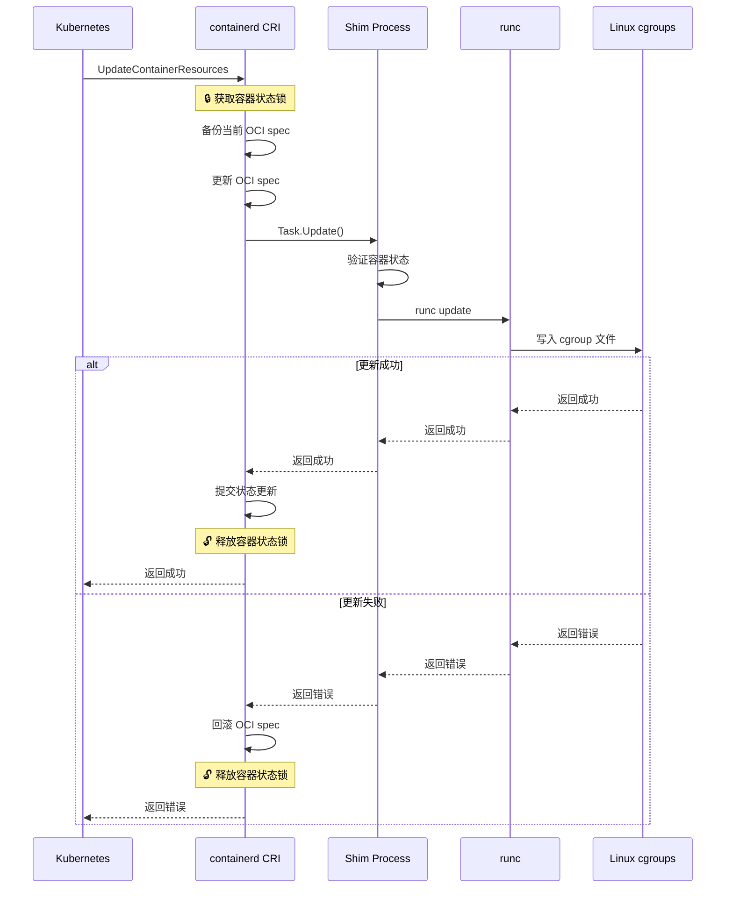

# containerd cgroup 资源调用链深度分析

> 基于 containerd v2.1.0 版本的源码分析

## 概述

本文档深度分析 containerd 如何调用 Linux 底层方法修改 cgroup，以及频繁修改同一资源时的影响和保护机制。

## 完整调用链架构

### 高层架构图

```
┌─────────────────────────────────────────────────────────────────────────────┐
│                          Kubernetes 控制平面                                │
│  ┌─────────────────────────────────────────────────────────────────────────┐ │
│  │  kubectl/API Server → kubelet → CRI Client                            │ │
│  └─────────────────────────────────────────────────────────────────────────┘ │
└──────────────────────────────┬──────────────────────────────────────────────┘
                               │ UpdateContainerResources gRPC 调用
                               ▼
┌─────────────────────────────────────────────────────────────────────────────┐
│                       containerd CRI 服务层                                 │
│  ┌─────────────────────────────────────────────────────────────────────────┐ │
│  │  🔒 container.Status.UpdateSync() - 事务性更新                        │ │
│  │  📝 updateOCIResource() - 更新 OCI 规范                              │ │
│  │  🔄 NRI 插件处理 - 可选扩展                                           │ │
│  │  📁 internal/cri/server/container_update_resources.go:38             │ │
│  └─────────────────────────────────────────────────────────────────────────┘ │
└──────────────────────────────┬──────────────────────────────────────────────┘
                               │ task.Update() 调用
                               ▼
┌─────────────────────────────────────────────────────────────────────────────┐
│                       containerd 客户端层                                   │
│  ┌─────────────────────────────────────────────────────────────────────────┐ │
│  │  📦 序列化: typeurl.MarshalAny(resources)                             │ │
│  │  📡 调用: TaskService().Update(ctx, request)                         │ │
│  │  📁 client/task.go:620                                               │ │
│  └─────────────────────────────────────────────────────────────────────────┘ │
└──────────────────────────────┬──────────────────────────────────────────────┘
                               │ gRPC/ttrpc 跨进程调用
                               ▼
┌─────────────────────────────────────────────────────────────────────────────┐
│                    containerd-shim-runc-v2 进程                             │
│  ┌─────────────────────────────────────────────────────────────────────────┐ │
│  │  🔍 container.getContainer(r.ID) - 查找容器                          │ │
│  │  🔄 状态机验证: runningState/pausedState/stoppedState                │ │
│  │  📁 cmd/containerd-shim-runc-v2/task/service.go:561                  │ │
│  └─────────────────────────────────────────────────────────────────────────┘ │
└──────────────────────────────┬──────────────────────────────────────────────┘
                               │ Container.Update() 调用
                               ▼
┌─────────────────────────────────────────────────────────────────────────────┐
│                           容器进程管理层                                     │
│  ┌─────────────────────────────────────────────────────────────────────────┐ │
│  │  🔒 process mutex 保护                                               │ │
│  │  📊 反序列化: json.Unmarshal(r.Value, &resources)                    │ │
│  │  ✅ 状态检查: 只有 running/paused 状态才能更新                        │ │
│  │  📁 cmd/containerd-shim-runc-v2/process/init.go:454                  │ │
│  └─────────────────────────────────────────────────────────────────────────┘ │
└──────────────────────────────┬──────────────────────────────────────────────┘
                               │ runtime.Update() 调用
                               ▼
┌─────────────────────────────────────────────────────────────────────────────┐
│                            runc 运行时层                                     │
│  ┌─────────────────────────────────────────────────────────────────────────┐ │
│  │  📝 JSON 序列化: json.NewEncoder(buf).Encode(resources)              │ │
│  │  🚀 执行命令: runc update --resources=- container_id                 │ │
│  │  📨 通过 stdin 传递 JSON 配置                                         │ │
│  │  📁 vendor/github.com/containerd/go-runc/runc.go:692                 │ │
│  └─────────────────────────────────────────────────────────────────────────┘ │
└──────────────────────────────┬──────────────────────────────────────────────┘
                               │ 系统调用和文件操作
                               ▼
┌─────────────────────────────────────────────────────────────────────────────┐
│                          Linux cgroups 层                                   │
│  ┌─────────────────────────────────────────────────────────────────────────┐ │
│  │  📁 cgroups v1: /sys/fs/cgroup/{subsystem}/{path}/                   │ │
│  │     • cpu.cfs_quota_us                                               │ │
│  │     • cpu.cfs_period_us                                              │ │
│  │     • cpu.shares                                                     │ │
│  │     • memory.limit_in_bytes                                          │ │
│  │     • memory.memsw.limit_in_bytes                                    │ │
│  │                                                                       │ │
│  │  📁 cgroups v2: /sys/fs/cgroup/{path}/                               │ │
│  │     • cpu.max                                                        │ │
│  │     • cpu.weight                                                     │ │
│  │     • memory.max                                                     │ │
│  │     • memory.swap.max                                                │ │
│  └─────────────────────────────────────────────────────────────────────────┘ │
└─────────────────────────────────────────────────────────────────────────────┘
```

## 底层系统调用分析

### cgroup 文件写入机制

#### 1. **cgroups v2 写入流程**

```go
// vendor/github.com/containerd/cgroups/v3/cgroup2/manager.go:73
func (c *Value) write(path string, perm os.FileMode) error {
    var data []byte
    switch t := c.value.(type) {
    case uint64:
        data = []byte(strconv.FormatUint(t, 10))
    case int64:
        data = []byte(strconv.FormatInt(t, 10))
    case string:
        data = []byte(t)
    }

    return os.WriteFile(
        filepath.Join(path, c.filename),
        data,
        perm,
    )
}
```

**关键系统调用**:
- `open()`: 打开 cgroup 文件 (如 `/sys/fs/cgroup/container_path/cpu.max`)
- `write()`: 写入新的资源限制值
- `close()`: 关闭文件描述符

#### 2. **cgroups v1 写入流程**

```go
// vendor/github.com/containerd/cgroups/v3/cgroup1/cpu.go:45
func (c *cpuController) Update(path string, resources *specs.LinuxResources) error {
    if cpu := resources.CPU; cpu != nil {
        // 写入 cpu.cfs_quota_us
        if cpu.Quota != nil {
            value := []byte(strconv.FormatInt(*cpu.Quota, 10))
            if err := os.WriteFile(
                filepath.Join(c.Path(path), "cpu.cfs_quota_us"),
                value,
                defaultFilePerm,
            ); err != nil {
                return err
            }
        }
    }
    return nil
}
```

**文件写入顺序**:
1. CPU 控制器: `cpu.cfs_period_us` → `cpu.cfs_quota_us` → `cpu.shares`
2. 内存控制器: `memory.limit_in_bytes` → `memory.memsw.limit_in_bytes`
3. 其他控制器按需更新

### 重试机制和错误处理

#### **EINVAL 错误重试机制**

```go
// vendor/github.com/containerd/cgroups/v3/cgroup1/cgroup.go:199
func writeCgroupProcs(path string, content []byte, perm fs.FileMode) error {
    f, err := os.OpenFile(path, os.O_CREATE|os.O_WRONLY, perm)
    if err != nil {
        return err
    }
    defer f.Close()

    for i := 0; i < 5; i++ {
        _, err = f.Write(content)
        if err == nil {
            return nil
        }
        // 进程状态为 TASK_NEW 时内核返回 EINVAL
        // 参考: https://github.com/torvalds/linux/blob/v6.0/kernel/sched/core.c#L10308-L10337
        if !errors.Is(err, syscall.EINVAL) {
            return err
        }
        time.Sleep(30 * time.Millisecond)  // 等待 30ms 后重试
    }
    return err
}
```

**重试场景**:
- 进程状态处于 `TASK_NEW` 时
- 临时的内核资源竞争
- 文件系统暂时不可用

## 并发控制和保护机制

### 1. **CRI 服务层并发保护**

#### **事务性状态更新**

```go
// internal/cri/server/container_update_resources.go:38
func (c *criService) UpdateContainerResources(ctx context.Context, r *runtime.UpdateContainerResourcesRequest) {
    // 使用事务确保原子性操作
    if err := container.Status.UpdateSync(func(status containerstore.Status) (containerstore.Status, error) {
        return c.updateContainerResources(ctx, container, r, status)
    }); err != nil {
        return nil, fmt.Errorf("failed to update resources: %w", err)
    }
}
```

#### **避免并发冲突的机制**

```go
// internal/cri/store/container/status.go:264
func (s *statusStorage) UpdateSync(u UpdateFunc) error {
    s.Lock()           // 🔒 获取互斥锁
    defer s.Unlock()   // 🔓 确保释放锁
    
    newStatus, err := u(s.status)
    if err != nil {
        return err
    }
    
    // 原子性文件写入
    data, err := newStatus.encode()
    if err != nil {
        return fmt.Errorf("failed to encode status: %w", err)
    }
    
    if err := continuity.AtomicWriteFile(s.path, data, 0600); err != nil {
        return fmt.Errorf("failed to checkpoint status to %q: %w", s.path, err)
    }
    
    s.status = newStatus
    return nil
}
```

**保护目标**:
1. 防止与容器启动的竞争条件
2. 防止对同一容器的并发资源更新
3. 确保容器状态的一致性

### 2. **进程层互斥保护**

#### **容器进程级别锁定**

```go
// cmd/containerd-shim-runc-v2/process/init.go:454
func (p *Init) Update(ctx context.Context, r *google_protobuf.Any) error {
    p.mu.Lock()        // 🔒 进程级互斥锁
    defer p.mu.Unlock() // 🔓 确保释放

    return p.initState.Update(ctx, r)
}
```

#### **状态机保护**

```go
// cmd/containerd-shim-runc-v2/process/init_state.go:255
type runningState struct{ p *Init }
type pausedState struct{ p *Init }  
type stoppedState struct{ p *Init }

func (s *runningState) Update(ctx context.Context, r *google_protobuf.Any) error {
    return s.p.update(ctx, r)  // ✅ 允许更新
}

func (s *stoppedState) Update(ctx context.Context, r *google_protobuf.Any) error {
    return errors.New("cannot update a stopped container")  // ❌ 拒绝更新
}
```

### 3. **cgroup 层面的并发保护**

#### **cgroups v1 更新保护**

```go
// vendor/github.com/containerd/cgroups/v3/cgroup1/control.go:301
func (c *cgroup) Update(resources *specs.LinuxResources) error {
    c.mu.Lock()        // 🔒 cgroup 级互斥锁
    defer c.mu.Unlock()
    
    if c.err != nil {
        return c.err
    }
    
    for _, s := range c.subsystems {
        if u, ok := s.(updater); ok {
            sp, err := c.path(s.Name())
            if err != nil {
                return err
            }
            if err := u.Update(sp, resources); err != nil {
                return err
            }
        }
    }
    return nil
}
```

## 频繁修改同一资源的影响分析

### 1. **性能影响**

#### **文件系统开销**

| 操作 | 频率 | 系统调用开销 | 影响评估 |
|------|------|-------------|----------|
| CPU 配额修改 | 高频 (>10/sec) | `open()`/`write()`/`close()` × 2 | 中等 |
| 内存限制修改 | 中频 (1-10/sec) | `open()`/`write()`/`close()` × 1-2 | 低 |
| 复合资源修改 | 低频 (<1/sec) | 多个文件系统操作 | 高 |

#### **内核资源竞争**

```bash
# 高频修改可能导致的内核日志
[  123.456789] cgroup: Too many updates to /sys/fs/cgroup/cpu/container_path/cpu.cfs_quota_us
[  123.456790] ratelimit: 10+ messages suppressed
```

**缓解策略**:
- 使用批量更新减少系统调用次数
- 实施客户端限流机制
- 合并短时间内的多次更新请求

### 2. **原子性保证**

#### **更新事务流程**



### 3. **错误恢复机制**

#### **自动回滚逻辑**

```go
// internal/cri/server/container_update_resources.go:78
defer func() {
    if retErr != nil {
        deferCtx, deferCancel := ctrdutil.DeferContext()
        defer deferCancel()
        // 发生错误时重置 spec
        if err := updateContainerSpec(deferCtx, cntr.Container, oldSpec); err != nil {
            log.G(ctx).WithError(err).Errorf("Failed to update spec %+v for container %q", oldSpec, id)
        }
    } else {
        // 只有在 spec 更新成功时才更新容器状态
        newStatus = copyResourcesToStatus(newSpec, status)
    }
}()
```

**回滚触发条件**:
- runc 命令执行失败
- cgroup 文件写入失败  
- 容器状态不允许更新
- 资源配置验证失败

### 4. **资源更新队列化**

#### **NRI 插件集成**

```go
// internal/nri/nri.go:295
func (l *local) UpdateContainer(ctx context.Context, pod PodSandbox, ctr Container, req *nri.LinuxResources) (*nri.LinuxResources, error) {
    l.Lock()           // 🔒 NRI 全局锁
    defer l.Unlock()   // 🔓 确保释放
    
    request := &nri.UpdateContainerRequest{
        Pod:            podSandboxToNRI(pod),
        Container:      containerToNRI(ctr),
        LinuxResources: req,
    }

    response, err := l.nri.UpdateContainer(ctx, request)
    if err != nil {
        return nil, err
    }
    
    // 批处理多个更新请求
    cnt := len(response.Update)
    if cnt > 1 {
        _, err = l.applyUpdates(ctx, response.Update[0:cnt-1])
        if err != nil {
            log.G(ctx).WithError(err).Warnf("pre-update update failed")
        }
    }

    return response.Update[cnt-1].GetLinux().GetResources(), nil
}
```

## 性能优化建议

### 1. **批量操作优化**

```go
// 优化前：逐个修改
for _, container := range containers {
    updateContainerResources(container, resources)
}

// 优化后：批量修改
type BatchUpdate struct {
    ContainerID string
    Resources   *specs.LinuxResources
}

func updateContainerResourcesBatch(updates []BatchUpdate) error {
    // 合并同容器的多次更新
    merged := mergeUpdates(updates)
    
    // 并行执行更新
    var wg sync.WaitGroup
    errCh := make(chan error, len(merged))
    
    for _, update := range merged {
        wg.Add(1)
        go func(u BatchUpdate) {
            defer wg.Done()
            if err := updateSingleContainer(u); err != nil {
                errCh <- err
            }
        }(update)
    }
    
    wg.Wait()
    close(errCh)
    
    // 收集错误
    var errors []error
    for err := range errCh {
        errors = append(errors, err)
    }
    
    if len(errors) > 0 {
        return fmt.Errorf("batch update failed: %v", errors)
    }
    
    return nil
}
```

### 2. **智能限流**

```go
type ResourceUpdateLimiter struct {
    mu          sync.Mutex
    lastUpdate  map[string]time.Time
    minInterval time.Duration
}

func (r *ResourceUpdateLimiter) ShouldUpdate(containerID string) bool {
    r.mu.Lock()
    defer r.mu.Unlock()
    
    if last, exists := r.lastUpdate[containerID]; exists {
        if time.Since(last) < r.minInterval {
            return false  // 限流：更新太频繁
        }
    }
    
    r.lastUpdate[containerID] = time.Now()
    return true
}
```

### 3. **监控和告警**

```go
// 性能指标监控
var (
    updateDuration = prometheus.NewHistogramVec(
        prometheus.HistogramOpts{
            Name: "containerd_resource_update_duration_seconds",
            Help: "Duration of resource update operations",
        },
        []string{"container_id", "resource_type"},
    )
    
    updateFailures = prometheus.NewCounterVec(
        prometheus.CounterOpts{
            Name: "containerd_resource_update_failures_total", 
            Help: "Total number of resource update failures",
        },
        []string{"container_id", "error_type"},
    )
)

func updateWithMetrics(containerID string, resources *specs.LinuxResources) error {
    start := time.Now()
    
    err := performUpdate(containerID, resources)
    
    updateDuration.WithLabelValues(containerID, "cpu_memory").Observe(time.Since(start).Seconds())
    
    if err != nil {
        updateFailures.WithLabelValues(containerID, classifyError(err)).Inc()
    }
    
    return err
}
```

## 总结

containerd 的 cgroup 资源修改机制通过以下关键设计实现了高可靠性：

1. **分层保护**: 从 CRI 服务到 cgroup 文件系统的多层并发保护
2. **事务性操作**: 通过状态锁和原子性文件操作确保数据一致性  
3. **错误恢复**: 完整的回滚机制和重试策略
4. **状态机管理**: 严格的容器状态验证，防止无效操作
5. **性能优化**: 通过批量处理和智能限流减少系统开销

频繁修改同一资源时，系统通过互斥锁、重试机制和错误恢复确保操作的原子性和一致性，但会带来一定的性能开销。在生产环境中，建议实施适当的限流策略和批量处理来优化性能。
