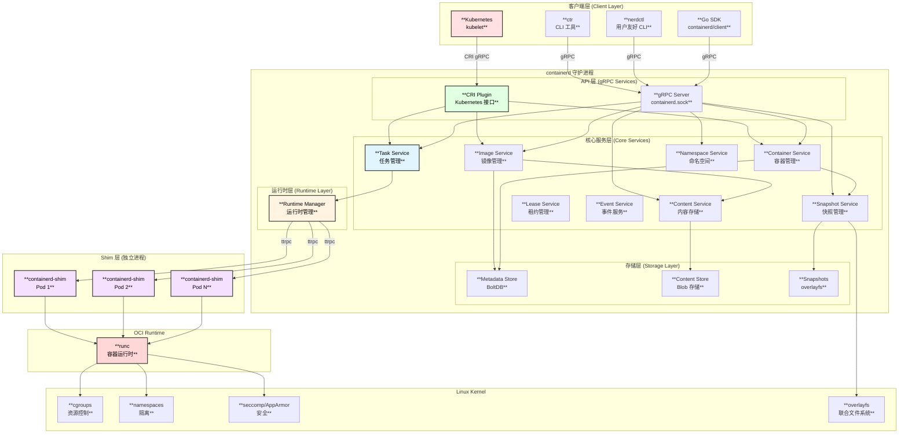
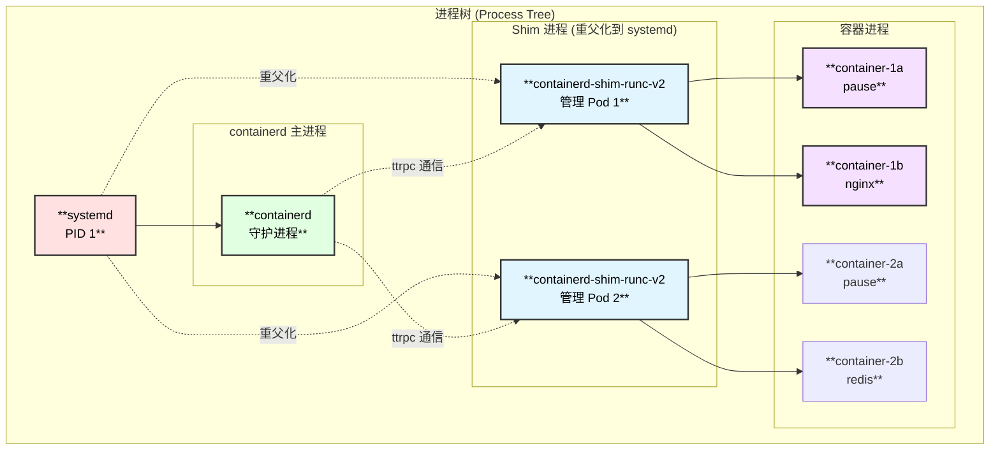
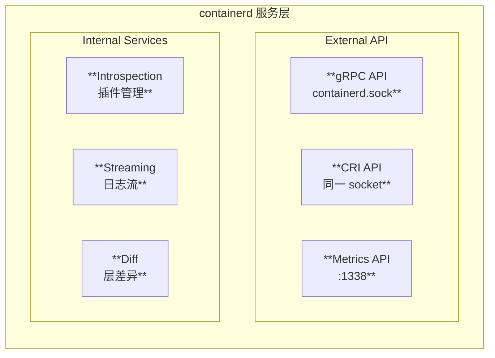
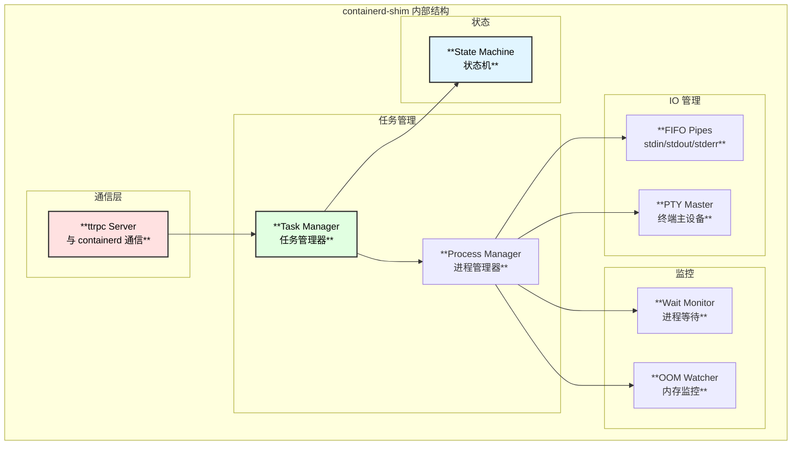
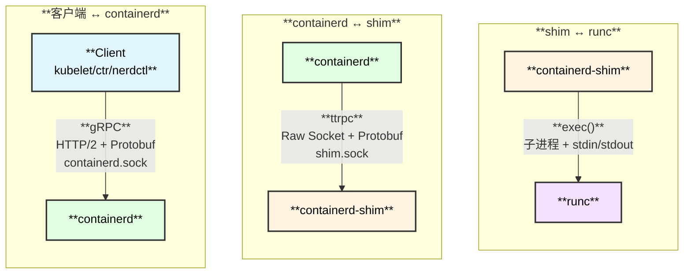
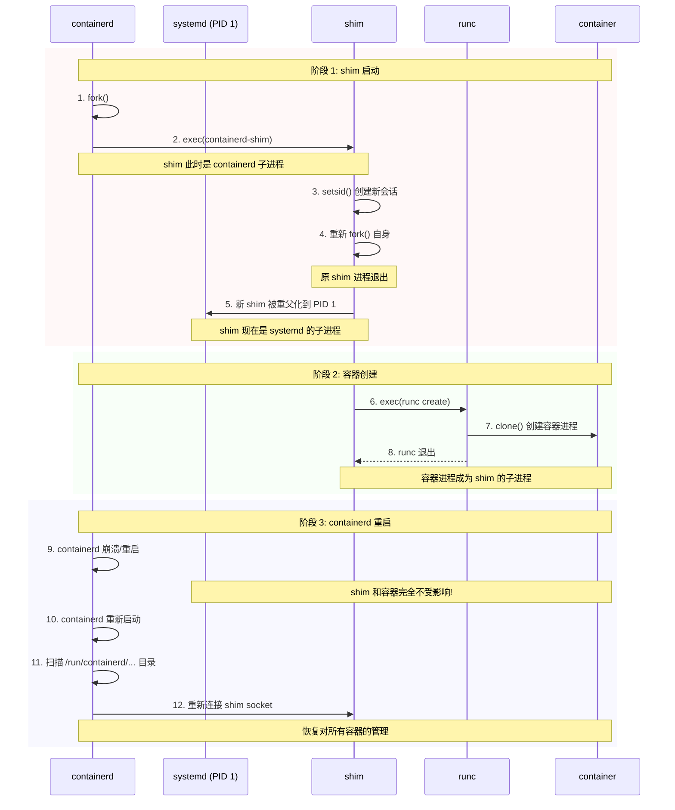
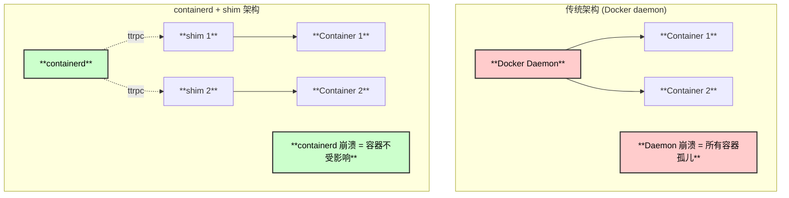
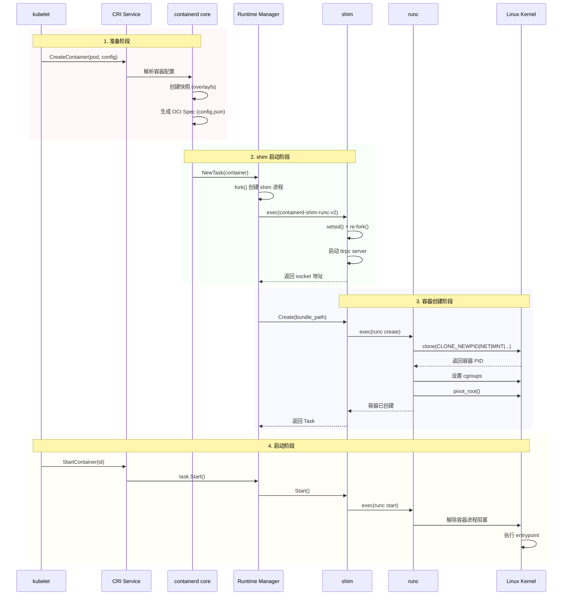

# containerd 架构、进程模型与运作原理

> 基于 containerd v2.1.0 版本源码分析

## 概述

containerd 是一个工业级的容器运行时，采用分层架构设计，通过多进程协作实现容器的管理。本文档详细解析 containerd 的整体架构、进程模型、组件交互以及 shim 独立运行的原理。

## 整体架构

### 架构全景图



## 进程模型

### 进程关系图



### 三类核心进程

| 进程 | 数量 | 生命周期 | 职责 |
|-----|------|---------|-----|
| **containerd** | 1 | 系统服务 | API 服务、元数据管理、镜像管理 |
| **containerd-shim** | N (每 Pod 一个) | 跟随 Pod | 容器进程管理、IO 保持、退出处理 |
| **runc** | 短暂 | 执行后退出 | 容器创建/启动/删除执行器 |

## 核心组件详解

### 1. containerd 主进程

containerd 是核心守护进程，提供以下服务:



**主要职责**:
- 提供 gRPC API 服务
- 管理容器镜像的拉取、存储、解压
- 管理容器的元数据 (BoltDB)
- 协调 snapshotter 创建容器文件系统
- 启动和管理 shim 进程
- 发布容器生命周期事件

### 2. containerd-shim 进程

shim 是每个 Pod/Sandbox 的管理进程:



**主要职责**:
- 作为容器进程的直接父进程
- 保持容器的 STDIO/PTY 开放
- 收集容器退出状态码
- 回收 (reap) 孤儿进程
- 通过 ttrpc 与 containerd 通信
- 监控容器 OOM 事件

### 3. runc 执行器

runc 是 OCI 运行时参考实现:

```
runc 命令生命周期:

┌─────────────────────────────────────────────────────────────────┐
│  runc create <container-id>                                     │
│  ├── 读取 config.json                                          │
│  ├── 创建 namespaces (pid, net, mnt, uts, ipc)                │
│  ├── 设置 cgroups                                              │
│  ├── 准备 rootfs (pivot_root)                                 │
│  ├── 创建容器进程 (暂停状态)                                   │
│  └── 退出 (容器进程由 shim 接管)                               │
└─────────────────────────────────────────────────────────────────┘
                              │
                              ▼
┌─────────────────────────────────────────────────────────────────┐
│  runc start <container-id>                                      │
│  ├── 解除容器进程暂停                                          │
│  ├── 执行容器 entrypoint                                       │
│  └── 退出                                                       │
└─────────────────────────────────────────────────────────────────┘
                              │
                              ▼
┌─────────────────────────────────────────────────────────────────┐
│  runc delete <container-id>                                     │
│  ├── 清理 cgroups                                              │
│  ├── 清理 namespaces                                           │
│  └── 删除状态文件                                              │
└─────────────────────────────────────────────────────────────────┘
```

## 进程间通信机制

### 通信协议对比



### 为什么使用 ttrpc?

| 特性 | gRPC | ttrpc |
|-----|------|-------|
| **传输层** | HTTP/2 | 原始 socket |
| **序列化** | Protobuf | Protobuf |
| **内存占用** | ~10MB | ~1-2MB |
| **延迟** | 较高 | 极低 |
| **适用场景** | 外部 API | 内部高频通信 |

### Socket 文件位置

```
containerd sockets:

/run/containerd/
├── containerd.sock              # 主 gRPC API socket
├── containerd.sock.ttrpc        # ttrpc socket (shim 通信)
└── debug.sock                   # 调试 socket

shim sockets (每个 Pod 一个):

/run/containerd/io.containerd.runtime.v2.task/<namespace>/<container-id>/
├── shim.sock                    # shim ttrpc socket
├── address                      # socket 地址文件
└── log                          # shim 日志 FIFO
```

## Shim 独立运行原理深度解析

### 核心问题

**为什么 shim 可以独立于 containerd 运行，containerd 重启不影响容器?**

### 答案: 进程重父化 (Re-parenting)



### 关键技术实现

#### 1. 双 fork 机制

```go
// pkg/shim/shim.go - shim 启动逻辑

func Run(id string, initFunc Init, opts ...BinaryOpts) {
    // ... 初始化 ...
    
    // 设置为子进程收割者
    if !config.NoSubreaper {
        if err := setSubreaper(); err != nil {
            return err
        }
    }
    
    // 关键: 设置自己为新的进程组/会话领导
    // 这使得 shim 不再依赖 containerd
}

// cmd/containerd-shim-runc-v2/main.go
func main() {
    // 第一次 fork 后，创建新会话
    if os.Getenv("_CONTAINERD_SHIM_REAPER") == "" {
        // 重新执行自己，脱离 containerd 进程组
        cmd := exec.Command("/proc/self/exe", os.Args[1:]...)
        cmd.Env = append(os.Environ(), "_CONTAINERD_SHIM_REAPER=1")
        cmd.Start()
        os.Exit(0)  // 原进程退出，新进程被 init 收养
    }
    
    // 第二次执行，真正运行 shim 逻辑
    shim.Run(...)
}
```

#### 2. 子进程收割者 (Subreaper)

```go
// cmd/containerd-shim-runc-v2/process/init.go

// shim 设置为 subreaper
func setSubreaper() error {
    return unix.Prctl(unix.PR_SET_CHILD_SUBREAPER, 1, 0, 0, 0)
}

// 效果:
// - shim 的所有孤儿子进程都会被 shim 收养
// - 而不是被 PID 1 收养
// - shim 负责 wait() 这些进程，获取退出码
```

#### 3. 状态持久化

```
/run/containerd/io.containerd.runtime.v2.task/<namespace>/<container-id>/
├── config.json          # OCI spec (containerd 恢复时读取)
├── init.pid             # 容器 init 进程 PID
├── shim.sock            # shim 通信 socket
├── address              # socket 地址
├── log                  # 日志 FIFO
└── rootfs/              # 容器根文件系统

关键点: 所有状态都持久化在文件系统
containerd 重启后可以完全重建管理状态
```

#### 4. containerd 恢复流程

```go
// core/runtime/v2/shim/shim.go

func (m *ShimManager) LoadExistingShims(ctx context.Context) error {
    // 扫描运行时目录
    taskDirs, _ := os.ReadDir("/run/containerd/io.containerd.runtime.v2.task/")
    
    for _, ns := range taskDirs {
        containerDirs, _ := os.ReadDir(filepath.Join(taskPath, ns.Name()))
        
        for _, container := range containerDirs {
            // 读取 shim socket 地址
            address, _ := os.ReadFile(filepath.Join(containerPath, "address"))
            
            // 重新连接到 shim
            conn, _ := ttrpc.Connect(string(address))
            
            // 重建 task 对象
            task := &shimTask{
                id:     container.Name(),
                shim:   conn,
                // ...
            }
            
            // 加入管理
            m.tasks[container.Name()] = task
        }
    }
    
    return nil
}
```

### 设计优势总结



| 特性 | Docker daemon | containerd + shim |
|-----|---------------|-------------------|
| 进程模型 | 单进程管理所有容器 | 每容器/Pod 独立 shim |
| daemon 重启 | 容器变孤儿 | 容器不受影响 |
| daemon 升级 | 需停止所有容器 | 可热升级 |
| 资源隔离 | 共享 daemon 资源 | 独立资源限制 |
| 故障隔离 | 一个容器问题影响全部 | 问题隔离到单个 shim |

## 容器创建完整流程



## 源码目录结构

```
📁 containerd/
├── 📁 cmd/
│   ├── 📁 containerd/                    # containerd 主程序
│   │   └── 📄 main.go                    # 入口点
│   │
│   └── 📁 containerd-shim-runc-v2/       # shim 程序
│       ├── 📄 main.go                    # shim 入口
│       ├── 📁 manager/                   # shim 管理器
│       ├── 📁 task/                      # 任务服务
│       ├── 📁 process/                   # 进程管理
│       └── 📁 runc/                      # runc 调用封装
│
├── 📁 client/                            # Go SDK
│   ├── 📄 client.go                      # 客户端实现
│   ├── 📄 container.go                   # 容器操作
│   ├── 📄 task.go                        # 任务操作
│   └── 📄 image.go                       # 镜像操作
│
├── 📁 core/                              # 核心组件
│   ├── 📁 runtime/                       # 运行时管理
│   │   └── 📁 v2/                        # v2 运行时
│   │       └── 📁 shim/                  # shim 管理
│   ├── 📁 containers/                    # 容器存储
│   ├── 📁 content/                       # 内容存储
│   ├── 📁 images/                        # 镜像管理
│   ├── 📁 snapshots/                     # 快照管理
│   └── 📁 metadata/                      # 元数据 (BoltDB)
│
├── 📁 internal/cri/                      # CRI 实现
│   ├── 📁 server/                        # CRI 服务
│   │   ├── 📄 service.go                 # 服务入口
│   │   ├── 📄 sandbox_*.go               # Pod/Sandbox 操作
│   │   └── 📄 container_*.go             # 容器操作
│   └── 📁 store/                         # CRI 存储
│
├── 📁 pkg/                               # 公共包
│   ├── 📁 oci/                           # OCI spec 生成
│   └── 📁 shim/                          # shim 框架
│
└── 📁 plugins/                           # 插件系统
    ├── 📁 services/                      # 服务插件
    └── 📁 snapshots/                     # 快照插件
```

## 总结

containerd 通过精心设计的多进程架构实现了高可用的容器运行时:

### 1. 分层解耦
- containerd 负责 API、镜像、元数据
- shim 负责容器进程生命周期
- runc 负责实际的容器操作

### 2. shim 独立运行关键点
- **双 fork + setsid**: 脱离 containerd 进程组
- **重父化到 init**: 成为系统服务的直接子进程
- **状态持久化**: 所有必要信息保存在文件系统
- **ttrpc 重连**: containerd 重启后可恢复连接

### 3. 设计优势
- **热升级**: containerd 可无中断升级
- **故障隔离**: 单点故障不影响其他组件
- **资源隔离**: 每个 Pod 有独立的 shim 进程
- **可观测性**: 清晰的进程边界便于监控调试

这种架构使 containerd 成为云原生环境中最可靠的容器运行时之一。
