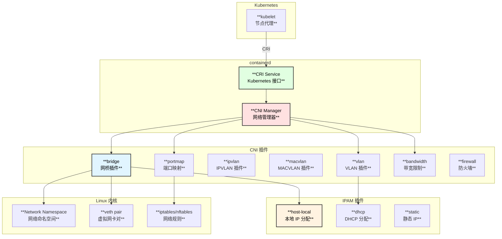
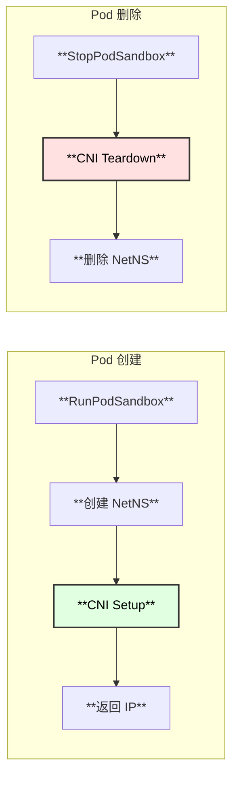
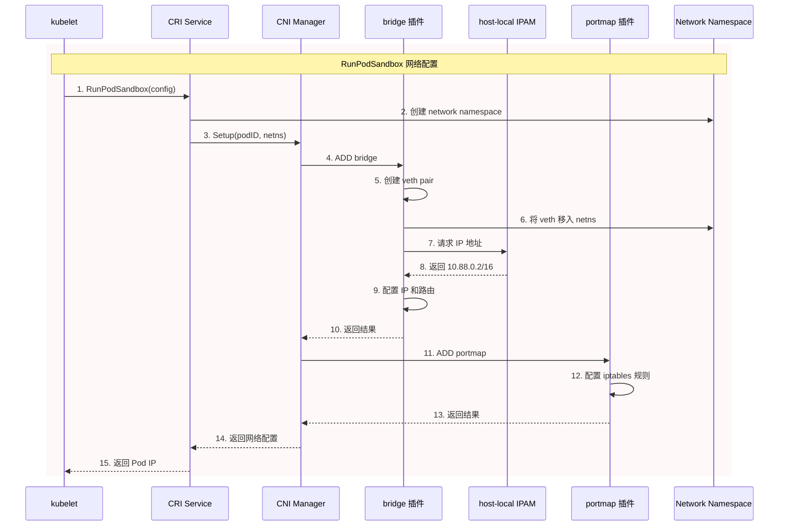
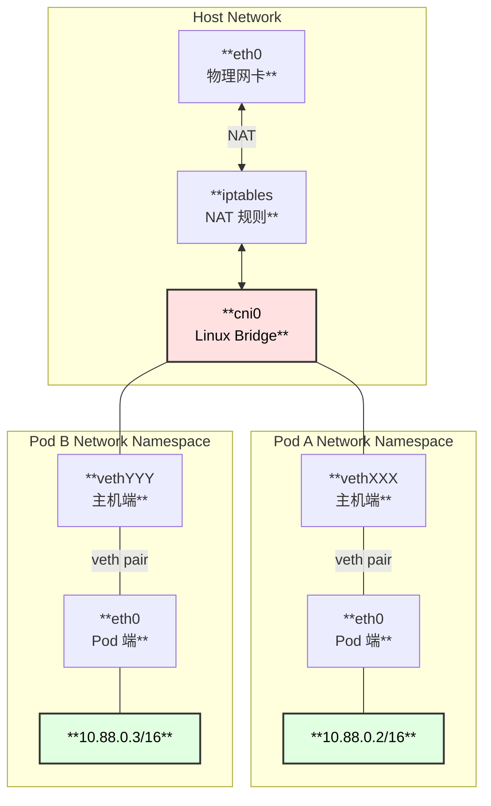
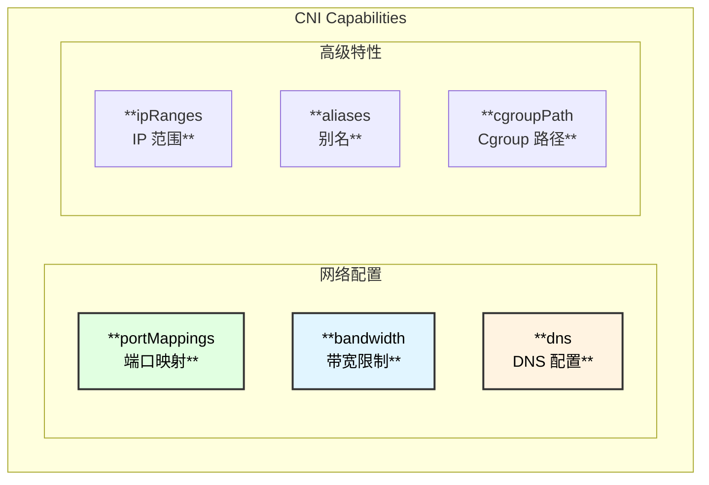
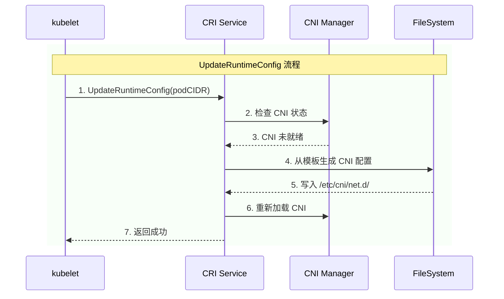
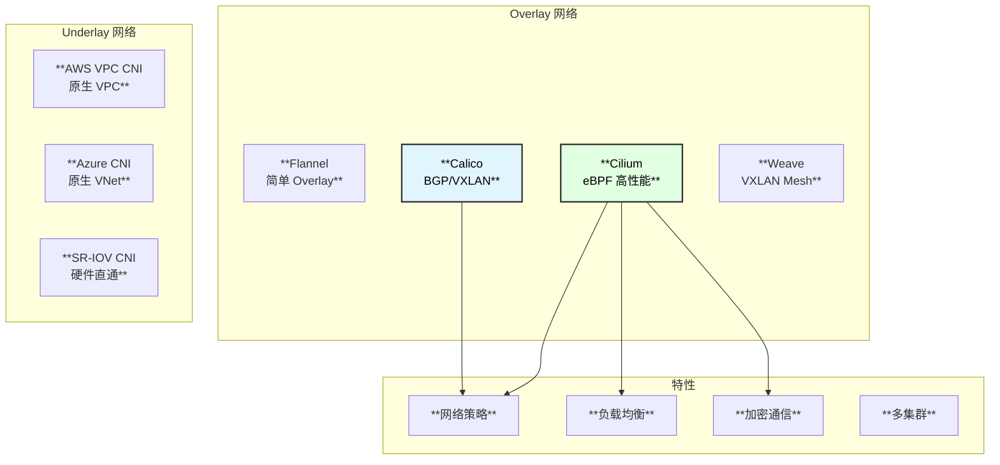
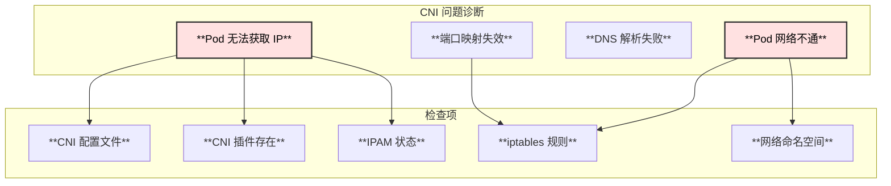

# CNI (Container Network Interface) 与 containerd 集成

> 基于 containerd v2.1.0 版本源码分析

## 概述

CNI (Container Network Interface) 是 CNCF 定义的容器网络标准接口。containerd 通过 CRI 插件集成 CNI，为 Kubernetes Pod 提供网络配置能力。本文档详细分析 CNI 在 containerd 中的使用方式和实现原理。

## CNI 架构

### 整体架构图



### CNI 调用链路



---

## CNI 配置

### containerd CNI 配置

```toml
# /etc/containerd/config.toml

version = 3

[plugins."io.containerd.cri.v1.runtime".cni]
  # CNI 插件二进制目录
  bin_dir = "/opt/cni/bin"
  
  # CNI 配置文件目录
  conf_dir = "/etc/cni/net.d"
  
  # 最大配置文件数量
  max_conf_num = 1
  
  # IP 优先级 (ipv4/ipv6/cni)
  ip_pref = ""
  
  # 配置模板 (用于动态生成)
  conf_template = ""
```

### CNI 配置文件示例

**单网络配置 (conflist):**

```json
{
  "cniVersion": "1.0.0",
  "name": "containerd-net",
  "plugins": [
    {
      "type": "bridge",
      "bridge": "cni0",
      "isGateway": true,
      "ipMasq": true,
      "promiscMode": true,
      "ipam": {
        "type": "host-local",
        "ranges": [
          [{"subnet": "10.88.0.0/16", "gateway": "10.88.0.1"}]
        ],
        "routes": [
          {"dst": "0.0.0.0/0"}
        ]
      }
    },
    {
      "type": "portmap",
      "capabilities": {"portMappings": true}
    },
    {
      "type": "bandwidth",
      "capabilities": {"bandwidth": true}
    }
  ]
}
```

---

## CNI 工作流程

### Pod 网络配置时序图



### 网络结构图



---

## 源码解析

### CNI 初始化

```go
// internal/cri/server/service_linux.go:74
func (c *criService) initPlatform() (err error) {
    // 网络配置目录
    pluginDirs := map[string]string{
        defaultNetworkPlugin: c.config.NetworkPluginConfDir,
    }
    
    // 为每个 RuntimeClass 配置独立的 CNI
    for name, conf := range c.config.Runtimes {
        if conf.NetworkPluginConfDir != "" {
            pluginDirs[name] = conf.NetworkPluginConfDir
        }
    }
    
    // 初始化 CNI 插件
    c.netPlugin = make(map[string]cni.CNI)
    for name, dir := range pluginDirs {
        i, err := cni.New(
            cni.WithMinNetworkCount(2),      // 至少需要 loopback + 主网络
            cni.WithPluginConfDir(dir),       // 配置目录
            cni.WithPluginMaxConfNum(max),    // 最大配置数
            cni.WithPluginDir(c.config.NetworkPluginBinDirs),  // 插件目录
        )
        if err != nil {
            return fmt.Errorf("failed to initialize cni: %w", err)
        }
        c.netPlugin[name] = i
    }
    
    return nil
}
```

### 网络配置 Setup

```go
// internal/cri/server/sandbox_run.go:394
func (c *criService) setupPodNetwork(ctx context.Context, sandbox *sandboxstore.Sandbox) error {
    var (
        id        = sandbox.ID
        config    = sandbox.Config
        path      = sandbox.NetNSPath
        netPlugin = c.getNetworkPlugin(sandbox.RuntimeHandler)
    )
    
    if netPlugin == nil {
        return errors.New("cni config not initialized")
    }
    
    // 设置内部 loopback
    if c.config.UseInternalLoopback {
        if err := c.bringUpLoopback(path); err != nil {
            return fmt.Errorf("unable to set lo to up: %w", err)
        }
    }
    
    // 构建 CNI 选项
    opts, err := cniNamespaceOpts(id, config)
    if err != nil {
        return fmt.Errorf("get cni namespace options: %w", err)
    }
    
    // 调用 CNI Setup
    var result *cni.Result
    if c.config.CniConfig.NetworkPluginSetupSerially {
        result, err = netPlugin.SetupSerially(ctx, id, path, opts...)
    } else {
        result, err = netPlugin.Setup(ctx, id, path, opts...)
    }
    
    if err != nil {
        return err
    }
    
    // 提取 Pod IP
    if configs, ok := result.Interfaces[defaultIfName]; ok && len(configs.IPConfigs) > 0 {
        sandbox.IP, sandbox.AdditionalIPs = selectPodIPs(ctx, configs.IPConfigs, c.config.IPPreference)
        sandbox.CNIResult = result
        return nil
    }
    
    return fmt.Errorf("failed to find network info for sandbox %q", id)
}
```

### CNI 参数构建

```go
// internal/cri/server/sandbox_run.go:439
func cniNamespaceOpts(id string, config *runtime.PodSandboxConfig) ([]cni.NamespaceOpts, error) {
    opts := []cni.NamespaceOpts{
        // Pod 元数据作为 Labels
        cni.WithLabels(toCNILabels(id, config)),
        
        // 端口映射
        cni.WithCapabilityPortMap(toCNIPortMappings(config.GetPortMappings())),
    }
    
    // 带宽限制
    bandWidth, err := toCNIBandWidth(config.GetAnnotations())
    if err != nil {
        return nil, err
    }
    if bandWidth != nil {
        opts = append(opts, cni.WithCapabilityBandWidth(*bandWidth))
    }
    
    // DNS 配置
    dns := toCNIDNS(config.GetDnsConfig())
    if dns != nil {
        opts = append(opts, cni.WithCapabilityDNS(*dns))
    }
    
    // Cgroup 路径
    if cgroup := config.GetLinux().GetCgroupParent(); cgroup != "" {
        opts = append(opts, cni.WithCapabilityCgroupPath(cgroup))
    }
    
    return opts, nil
}

// CNI Labels
func toCNILabels(id string, config *runtime.PodSandboxConfig) map[string]string {
    return map[string]string{
        "K8S_POD_NAMESPACE":          config.GetMetadata().GetNamespace(),
        "K8S_POD_NAME":               config.GetMetadata().GetName(),
        "K8S_POD_INFRA_CONTAINER_ID": id,
        "K8S_POD_UID":                config.GetMetadata().GetUid(),
        "IgnoreUnknown":              "1",
    }
}
```

### 网络清理 Teardown

```go
// internal/cri/server/sandbox_stop.go
func (c *criService) teardownPodNetwork(ctx context.Context, sandbox sandboxstore.Sandbox) error {
    netPlugin := c.getNetworkPlugin(sandbox.RuntimeHandler)
    if netPlugin == nil {
        return nil
    }
    
    // 调用 CNI Remove
    if sandbox.NetNSPath != "" {
        return netPlugin.Remove(ctx, sandbox.ID, sandbox.NetNSPath,
            cni.WithLabels(toCNILabels(sandbox.ID, sandbox.Config)),
            cni.WithCapabilityPortMap(toCNIPortMappings(sandbox.Config.GetPortMappings())),
        )
    }
    
    return nil
}
```

---

## CNI 能力 (Capabilities)

### 支持的 Capabilities



### 端口映射示例

```go
// 端口映射转换
func toCNIPortMappings(portMappings []*runtime.PortMapping) []cni.PortMapping {
    var result []cni.PortMapping
    for _, pm := range portMappings {
        result = append(result, cni.PortMapping{
            HostPort:      pm.GetHostPort(),
            ContainerPort: pm.GetContainerPort(),
            Protocol:      pm.GetProtocol().String(),
            HostIP:        pm.GetHostIp(),
        })
    }
    return result
}
```

### 带宽限制示例

```go
// 从 Kubernetes 注解提取带宽配置
func toCNIBandWidth(annotations map[string]string) (*cni.BandWidth, error) {
    // 解析注解: kubernetes.io/ingress-bandwidth, kubernetes.io/egress-bandwidth
    ingress, egress, err := bandwidth.ExtractPodBandwidthResources(annotations)
    if err != nil {
        return nil, err
    }
    
    if ingress == nil && egress == nil {
        return nil, nil
    }
    
    bandWidth := &cni.BandWidth{}
    
    if ingress != nil {
        bandWidth.IngressRate = uint64(ingress.Value())
        bandWidth.IngressBurst = math.MaxUint32
    }
    
    if egress != nil {
        bandWidth.EgressRate = uint64(egress.Value())
        bandWidth.EgressBurst = math.MaxUint32
    }
    
    return bandWidth, nil
}
```

---

## UpdateRuntimeConfig

### 动态更新 CNI 配置



```go
// internal/cri/server/update_runtime_config.go:56
func (c *criService) UpdateRuntimeConfig(ctx context.Context, r *runtime.UpdateRuntimeConfigRequest) (*runtime.UpdateRuntimeConfigResponse, error) {
    podCIDRs := r.GetRuntimeConfig().GetNetworkConfig().GetPodCidr()
    if podCIDRs == "" {
        return &runtime.UpdateRuntimeConfigResponse{}, nil
    }
    
    cidrs := strings.Split(podCIDRs, ",")
    routes, err := getRoutes(cidrs)
    if err != nil {
        return nil, fmt.Errorf("get routes: %w", err)
    }
    
    confTemplate := c.config.NetworkPluginConfTemplate
    if confTemplate == "" {
        return &runtime.UpdateRuntimeConfigResponse{}, nil
    }
    
    // 检查网络插件状态
    netPlugin := c.netPlugin[defaultNetworkPlugin]
    if netPlugin.Status() == nil {
        return &runtime.UpdateRuntimeConfigResponse{}, nil
    }
    
    // 从模板生成并写入配置文件
    if err := writeCNIConfigFile(ctx, c.config.NetworkPluginConfDir, 
        confTemplate, cidrs[0], cidrs, routes); err != nil {
        return nil, err
    }
    
    return &runtime.UpdateRuntimeConfigResponse{}, nil
}
```

---

## 常见 CNI 插件

### 主网络插件

| 插件 | 说明 | 适用场景 |
|------|------|---------|
| **bridge** | Linux 网桥 | 单机/简单网络 |
| **vlan** | VLAN 网络 | 与物理网络集成 |
| **macvlan** | MAC 地址虚拟化 | 容器直接接入物理网络 |
| **ipvlan** | IP 地址虚拟化 | 高性能场景 |
| **ptp** | 点对点连接 | 简单网络 |
| **host-device** | 使用主机设备 | SR-IOV 场景 |

### Meta 插件

| 插件 | 说明 |
|------|------|
| **portmap** | 端口映射 (DNAT) |
| **bandwidth** | 带宽限制 (tc) |
| **firewall** | 防火墙规则 |
| **tuning** | 网络参数调优 |
| **sbr** | 源路由 |

### IPAM 插件

| 插件 | 说明 |
|------|------|
| **host-local** | 本地 IP 池管理 |
| **dhcp** | DHCP 分配 |
| **static** | 静态 IP |
| **whereabouts** | 分布式 IPAM |

---

## 第三方 CNI 方案

### 常见 CNI 实现



---

## 故障排查

### 常见问题



### 诊断命令

```bash
# 检查 CNI 配置
ls -la /etc/cni/net.d/
cat /etc/cni/net.d/*.conflist

# 检查 CNI 插件
ls -la /opt/cni/bin/

# 检查 IPAM 状态 (host-local)
cat /var/lib/cni/networks/<network-name>/*

# 检查网络命名空间
ip netns list
ip netns exec <ns> ip addr

# 检查 iptables 规则
iptables -t nat -L -n -v | grep -i cni
iptables -t filter -L -n -v | grep -i cni

# 检查网桥
brctl show
ip link show cni0

# 查看 containerd 日志
journalctl -u containerd | grep -i cni
```

---

## 关键文件位置

```
📁 containerd/
├── 📁 internal/cri/server/
│   ├── 📄 service_linux.go          # CNI 初始化
│   │   └── initPlatform()           # 创建 CNI 实例
│   │
│   ├── 📄 sandbox_run.go            # Pod 网络配置
│   │   ├── setupPodNetwork()        # CNI Setup
│   │   ├── cniNamespaceOpts()       # CNI 参数构建
│   │   └── toCNILabels()            # CNI Labels
│   │
│   ├── 📄 sandbox_stop.go           # Pod 网络清理
│   │   └── teardownPodNetwork()     # CNI Remove
│   │
│   └── 📄 update_runtime_config.go  # 动态配置更新
│       └── UpdateRuntimeConfig()    # 更新 CNI 配置
│
├── 📁 internal/cri/config/
│   ├── 📄 config.go                 # CNI 配置结构
│   └── 📄 config_unix.go            # Unix 平台配置
│
└── 📁 vendor/github.com/containerd/go-cni/
    ├── 📄 cni.go                    # CNI 客户端接口
    ├── 📄 opts.go                   # 配置选项
    └── 📄 result.go                 # 结果处理
```

---

## 配置目录结构

```
/etc/cni/
└── net.d/
    ├── 10-containerd-net.conflist   # 主网络配置
    └── 99-loopback.conf             # loopback 配置

/opt/cni/bin/
├── bridge                           # 网桥插件
├── host-local                       # IPAM 插件
├── loopback                         # loopback 插件
├── portmap                          # 端口映射
├── bandwidth                        # 带宽限制
├── firewall                         # 防火墙
└── ...

/var/lib/cni/
├── networks/
│   └── containerd-net/              # 网络 IPAM 状态
│       ├── 10.88.0.2                # 已分配 IP
│       ├── 10.88.0.3
│       └── last_reserved_ip.0       # 最后分配的 IP
└── results/
    └── containerd-net-xxx           # CNI 结果缓存
```

---

## 总结

CNI 在 containerd 中的集成要点：

### 1. 初始化流程

- CRI 服务启动时初始化 CNI Manager
- 加载 `/etc/cni/net.d/` 中的配置文件
- 支持每个 RuntimeClass 使用不同的 CNI 配置

### 2. 网络配置流程

- 在 `RunPodSandbox` 时调用 CNI Setup
- 创建 network namespace
- 调用 CNI 插件链配置网络
- 返回分配的 IP 地址

### 3. 网络清理流程

- 在 `StopPodSandbox` 时调用 CNI Remove
- 释放 IP 地址
- 清理网络规则

### 4. 高级特性

- 端口映射 (portMappings)
- 带宽限制 (bandwidth)
- DNS 配置 (dns)
- 动态更新 (UpdateRuntimeConfig)

### 5. 最佳实践

- 选择适合场景的 CNI 插件
- 合理规划 CIDR 范围
- 配置网络策略增强安全性
- 监控 CNI 插件性能和 IP 池使用率
