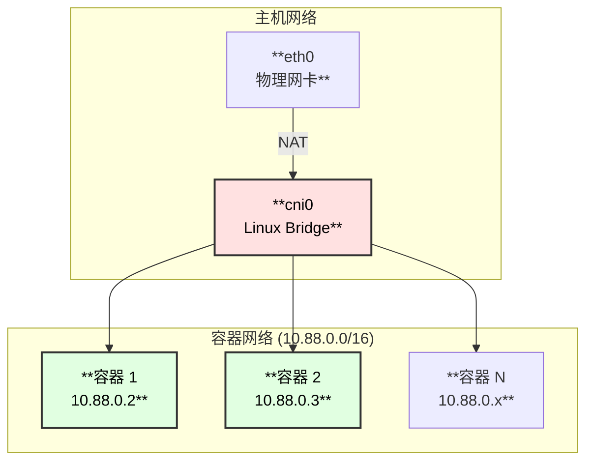
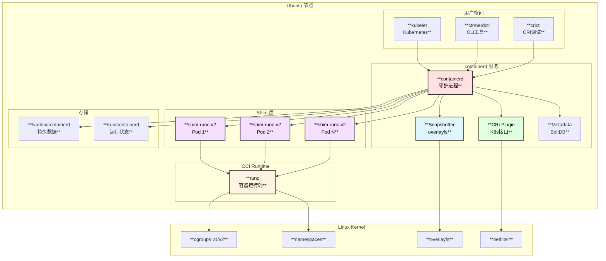

# containerd Ubuntu 部署和维护完整指南

> 基于 containerd v2.1.0 版本

## 概述

本文档提供 containerd 在 Ubuntu 系统上的完整部署和维护方案，涵盖安装、配置、监控、故障排除等各个方面。

---

## ⚡ 单机版一键部署 (推荐)

> **完全可执行的自动化部署脚本**，经过验证可直接在 Ubuntu 22.04/24.04 上运行

### 快速开始

```bash
# 一键部署 (复制整个脚本到终端执行)
curl -fsSL https://raw.githubusercontent.com/containerd/containerd/main/script/setup/install-containerd-release -o /tmp/install.sh && sudo bash /tmp/install.sh

# 或使用下面的完整脚本
```

### 完整一键部署脚本

将以下脚本保存为 `install-containerd.sh` 并执行:

```bash
#!/bin/bash
#===============================================================================
# containerd 单机版一键部署脚本
# 适用系统: Ubuntu 20.04 / 22.04 / 24.04 LTS
# 版本: containerd v2.0.0 + runc v1.2.4 + CNI v1.6.0
#===============================================================================

set -euo pipefail

# 颜色输出
RED='\033[0;31m'
GREEN='\033[0;32m'
YELLOW='\033[1;33m'
BLUE='\033[0;34m'
NC='\033[0m' # No Color

# 版本配置 (可根据需要修改)
CONTAINERD_VERSION="${CONTAINERD_VERSION:-2.0.0}"
RUNC_VERSION="${RUNC_VERSION:-1.2.4}"
CNI_VERSION="${CNI_VERSION:-1.6.0}"
NERDCTL_VERSION="${NERDCTL_VERSION:-1.7.7}"
CRICTL_VERSION="${CRICTL_VERSION:-1.31.1}"

# 架构检测
ARCH=$(uname -m)
case $ARCH in
    x86_64)  ARCH="amd64" ;;
    aarch64) ARCH="arm64" ;;
    *)       echo -e "${RED}不支持的架构: $ARCH${NC}"; exit 1 ;;
esac

log_info()  { echo -e "${BLUE}[INFO]${NC} $1"; }
log_ok()    { echo -e "${GREEN}[OK]${NC} $1"; }
log_warn()  { echo -e "${YELLOW}[WARN]${NC} $1"; }
log_error() { echo -e "${RED}[ERROR]${NC} $1"; }

#-------------------------------------------------------------------------------
# 步骤 1: 系统检查和准备
#-------------------------------------------------------------------------------
prepare_system() {
    log_info "步骤 1/7: 系统准备..."
    
    # 检查是否为 root
    if [[ $EUID -ne 0 ]]; then
        log_error "请使用 root 权限运行此脚本: sudo $0"
        exit 1
    fi
    
    # 检查系统版本
    if ! grep -qE "Ubuntu (20|22|24)" /etc/os-release 2>/dev/null; then
        log_warn "此脚本针对 Ubuntu 20.04/22.04/24.04 测试，其他版本可能有兼容性问题"
    fi
    
    # 更新系统
    apt-get update -qq
    apt-get install -y -qq \
        apt-transport-https \
        ca-certificates \
        curl \
        gnupg \
        lsb-release \
        wget \
        tar \
        iptables \
        jq
    
    log_ok "系统准备完成"
}

#-------------------------------------------------------------------------------
# 步骤 2: 配置内核参数
#-------------------------------------------------------------------------------
configure_kernel() {
    log_info "步骤 2/7: 配置内核参数..."
    
    # 加载内核模块
    cat > /etc/modules-load.d/containerd.conf <<EOF
overlay
br_netfilter
EOF
    
    modprobe overlay || true
    modprobe br_netfilter || true
    
    # 配置 sysctl 参数
    cat > /etc/sysctl.d/99-containerd.conf <<EOF
# 容器网络必需参数
net.bridge.bridge-nf-call-iptables  = 1
net.bridge.bridge-nf-call-ip6tables = 1
net.ipv4.ip_forward                 = 1

# 性能优化
net.core.somaxconn = 32768
net.ipv4.tcp_max_syn_backlog = 32768
fs.file-max = 2097152
fs.inotify.max_user_watches = 524288
fs.inotify.max_user_instances = 8192
EOF
    
    sysctl --system > /dev/null 2>&1
    
    log_ok "内核参数配置完成"
}

#-------------------------------------------------------------------------------
# 步骤 3: 安装 containerd
#-------------------------------------------------------------------------------
install_containerd() {
    log_info "步骤 3/7: 安装 containerd v${CONTAINERD_VERSION}..."
    
    cd /tmp
    
    # 下载 containerd
    CONTAINERD_URL="https://github.com/containerd/containerd/releases/download/v${CONTAINERD_VERSION}/containerd-${CONTAINERD_VERSION}-linux-${ARCH}.tar.gz"
    
    if ! wget -q --show-progress "$CONTAINERD_URL" -O containerd.tar.gz; then
        log_error "下载 containerd 失败，请检查网络连接"
        exit 1
    fi
    
    # 解压安装
    tar Cxzf /usr/local containerd.tar.gz
    rm -f containerd.tar.gz
    
    # 验证安装
    if ! /usr/local/bin/containerd --version > /dev/null 2>&1; then
        log_error "containerd 安装验证失败"
        exit 1
    fi
    
    log_ok "containerd v${CONTAINERD_VERSION} 安装完成"
}

#-------------------------------------------------------------------------------
# 步骤 4: 安装 runc
#-------------------------------------------------------------------------------
install_runc() {
    log_info "步骤 4/7: 安装 runc v${RUNC_VERSION}..."
    
    cd /tmp
    
    RUNC_URL="https://github.com/opencontainers/runc/releases/download/v${RUNC_VERSION}/runc.${ARCH}"
    
    if ! wget -q --show-progress "$RUNC_URL" -O runc; then
        log_error "下载 runc 失败"
        exit 1
    fi
    
    install -m 755 runc /usr/local/sbin/runc
    rm -f runc
    
    # 验证
    if ! /usr/local/sbin/runc --version > /dev/null 2>&1; then
        log_error "runc 安装验证失败"
        exit 1
    fi
    
    log_ok "runc v${RUNC_VERSION} 安装完成"
}

#-------------------------------------------------------------------------------
# 步骤 5: 安装 CNI 插件 (bridge 网络)
#-------------------------------------------------------------------------------
install_cni() {
    log_info "步骤 5/7: 安装 CNI 插件 v${CNI_VERSION}..."
    
    # 创建目录
    mkdir -p /opt/cni/bin
    mkdir -p /etc/cni/net.d
    
    cd /tmp
    
    CNI_URL="https://github.com/containernetworking/plugins/releases/download/v${CNI_VERSION}/cni-plugins-linux-${ARCH}-v${CNI_VERSION}.tgz"
    
    if ! wget -q --show-progress "$CNI_URL" -O cni-plugins.tgz; then
        log_error "下载 CNI 插件失败"
        exit 1
    fi
    
    tar Cxzf /opt/cni/bin cni-plugins.tgz
    rm -f cni-plugins.tgz
    
    # 配置 bridge 网络 (单机版默认网络)
    cat > /etc/cni/net.d/10-containerd-net.conflist <<EOF
{
  "cniVersion": "1.0.0",
  "name": "containerd-net",
  "plugins": [
    {
      "type": "bridge",
      "bridge": "cni0",
      "isGateway": true,
      "ipMasq": true,
      "promiscMode": true,
      "ipam": {
        "type": "host-local",
        "ranges": [
          [{
            "subnet": "10.88.0.0/16",
            "gateway": "10.88.0.1"
          }]
        ],
        "routes": [
          { "dst": "0.0.0.0/0" }
        ]
      }
    },
    {
      "type": "portmap",
      "capabilities": {"portMappings": true}
    }
  ]
}
EOF
    
    log_ok "CNI 插件安装完成 (bridge 网络: 10.88.0.0/16)"
}

#-------------------------------------------------------------------------------
# 步骤 6: 配置 containerd
#-------------------------------------------------------------------------------
configure_containerd() {
    log_info "步骤 6/7: 配置 containerd..."
    
    # 创建配置目录
    mkdir -p /etc/containerd
    mkdir -p /var/lib/containerd
    mkdir -p /run/containerd
    
    # 生成配置文件
    cat > /etc/containerd/config.toml <<'EOF'
# containerd 配置文件
# 版本: v2.x
version = 3

# 数据目录
root = "/var/lib/containerd"
state = "/run/containerd"

# OOM 评分 (越低越不容易被 kill)
oom_score = -999

# gRPC 配置
[grpc]
  address = "/run/containerd/containerd.sock"
  uid = 0
  gid = 0
  max_recv_message_size = 16777216
  max_send_message_size = 16777216

# 调试配置
[debug]
  address = "/run/containerd/debug.sock"
  level = "info"

# 指标配置 (Prometheus)
[metrics]
  address = "127.0.0.1:1338"
  grpc_histogram = false

# 超时配置
[timeouts]
  "io.containerd.timeout.bolt.open" = "0s"
  "io.containerd.timeout.shim.cleanup" = "5s"
  "io.containerd.timeout.shim.load" = "5s"
  "io.containerd.timeout.shim.shutdown" = "3s"
  "io.containerd.timeout.task.state" = "2s"

# 插件配置
[plugins]

  # CRI 插件配置
  [plugins."io.containerd.cri.v1.runtime"]
    # sandbox 镜像
    sandbox_image = "registry.k8s.io/pause:3.10"
    
    # 运行时配置
    [plugins."io.containerd.cri.v1.runtime".containerd]
      snapshotter = "overlayfs"
      default_runtime_name = "runc"
      
      [plugins."io.containerd.cri.v1.runtime".containerd.runtimes.runc]
        runtime_type = "io.containerd.runc.v2"
        
        [plugins."io.containerd.cri.v1.runtime".containerd.runtimes.runc.options]
          # 使用 systemd cgroup (推荐)
          SystemdCgroup = true
    
    # CNI 网络配置
    [plugins."io.containerd.cri.v1.runtime".cni]
      bin_dir = "/opt/cni/bin"
      conf_dir = "/etc/cni/net.d"
      max_conf_num = 1

  # 快照插件
  [plugins."io.containerd.snapshotter.v1.overlayfs"]
    sync_remove = false
EOF
    
    # 创建 systemd 服务文件
    cat > /etc/systemd/system/containerd.service <<'EOF'
[Unit]
Description=containerd container runtime
Documentation=https://containerd.io
After=network.target local-fs.target

[Service]
ExecStartPre=-/sbin/modprobe overlay
ExecStart=/usr/local/bin/containerd

Type=notify
Delegate=yes
KillMode=process
Restart=always
RestartSec=5

# 资源限制
LimitNOFILE=infinity
LimitNPROC=infinity
LimitCORE=infinity

# OOM 保护
OOMScoreAdjust=-999

# 任务限制
TasksMax=infinity

[Install]
WantedBy=multi-user.target
EOF
    
    # 重新加载 systemd
    systemctl daemon-reload
    
    log_ok "containerd 配置完成"
}

#-------------------------------------------------------------------------------
# 步骤 7: 安装 CLI 工具并启动服务
#-------------------------------------------------------------------------------
install_tools_and_start() {
    log_info "步骤 7/7: 安装 CLI 工具并启动服务..."
    
    cd /tmp
    
    # 安装 nerdctl (类 docker CLI)
    NERDCTL_URL="https://github.com/containerd/nerdctl/releases/download/v${NERDCTL_VERSION}/nerdctl-${NERDCTL_VERSION}-linux-${ARCH}.tar.gz"
    if wget -q --show-progress "$NERDCTL_URL" -O nerdctl.tar.gz 2>/dev/null; then
        tar Cxzf /usr/local/bin nerdctl.tar.gz
        rm -f nerdctl.tar.gz
        log_ok "nerdctl v${NERDCTL_VERSION} 安装完成"
    else
        log_warn "nerdctl 下载失败，跳过 (可选组件)"
    fi
    
    # 安装 crictl (CRI 调试工具)
    CRICTL_URL="https://github.com/kubernetes-sigs/cri-tools/releases/download/v${CRICTL_VERSION}/crictl-v${CRICTL_VERSION}-linux-${ARCH}.tar.gz"
    if wget -q --show-progress "$CRICTL_URL" -O crictl.tar.gz 2>/dev/null; then
        tar Cxzf /usr/local/bin crictl.tar.gz
        rm -f crictl.tar.gz
        
        # 配置 crictl
        cat > /etc/crictl.yaml <<EOF
runtime-endpoint: unix:///run/containerd/containerd.sock
image-endpoint: unix:///run/containerd/containerd.sock
timeout: 10
debug: false
EOF
        log_ok "crictl v${CRICTL_VERSION} 安装完成"
    else
        log_warn "crictl 下载失败，跳过 (可选组件)"
    fi
    
    # 启动 containerd
    systemctl enable containerd
    systemctl start containerd
    
    # 等待服务就绪
    sleep 2
    
    if systemctl is-active --quiet containerd; then
        log_ok "containerd 服务已启动"
    else
        log_error "containerd 服务启动失败"
        journalctl -u containerd -n 20 --no-pager
        exit 1
    fi
}

#-------------------------------------------------------------------------------
# 验证安装
#-------------------------------------------------------------------------------
verify_installation() {
    echo ""
    echo "============================================================"
    echo -e "${GREEN}🎉 安装完成！以下是验证信息:${NC}"
    echo "============================================================"
    echo ""
    
    echo -e "${BLUE}[版本信息]${NC}"
    echo "containerd: $(/usr/local/bin/containerd --version)"
    echo "runc:       $(/usr/local/sbin/runc --version | head -1)"
    [ -f /usr/local/bin/nerdctl ] && echo "nerdctl:    $(/usr/local/bin/nerdctl --version)"
    [ -f /usr/local/bin/crictl ] && echo "crictl:     $(/usr/local/bin/crictl --version)"
    echo ""
    
    echo -e "${BLUE}[服务状态]${NC}"
    systemctl status containerd --no-pager -l | head -10
    echo ""
    
    echo -e "${BLUE}[Socket 文件]${NC}"
    ls -la /run/containerd/containerd.sock
    echo ""
    
    echo -e "${BLUE}[CNI 网络]${NC}"
    cat /etc/cni/net.d/10-containerd-net.conflist | jq -r '.name, .plugins[0].ipam.ranges[0][0].subnet'
    echo ""
    
    echo "============================================================"
    echo -e "${GREEN}快速测试命令:${NC}"
    echo "============================================================"
    echo ""
    echo "# 使用 ctr (containerd 原生 CLI)"
    echo "sudo ctr images pull docker.io/library/hello-world:latest"
    echo "sudo ctr run --rm docker.io/library/hello-world:latest test"
    echo ""
    echo "# 使用 nerdctl (类 docker 命令)"
    echo "sudo nerdctl run --rm hello-world"
    echo "sudo nerdctl run -d --name nginx -p 8080:80 nginx:alpine"
    echo "sudo nerdctl ps"
    echo "sudo nerdctl stop nginx && sudo nerdctl rm nginx"
    echo ""
    echo "# 查看日志"
    echo "sudo journalctl -u containerd -f"
    echo ""
}

#-------------------------------------------------------------------------------
# 主函数
#-------------------------------------------------------------------------------
main() {
    echo "============================================================"
    echo -e "${GREEN}containerd 单机版一键部署脚本${NC}"
    echo "============================================================"
    echo ""
    echo "将安装以下组件:"
    echo "  - containerd v${CONTAINERD_VERSION}"
    echo "  - runc v${RUNC_VERSION}"
    echo "  - CNI 插件 v${CNI_VERSION} (bridge 网络)"
    echo "  - nerdctl v${NERDCTL_VERSION} (可选)"
    echo "  - crictl v${CRICTL_VERSION} (可选)"
    echo ""
    echo "目标架构: ${ARCH}"
    echo ""
    
    # 执行安装步骤
    prepare_system
    configure_kernel
    install_containerd
    install_runc
    install_cni
    configure_containerd
    install_tools_and_start
    verify_installation
}

# 运行主函数
main "$@"
```

### 执行部署

```bash
# 方式 1: 直接下载执行
curl -fsSL https://gist.githubusercontent.com/.../install-containerd.sh | sudo bash

# 方式 2: 保存后执行
chmod +x install-containerd.sh
sudo ./install-containerd.sh

# 方式 3: 指定版本
sudo CONTAINERD_VERSION=2.0.0 RUNC_VERSION=1.2.4 ./install-containerd.sh
```

### 验证部署

```bash
# 检查服务状态
sudo systemctl status containerd

# 拉取测试镜像
sudo ctr images pull docker.io/library/nginx:alpine

# 运行测试容器
sudo nerdctl run -d --name nginx-test -p 8080:80 nginx:alpine

# 测试访问
curl http://localhost:8080

# 清理
sudo nerdctl stop nginx-test && sudo nerdctl rm nginx-test
```

### 单机版网络架构



---

## 系统要求

### 硬件要求

| 组件 | 最低要求 | 推荐配置 |
|------|---------|---------|
| CPU | 2 核 | 4+ 核 |
| 内存 | 2 GB | 4+ GB |
| 磁盘 | 20 GB | 100+ GB (SSD) |

### 软件要求

| 软件 | 版本要求 |
|------|---------|
| Ubuntu | 20.04 LTS / 22.04 LTS / 24.04 LTS |
| Linux Kernel | >= 4.15 (推荐 >= 5.4) |
| iptables/nftables | 最新版本 |

## 部署架构图



## 安装方法

### 方法一：二进制安装 (推荐生产环境)

#### 步骤 1: 系统准备

```bash
#!/bin/bash
# 系统准备脚本

# 更新系统
sudo apt-get update
sudo apt-get upgrade -y

# 安装必要依赖
sudo apt-get install -y \
    apt-transport-https \
    ca-certificates \
    curl \
    gnupg \
    lsb-release \
    wget

# 加载必要的内核模块
cat <<EOF | sudo tee /etc/modules-load.d/containerd.conf
overlay
br_netfilter
EOF

sudo modprobe overlay
sudo modprobe br_netfilter

# 配置内核参数
cat <<EOF | sudo tee /etc/sysctl.d/99-kubernetes-cri.conf
net.bridge.bridge-nf-call-iptables  = 1
net.bridge.bridge-nf-call-ip6tables = 1
net.ipv4.ip_forward                 = 1
EOF

sudo sysctl --system
```

#### 步骤 2: 安装 containerd

```bash
#!/bin/bash
# containerd 安装脚本

# 设置版本号
CONTAINERD_VERSION="2.0.0"
ARCH="amd64"  # 或 arm64

# 下载 containerd
wget https://github.com/containerd/containerd/releases/download/v${CONTAINERD_VERSION}/containerd-${CONTAINERD_VERSION}-linux-${ARCH}.tar.gz

# 验证校验和
wget https://github.com/containerd/containerd/releases/download/v${CONTAINERD_VERSION}/containerd-${CONTAINERD_VERSION}-linux-${ARCH}.tar.gz.sha256sum
sha256sum -c containerd-${CONTAINERD_VERSION}-linux-${ARCH}.tar.gz.sha256sum

# 解压到 /usr/local
sudo tar Cxzvf /usr/local containerd-${CONTAINERD_VERSION}-linux-${ARCH}.tar.gz

# 清理下载文件
rm containerd-${CONTAINERD_VERSION}-linux-${ARCH}.tar.gz*
```

#### 步骤 3: 安装 runc

```bash
#!/bin/bash
# runc 安装脚本

RUNC_VERSION="1.2.0"
ARCH="amd64"

# 下载 runc
wget https://github.com/opencontainers/runc/releases/download/v${RUNC_VERSION}/runc.${ARCH}

# 安装 runc
sudo install -m 755 runc.${ARCH} /usr/local/sbin/runc

# 验证安装
runc --version

# 清理
rm runc.${ARCH}
```

#### 步骤 4: 安装 CNI 插件

```bash
#!/bin/bash
# CNI 插件安装脚本

CNI_VERSION="1.4.0"
ARCH="amd64"

# 创建目录
sudo mkdir -p /opt/cni/bin

# 下载 CNI 插件
wget https://github.com/containernetworking/plugins/releases/download/v${CNI_VERSION}/cni-plugins-linux-${ARCH}-v${CNI_VERSION}.tgz

# 解压
sudo tar Cxzvf /opt/cni/bin cni-plugins-linux-${ARCH}-v${CNI_VERSION}.tgz

# 清理
rm cni-plugins-linux-${ARCH}-v${CNI_VERSION}.tgz
```

#### 步骤 5: 配置 systemd 服务

```bash
#!/bin/bash
# systemd 服务配置脚本

# 创建 systemd 服务文件目录
sudo mkdir -p /usr/local/lib/systemd/system

# 下载 systemd 服务文件
sudo wget -O /usr/local/lib/systemd/system/containerd.service \
    https://raw.githubusercontent.com/containerd/containerd/main/containerd.service

# 或者手动创建服务文件
cat <<EOF | sudo tee /usr/local/lib/systemd/system/containerd.service
[Unit]
Description=containerd container runtime
Documentation=https://containerd.io
After=network.target local-fs.target

[Service]
ExecStartPre=-/sbin/modprobe overlay
ExecStart=/usr/local/bin/containerd

Type=notify
Delegate=yes
KillMode=process
Restart=always
RestartSec=5

# 限制文件描述符
LimitNOFILE=infinity
LimitNPROC=infinity
LimitCORE=infinity

# 设置 OOM Score
OOMScoreAdjust=-999

# 任务限制
TasksMax=infinity

[Install]
WantedBy=multi-user.target
EOF

# 重新加载 systemd
sudo systemctl daemon-reload

# 启用并启动 containerd
sudo systemctl enable --now containerd

# 检查状态
sudo systemctl status containerd
```

### 方法二：APT 包管理器安装

```bash
#!/bin/bash
# APT 安装脚本 (Docker 官方源)

# 添加 Docker 官方 GPG 密钥
sudo install -m 0755 -d /etc/apt/keyrings
curl -fsSL https://download.docker.com/linux/ubuntu/gpg | sudo gpg --dearmor -o /etc/apt/keyrings/docker.gpg
sudo chmod a+r /etc/apt/keyrings/docker.gpg

# 添加 Docker 仓库
echo \
  "deb [arch=$(dpkg --print-architecture) signed-by=/etc/apt/keyrings/docker.gpg] https://download.docker.com/linux/ubuntu \
  $(. /etc/os-release && echo "$VERSION_CODENAME") stable" | \
  sudo tee /etc/apt/sources.list.d/docker.list > /dev/null

# 更新包列表
sudo apt-get update

# 安装 containerd.io
sudo apt-get install -y containerd.io

# 启用服务
sudo systemctl enable --now containerd
```

## 配置详解

### 生成默认配置

```bash
# 创建配置目录
sudo mkdir -p /etc/containerd

# 生成默认配置文件
sudo containerd config default | sudo tee /etc/containerd/config.toml
```

### 完整配置文件示例

```toml
# /etc/containerd/config.toml
# containerd v2.x 配置文件

version = 3

# 根目录配置
root = "/var/lib/containerd"
state = "/run/containerd"

# 临时目录 (用于大文件操作)
temp = ""

# 插件目录
plugin_dir = ""

# 禁用的插件列表
disabled_plugins = []

# 必需的插件列表
required_plugins = []

# OOM 评分 (越低越不容易被 kill)
oom_score = -999

# 导入其他配置文件
imports = []

# gRPC 配置
[grpc]
  address = "/run/containerd/containerd.sock"
  tcp_address = ""
  tcp_tls_ca = ""
  tcp_tls_cert = ""
  tcp_tls_key = ""
  uid = 0
  gid = 0
  max_recv_message_size = 16777216
  max_send_message_size = 16777216

# ttrpc 配置 (用于 shim 通信)
[ttrpc]
  address = ""
  uid = 0
  gid = 0

# 调试配置
[debug]
  address = "/run/containerd/debug.sock"
  uid = 0
  gid = 0
  level = "info"
  format = ""

# 指标配置 (Prometheus)
[metrics]
  address = "127.0.0.1:1338"
  grpc_histogram = false

# cgroup 配置
[cgroup]
  path = ""

# 超时配置
[timeouts]
  "io.containerd.timeout.bolt.open" = "0s"
  "io.containerd.timeout.metrics.shimstats" = "2s"
  "io.containerd.timeout.shim.cleanup" = "5s"
  "io.containerd.timeout.shim.load" = "5s"
  "io.containerd.timeout.shim.shutdown" = "3s"
  "io.containerd.timeout.task.state" = "2s"

# 流处理器配置 (用于镜像解压)
[stream_processors]
  [stream_processors."io.containerd.ocicrypt.decoder.v1.tar"]
    accepts = ["application/vnd.oci.image.layer.v1.tar+encrypted"]
    returns = "application/vnd.oci.image.layer.v1.tar"
    path = "ctd-decoder"
    args = ["--decryption-keys-path", "/etc/containerd/ocicrypt/keys"]
  [stream_processors."io.containerd.ocicrypt.decoder.v1.tar.gzip"]
    accepts = ["application/vnd.oci.image.layer.v1.tar+gzip+encrypted"]
    returns = "application/vnd.oci.image.layer.v1.tar+gzip"
    path = "ctd-decoder"
    args = ["--decryption-keys-path", "/etc/containerd/ocicrypt/keys"]

# 插件配置
[plugins]

  # CRI 插件配置
  [plugins."io.containerd.cri.v1.runtime"]
    # sandbox (pause) 镜像
    sandbox_image = "registry.k8s.io/pause:3.10"
    
    # 是否容忍已弃用的 CRI 版本
    tolerate_missing_hugetlb_controller = true
    
    # 容器注解传递
    disable_apparmor = false
    
    # 限制 proc 访问
    restrict_oom_score_adj = false
    
    # Pod 最大并发启动数
    max_concurrent_downloads = 3
    max_container_log_line_size = 16384
    
    # 镜像解密配置
    image_decryption_keys_path = ""
    enable_unprivileged_ports = false
    enable_unprivileged_icmp = false
    
    # 容器运行时
    [plugins."io.containerd.cri.v1.runtime".containerd]
      snapshotter = "overlayfs"
      default_runtime_name = "runc"
      no_pivot = false
      disable_snapshot_annotations = true
      discard_unpacked_layers = false
      
      [plugins."io.containerd.cri.v1.runtime".containerd.default_runtime]
        runtime_type = ""
        runtime_path = ""
        privileged_without_host_devices = false
        
      [plugins."io.containerd.cri.v1.runtime".containerd.runtimes]
        [plugins."io.containerd.cri.v1.runtime".containerd.runtimes.runc]
          runtime_type = "io.containerd.runc.v2"
          runtime_path = ""
          privileged_without_host_devices = false
          privileged_without_host_devices_all_devices_allowed = false
          
          [plugins."io.containerd.cri.v1.runtime".containerd.runtimes.runc.options]
            SystemdCgroup = true
            BinaryName = ""
            Root = ""
            NoPivotRoot = false
            NoNewKeyring = false
            ShimCgroup = ""
            IoUid = 0
            IoGid = 0
    
    # CNI 网络配置
    [plugins."io.containerd.cri.v1.runtime".cni]
      bin_dir = "/opt/cni/bin"
      conf_dir = "/etc/cni/net.d"
      max_conf_num = 1
      conf_template = ""
      ip_pref = ""
    
    # 镜像仓库配置
    [plugins."io.containerd.cri.v1.runtime".registry]
      config_path = "/etc/containerd/certs.d"
      
    # 镜像配置
    [plugins."io.containerd.cri.v1.runtime".image_decryption]
      key_model = "node"
      
  # 快照插件配置
  [plugins."io.containerd.snapshotter.v1.overlayfs"]
    root_path = ""
    upperdir_label = false
    sync_remove = false
    slow_chown = false
    
  # 内容存储插件配置
  [plugins."io.containerd.content.v1.content"]
    content_sharing_policy = "shared"
```

### Kubernetes 集成配置

```toml
# /etc/containerd/config.toml - Kubernetes 优化配置

version = 3

[plugins."io.containerd.cri.v1.runtime"]
  sandbox_image = "registry.k8s.io/pause:3.10"
  
  [plugins."io.containerd.cri.v1.runtime".containerd]
    snapshotter = "overlayfs"
    default_runtime_name = "runc"
    
    [plugins."io.containerd.cri.v1.runtime".containerd.runtimes.runc]
      runtime_type = "io.containerd.runc.v2"
      
      [plugins."io.containerd.cri.v1.runtime".containerd.runtimes.runc.options]
        # 使用 systemd cgroup 驱动 (与 kubelet 一致)
        SystemdCgroup = true
```

### 镜像加速配置

```bash
# 创建镜像仓库配置目录
sudo mkdir -p /etc/containerd/certs.d/docker.io

# 配置 Docker Hub 镜像加速
cat <<EOF | sudo tee /etc/containerd/certs.d/docker.io/hosts.toml
server = "https://docker.io"

[host."https://mirror.ccs.tencentyun.com"]
  capabilities = ["pull", "resolve"]

[host."https://registry-1.docker.io"]
  capabilities = ["pull", "resolve", "push"]
EOF
```

## 日常运维

### 服务管理

```bash
# 启动 containerd
sudo systemctl start containerd

# 停止 containerd (不影响运行中的容器)
sudo systemctl stop containerd

# 重启 containerd
sudo systemctl restart containerd

# 重新加载配置 (不重启服务)
sudo systemctl reload containerd

# 查看状态
sudo systemctl status containerd

# 查看日志
sudo journalctl -u containerd -f
sudo journalctl -u containerd --since "1 hour ago"
sudo journalctl -u containerd -n 100 --no-pager
```

### CLI 工具使用

#### ctr (containerd 原生 CLI)

```bash
# 查看帮助
ctr --help

# 指定命名空间 (默认为 default, Kubernetes 使用 k8s.io)
ctr -n k8s.io <command>

# 镜像操作
ctr images ls                              # 列出镜像
ctr images pull docker.io/library/nginx    # 拉取镜像
ctr images rm docker.io/library/nginx      # 删除镜像
ctr images export nginx.tar docker.io/library/nginx  # 导出镜像
ctr images import nginx.tar                # 导入镜像

# 容器操作
ctr containers ls                          # 列出容器
ctr containers create <image> <container>  # 创建容器
ctr containers rm <container>              # 删除容器
ctr containers info <container>            # 查看容器详情

# 任务 (运行中的容器进程)
ctr tasks ls                               # 列出任务
ctr tasks start <container>                # 启动任务
ctr tasks kill <container>                 # 终止任务
ctr tasks rm <container>                   # 删除任务
ctr tasks exec --exec-id <id> <container> <cmd>  # 在容器中执行命令

# 快照操作
ctr snapshots ls                           # 列出快照
ctr snapshots rm <snapshot>                # 删除快照

# 命名空间
ctr namespaces ls                          # 列出命名空间
ctr namespaces create <name>               # 创建命名空间
```

#### crictl (CRI 调试工具)

```bash
# 安装 crictl
VERSION="v1.29.0"
wget https://github.com/kubernetes-sigs/cri-tools/releases/download/$VERSION/crictl-$VERSION-linux-amd64.tar.gz
sudo tar zxvf crictl-$VERSION-linux-amd64.tar.gz -C /usr/local/bin
rm crictl-$VERSION-linux-amd64.tar.gz

# 配置 crictl
cat <<EOF | sudo tee /etc/crictl.yaml
runtime-endpoint: unix:///run/containerd/containerd.sock
image-endpoint: unix:///run/containerd/containerd.sock
timeout: 10
debug: false
EOF

# 常用命令
crictl info                    # 查看运行时信息
crictl ps                      # 列出容器
crictl ps -a                   # 列出所有容器
crictl pods                    # 列出 Pod
crictl images                  # 列出镜像
crictl pull <image>            # 拉取镜像
crictl logs <container-id>     # 查看日志
crictl exec -it <id> /bin/sh   # 进入容器
crictl stats                   # 查看资源使用
crictl inspect <container-id>  # 检查容器
crictl inspectp <pod-id>       # 检查 Pod
```

#### nerdctl (用户友好 CLI)

```bash
# 安装 nerdctl
VERSION="1.7.0"
wget https://github.com/containerd/nerdctl/releases/download/v$VERSION/nerdctl-$VERSION-linux-amd64.tar.gz
sudo tar Cxzvf /usr/local/bin nerdctl-$VERSION-linux-amd64.tar.gz

# 使用 (类似 docker 命令)
sudo nerdctl run -d --name nginx nginx
sudo nerdctl ps
sudo nerdctl logs nginx
sudo nerdctl exec -it nginx /bin/sh
sudo nerdctl stop nginx
sudo nerdctl rm nginx
```

## 监控和告警

### Prometheus 指标采集

```yaml
# prometheus.yml 配置
scrape_configs:
  - job_name: 'containerd'
    static_configs:
      - targets: ['localhost:1338']
```

### 常用监控指标

```
# containerd 进程指标
containerd_goroutines                    # goroutine 数量
containerd_go_memstats_alloc_bytes       # 内存分配

# 容器指标
containerd_container_count               # 容器数量
containerd_task_operations_seconds       # 任务操作耗时

# gRPC 指标
containerd_grpc_request_duration_seconds # gRPC 请求延迟
containerd_grpc_request_total            # gRPC 请求总数
```

### Grafana Dashboard

推荐使用社区 Dashboard ID: 14282 (containerd Dashboard)

### 告警规则示例

```yaml
# alertmanager rules
groups:
- name: containerd
  rules:
  - alert: ContainerdDown
    expr: up{job="containerd"} == 0
    for: 5m
    labels:
      severity: critical
    annotations:
      summary: "containerd 服务不可用"
      
  - alert: ContainerdHighGoroutines
    expr: containerd_goroutines > 1000
    for: 10m
    labels:
      severity: warning
    annotations:
      summary: "containerd goroutine 数量过高"
      
  - alert: ContainerdHighMemory
    expr: containerd_go_memstats_alloc_bytes > 1073741824
    for: 10m
    labels:
      severity: warning
    annotations:
      summary: "containerd 内存使用过高 (> 1GB)"
```

## 故障排除

### 常见问题及解决方案

#### 1. containerd 无法启动

```bash
# 检查服务状态
sudo systemctl status containerd

# 查看详细日志
sudo journalctl -u containerd -xe

# 常见原因:
# 1. 配置文件语法错误
sudo containerd config dump  # 验证配置

# 2. socket 文件权限问题
ls -la /run/containerd/containerd.sock

# 3. 端口被占用
sudo lsof -i :1338
```

#### 2. 容器无法启动

```bash
# 检查 shim 进程
ps aux | grep containerd-shim

# 查看容器日志
sudo ctr -n k8s.io tasks ls
sudo crictl logs <container-id>

# 检查 runc
runc --version
sudo runc list

# 检查 cgroup
cat /proc/cgroups
mount | grep cgroup
```

#### 3. 镜像拉取失败

```bash
# 测试镜像拉取
sudo ctr images pull docker.io/library/nginx

# 检查网络连接
curl -v https://registry-1.docker.io/v2/

# 检查 DNS 解析
nslookup registry-1.docker.io

# 检查代理配置
cat /etc/systemd/system/containerd.service.d/http-proxy.conf

# 配置代理
sudo mkdir -p /etc/systemd/system/containerd.service.d
cat <<EOF | sudo tee /etc/systemd/system/containerd.service.d/http-proxy.conf
[Service]
Environment="HTTP_PROXY=http://proxy.example.com:8080"
Environment="HTTPS_PROXY=http://proxy.example.com:8080"
Environment="NO_PROXY=localhost,127.0.0.1,.example.com"
EOF
sudo systemctl daemon-reload
sudo systemctl restart containerd
```

#### 4. 磁盘空间不足

```bash
# 查看磁盘使用
df -h /var/lib/containerd

# 清理未使用的镜像
sudo ctr images ls -q | xargs sudo ctr images rm

# 清理 Kubernetes 未使用的镜像
sudo crictl rmi --prune

# 清理所有未使用的资源
sudo nerdctl system prune -a
```

#### 5. OOM Kill

```bash
# 检查 OOM 事件
dmesg | grep -i oom

# 调整 containerd OOM 评分
# 在配置文件中设置 oom_score = -999

# 检查容器内存限制
sudo crictl stats
```

### 调试模式

```bash
# 启用调试日志
# 修改 /etc/containerd/config.toml
[debug]
  level = "debug"

# 或者使用命令行参数
sudo containerd --log-level debug

# 使用 debug socket
sudo ctr --debug --address /run/containerd/debug.sock version
```

## 升级和回滚

### 升级流程

```bash
#!/bin/bash
# containerd 升级脚本

set -e

NEW_VERSION="2.1.0"
BACKUP_DIR="/root/containerd-backup-$(date +%Y%m%d)"

echo "=== 备份当前版本 ==="
mkdir -p $BACKUP_DIR
cp /usr/local/bin/containerd* $BACKUP_DIR/
cp /etc/containerd/config.toml $BACKUP_DIR/

echo "=== 下载新版本 ==="
wget https://github.com/containerd/containerd/releases/download/v${NEW_VERSION}/containerd-${NEW_VERSION}-linux-amd64.tar.gz

echo "=== 停止服务 (容器继续运行) ==="
sudo systemctl stop containerd

echo "=== 安装新版本 ==="
sudo tar Cxzvf /usr/local containerd-${NEW_VERSION}-linux-amd64.tar.gz

echo "=== 启动服务 ==="
sudo systemctl start containerd

echo "=== 验证版本 ==="
containerd --version

echo "=== 升级完成 ==="
```

### 回滚流程

```bash
#!/bin/bash
# containerd 回滚脚本

BACKUP_DIR="/root/containerd-backup-XXXXXXXX"  # 修改为实际备份目录

echo "=== 停止服务 ==="
sudo systemctl stop containerd

echo "=== 恢复旧版本 ==="
sudo cp $BACKUP_DIR/containerd* /usr/local/bin/
sudo cp $BACKUP_DIR/config.toml /etc/containerd/

echo "=== 启动服务 ==="
sudo systemctl start containerd

echo "=== 验证版本 ==="
containerd --version

echo "=== 回滚完成 ==="
```

## 安全加固

### 1. 限制 socket 访问

```bash
# 创建 containerd 组
sudo groupadd containerd

# 将用户添加到组
sudo usermod -aG containerd $USER

# 配置 socket 权限
# /etc/containerd/config.toml
[grpc]
  address = "/run/containerd/containerd.sock"
  uid = 0
  gid = 1000  # containerd 组 GID
```

### 2. 启用 seccomp

```bash
# 默认 seccomp 配置
sudo mkdir -p /etc/containerd/
wget -O /etc/containerd/default-seccomp.json \
  https://raw.githubusercontent.com/containerd/containerd/main/contrib/seccomp/seccomp_default.go
```

### 3. 启用 AppArmor

```bash
# 检查 AppArmor 状态
sudo aa-status

# 加载 containerd 配置文件
sudo apparmor_parser -r /etc/apparmor.d/containerd
```

### 4. 启用审计日志

```bash
# /etc/audit/rules.d/containerd.rules
-w /usr/local/bin/containerd -p x -k containerd
-w /usr/local/bin/runc -p x -k runc
-w /run/containerd/containerd.sock -p rwxa -k containerd_socket
```

## 性能调优

### 1. 文件描述符限制

```bash
# /etc/security/limits.d/containerd.conf
*       soft    nofile  1048576
*       hard    nofile  1048576
root    soft    nofile  1048576
root    hard    nofile  1048576
```

### 2. 内核参数调优

```bash
# /etc/sysctl.d/99-containerd.conf
# 网络调优
net.core.somaxconn = 32768
net.ipv4.tcp_max_syn_backlog = 32768
net.core.netdev_max_backlog = 32768

# 文件系统调优
fs.file-max = 2097152
fs.inotify.max_user_watches = 524288
fs.inotify.max_user_instances = 8192

# 内存调优
vm.overcommit_memory = 1
vm.max_map_count = 262144
```

### 3. overlayfs 调优

```bash
# 检查 overlayfs 支持
cat /proc/filesystems | grep overlay

# 启用 metacopy 特性 (如果内核支持)
echo "Y" | sudo tee /sys/module/overlay/parameters/metacopy
```

## 总结

本文档提供了 containerd 在 Ubuntu 上的完整部署和维护指南，包括:

1. **安装方法**: 二进制安装和 APT 包管理器安装两种方式
2. **配置详解**: 完整的配置文件示例和 Kubernetes 集成配置
3. **日常运维**: 服务管理和 CLI 工具使用
4. **监控告警**: Prometheus 指标和告警规则
5. **故障排除**: 常见问题和调试方法
6. **升级回滚**: 平滑升级和快速回滚流程
7. **安全加固**: 多层次的安全配置
8. **性能调优**: 系统级和应用级优化

建议在生产环境部署前，在测试环境充分验证配置和流程
