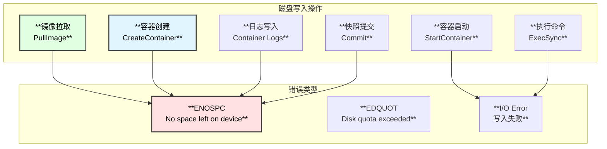
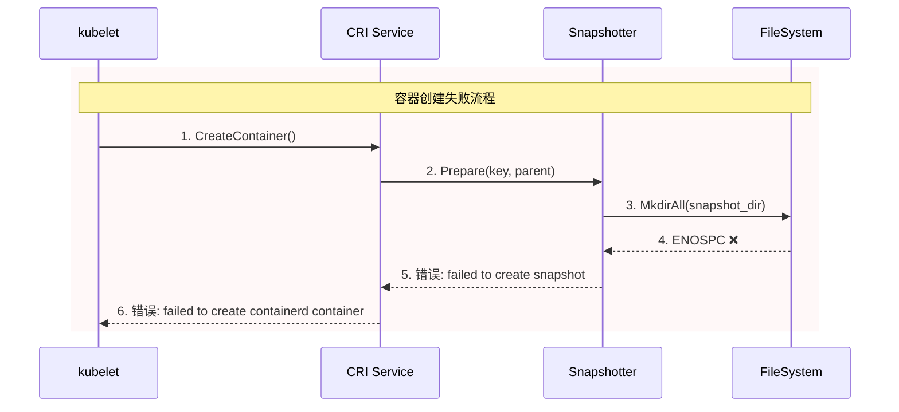
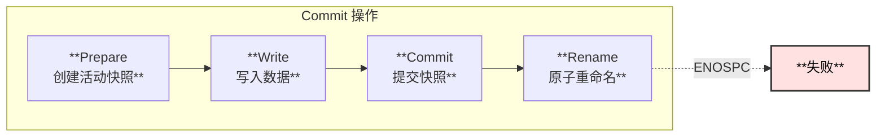
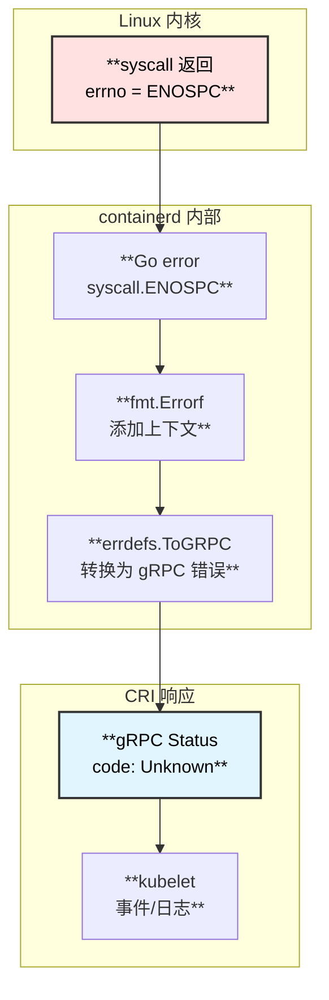
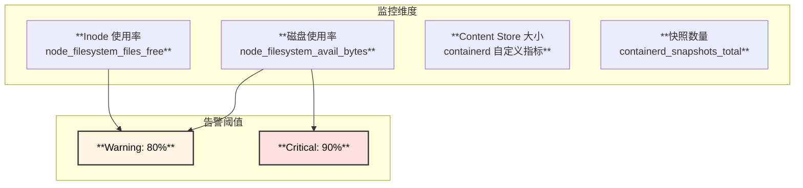
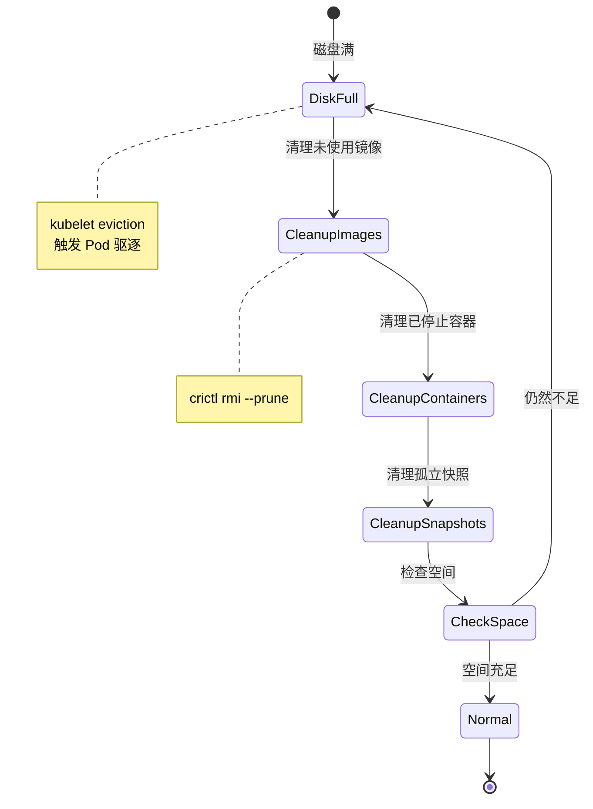

# containerd 磁盘空间不足错误分析

> 基于 containerd v2.1.0 版本源码分析

## 概述

当 containerd 运行的存储目录 (通常是 `/var/lib/containerd`) 磁盘空间不足时，会在多个操作环节产生错误。本文档详细分析这些错误的来源、表现形式，以及它们如何通过 CRI 接口返回给 kubelet。

## 磁盘空间不足影响的操作

### 受影响操作概览



---

## 错误场景详解

### 1. 镜像拉取失败

#### 触发位置

```
PullImage (CRI)
└── Transfer Service
    └── Content Store
        └── Writer.Write() ← ENOSPC
```

#### 错误信息

```
failed to copy: write /var/lib/containerd/io.containerd.content.v1.content/ingest/xxx: 
no space left on device
```

#### CRI 返回

```go
// 错误会包装后返回给 kubelet
return nil, fmt.Errorf("failed to pull image %q: %w", ref, err)

// kubelet 收到的错误
rpc error: code = Unknown desc = failed to pull image "nginx:latest": 
failed to copy: write /var/lib/containerd/.../ingest/xxx: no space left on device
```

#### 源码位置

```go
// core/content/helpers.go:202
func CopyReaderAt(cw Writer, ra ReaderAt, n int64) error {
    _, err := io.CopyN(cw, io.NewSectionReader(ra, 0, n), n)
    if err != nil {
        // Short writes would return its own error, this indicates a read failure
        return fmt.Errorf("write failed: %w", err)
    }
    return nil
}
```

---

### 2. 容器创建失败

#### 触发位置



#### 错误信息

**快照创建失败：**

```
failed to create containerd container: failed to create snapshot: 
failed to create prepare snapshot dir: failed to create temp dir: 
mkdir /var/lib/containerd/.../snapshots/new-xxx: no space left on device
```

**容器根目录创建失败：**

```
failed to create container root directory "/var/lib/containerd/io.containerd.grpc.v1.cri/containers/xxx": 
mkdir /var/lib/containerd/.../containers/xxx: no space left on device
```

#### CRI 错误返回

```go
// internal/cri/server/container_create.go:229
if err := c.os.MkdirAll(containerRootDir, 0755); err != nil {
    return "", fmt.Errorf(
        "failed to create container root directory %q: %w",
        containerRootDir,
        err,  // 底层 ENOSPC 错误
    )
}

// 最终返回给 kubelet
return nil, fmt.Errorf("failed to create containerd container: %w", err)
```

---

### 3. 容器启动失败

#### 触发位置

```
StartContainer (CRI)
└── Task.Start()
    └── shim.Start()
        └── runc.Start()
            └── 写入状态文件 ← ENOSPC
```

#### 错误信息

```
failed to start containerd task "xxx": 
OCI runtime create failed: unable to start container process: 
error during container init: write /run/containerd/.../init.pid: no space left on device
```

```
failed to create shim task: 
OCI runtime create failed: runc create failed: 
unable to start container process: error during container init: 
open /dev/null: no space left on device
```

---

### 4. 日志写入失败

#### 触发位置

```
Container Runtime
└── Log Driver
    └── fifo/file Writer
        └── Write() ← ENOSPC
```

#### 错误信息

```
error writing container logs: write /var/log/pods/xxx/container/0.log: 
no space left on device
```

#### 影响

- 容器日志可能不完整
- 日志轮转可能失败
- 容器本身通常不会因此停止

---

### 5. 快照提交失败

#### 触发位置



#### 错误信息

```
failed to commit snapshot xxx: 
failed to rename: rename /var/lib/containerd/.../new-xxx /var/lib/containerd/.../xxx: 
no space left on device
```

---

## CRI 错误返回汇总

### 错误传播链路



### CRI 操作与错误对照表

| CRI 操作 | 可能的磁盘错误 | gRPC 状态码 | 错误消息关键词 |
|---------|--------------|------------|--------------|
| **PullImage** | 内容写入失败 | Unknown | `failed to copy`, `no space left` |
| **CreateContainer** | 快照/目录创建失败 | Unknown | `failed to create snapshot`, `mkdir` |
| **StartContainer** | 状态文件写入失败 | Unknown | `OCI runtime create failed` |
| **ExecSync** | 临时文件写入失败 | Unknown | `failed to create exec` |
| **Attach** | FIFO 创建失败 | Unknown | `failed to create fifo` |
| **PortForward** | 临时文件写入失败 | Unknown | `failed to create port forward` |

---

## 错误处理源码分析

### Snapshotter 错误处理

```go
// plugins/snapshots/overlay/overlay.go:455
func (o *snapshotter) createSnapshot(...) ([]mount.Mount, error) {
    // ...
    td, err = o.prepareDirectory(ctx, snapshotDir, kind)
    if err != nil {
        return fmt.Errorf("failed to create prepare snapshot dir: %w", err)
    }
    // ...
}

// plugins/snapshots/overlay/overlay.go:536
func (o *snapshotter) prepareDirectory(...) (string, error) {
    td, err := os.MkdirTemp(snapshotDir, "new-")
    if err != nil {
        // 这里会捕获 ENOSPC
        return "", fmt.Errorf("failed to create temp dir: %w", err)
    }
    // ...
}
```

### CRI Service 错误处理

```go
// internal/cri/server/container_create.go:429
if cntr, err = c.client.NewContainer(r.ctx, r.containerID, opts...); err != nil {
    // 错误会被包装并返回给 kubelet
    return "", fmt.Errorf("failed to create containerd container: %w", err)
}

// internal/cri/server/image_pull.go
func (c *criService) PullImage(ctx context.Context, r *runtime.PullImageRequest) (*runtime.PullImageResponse, error) {
    // ...
    if err != nil {
        return nil, fmt.Errorf("failed to pull image %q: %w", ref, err)
    }
    // ...
}
```

### Task 错误处理

```go
// client/task.go
func (t *task) Start(ctx context.Context) error {
    response, err := t.client.TaskService().Start(ctx, &tasks.StartRequest{
        ContainerID: t.id,
    })
    if err != nil {
        // shim/runc 的错误会被传递
        return errdefs.FromGRPC(err)
    }
    // ...
}
```

---

## 监控与预防

### 监控指标



### 预防措施

```bash
# 1. 配置镜像垃圾回收
cat <<EOF >> /etc/containerd/config.toml
[plugins."io.containerd.gc.v1.scheduler"]
  pause_threshold = 0.02
  deletion_threshold = 0
  mutation_threshold = 100
  schedule_delay = "0s"
  startup_delay = "100ms"
EOF

# 2. 配置 kubelet 镜像垃圾回收
cat <<EOF >> /var/lib/kubelet/config.yaml
imageGCHighThresholdPercent: 85
imageGCLowThresholdPercent: 80
EOF

# 3. 清理未使用的镜像
crictl rmi --prune

# 4. 清理未使用的容器
crictl rm $(crictl ps -a -q --state exited)
```

---

## 错误恢复

### 自动恢复流程



### 手动清理命令

```bash
# 检查磁盘使用
df -h /var/lib/containerd

# 查看 containerd 存储分布
du -sh /var/lib/containerd/io.containerd.*

# 清理 content store 中的未引用内容
ctr content ls | grep -v "in use" | awk '{print $1}' | xargs -I {} ctr content rm {}

# 清理未使用的快照
ctr snapshot ls | grep -v "Active\|Committed" | awk '{print $1}' | xargs -I {} ctr snapshot rm {}

# 强制清理 (危险操作)
systemctl stop containerd
rm -rf /var/lib/containerd/io.containerd.content.v1.content/ingest/*
systemctl start containerd
```

---

## 关键文件位置

```
📁 containerd/
├── 📁 core/content/
│   ├── 📄 helpers.go                # 内容写入辅助函数
│   │   └── CopyReaderAt()           # 复制内容时可能返回 ENOSPC
│   └── 📄 writer.go                 # Writer 实现
│
├── 📁 plugins/snapshots/overlay/
│   └── 📄 overlay.go                # 快照操作
│       ├── prepareDirectory()       # 创建临时目录
│       ├── createSnapshot()         # 创建快照
│       └── Commit()                 # 提交快照
│
├── 📁 internal/cri/server/
│   ├── 📄 container_create.go       # 容器创建
│   │   └── createContainer()        # 错误包装
│   ├── 📄 container_start.go        # 容器启动
│   ├── 📄 image_pull.go             # 镜像拉取
│   └── 📄 helpers.go                # 辅助函数
│
└── 📁 cmd/containerd-shim-runc-v2/
    └── 📁 task/
        └── 📄 service.go            # Task 服务
            └── Create()             # 可能返回 runc 错误
```

---

## 总结

### 错误特征

| 特征 | 说明 |
|------|------|
| **错误类型** | 主要是 `ENOSPC` (errno 28) |
| **传播方式** | 通过 Go error 包装，最终转为 gRPC Unknown |
| **影响范围** | 新操作失败，已运行容器通常不受影响 |
| **恢复方式** | 清理磁盘空间后自动恢复 |

### 最佳实践

1. **监控预警**: 在磁盘使用率达到 80% 时告警
2. **自动清理**: 配置镜像垃圾回收策略
3. **容量规划**: 为 `/var/lib/containerd` 预留充足空间
4. **分离存储**: 考虑将 content store 放在单独的文件系统
5. **日志管理**: 配置日志轮转避免日志撑满磁盘

### kubelet 事件示例

```
Events:
  Type     Reason     Age   From               Message
  ----     ------     ----  ----               -------
  Warning  Failed     1m    kubelet            Failed to pull image "nginx:latest": 
                                               rpc error: code = Unknown desc = failed to copy: 
                                               no space left on device
  Warning  Failed     1m    kubelet            Error: ErrImagePull
  Normal   BackOff    30s   kubelet            Back-off pulling image "nginx:latest"
  Warning  Failed     30s   kubelet            Error: ImagePullBackOff
```
