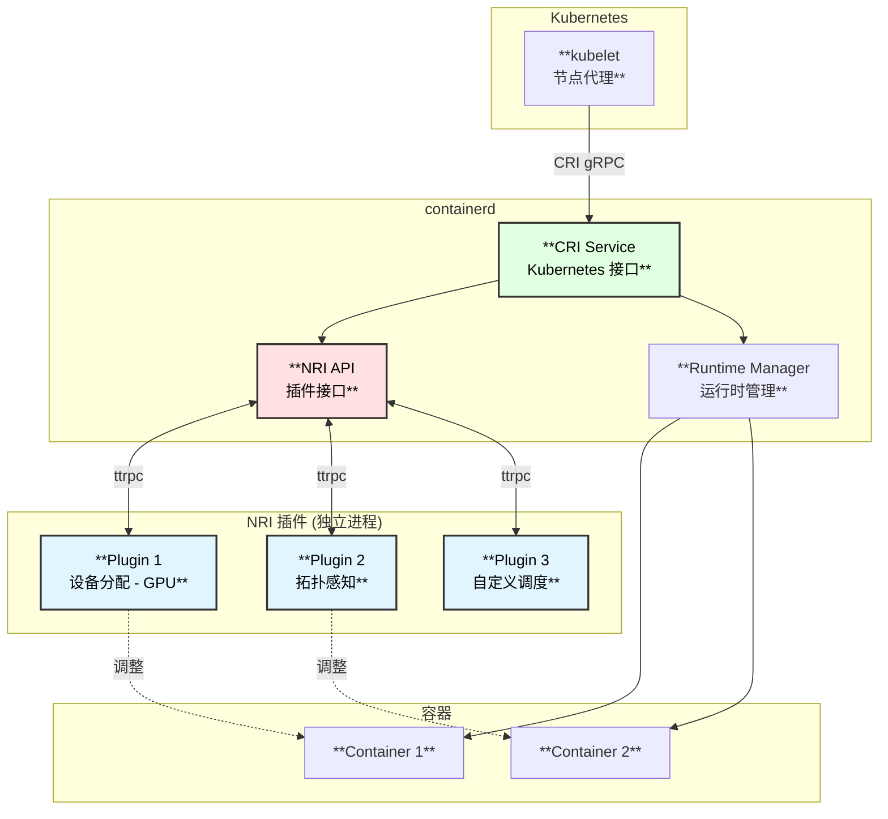
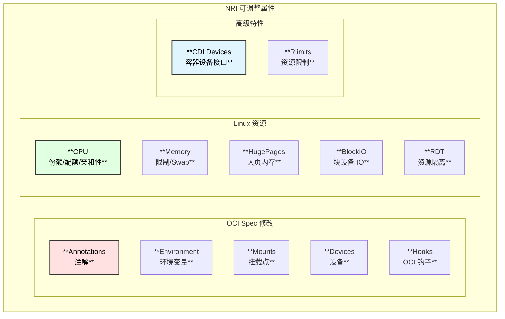
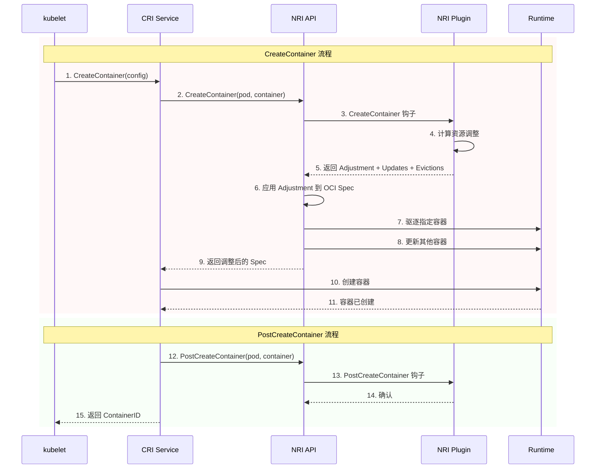
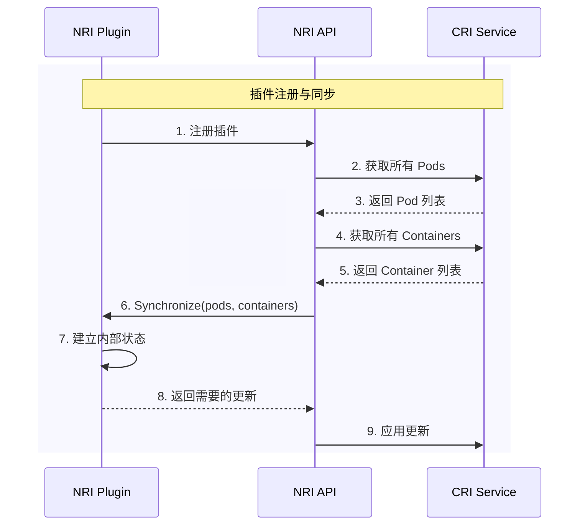
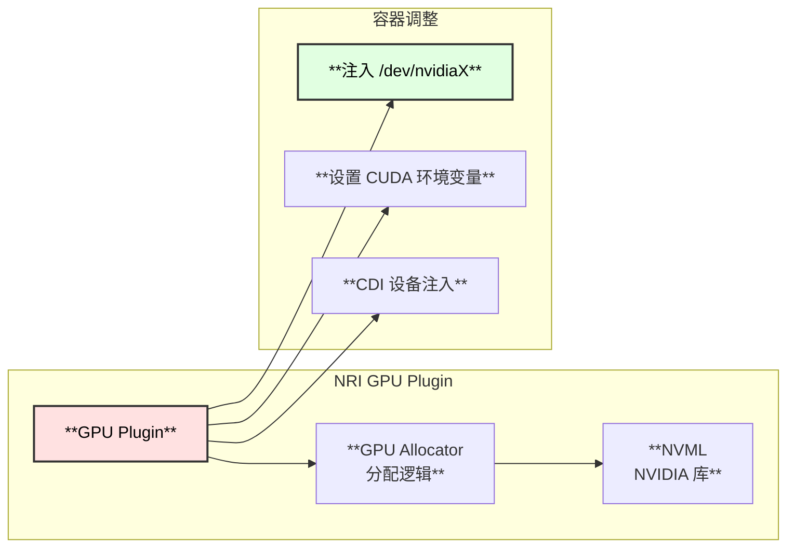
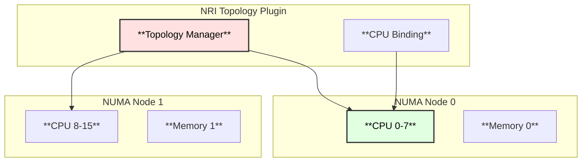
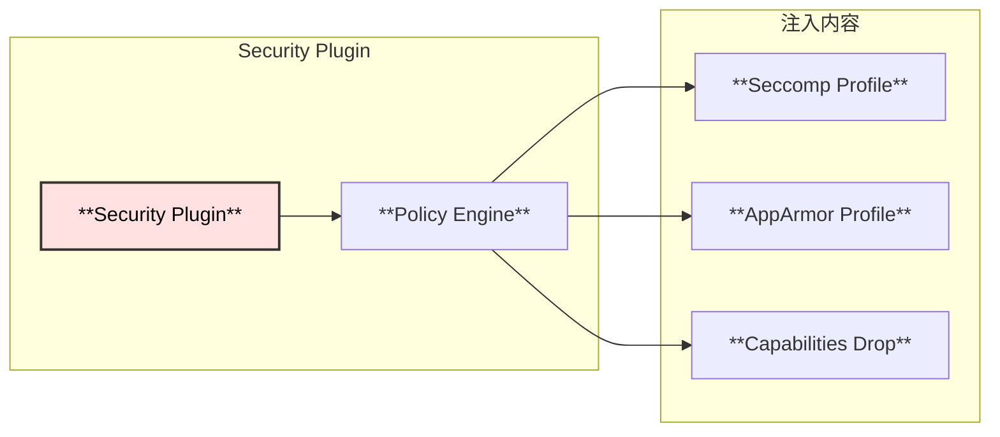

# NRI (Node Resource Interface) 深度解析

> 基于 containerd v2.1.0 版本源码分析

## 概述

NRI (Node Resource Interface) 是一个用于扩展容器运行时功能的插件框架。它允许第三方插件在容器生命周期的关键节点介入，实现资源分配、设备注入、配置修改等高级功能。

## NRI 架构

### 整体架构图



### NRI 生命周期钩子

```mermaid
graph LR
    subgraph "Pod 生命周期"
        RUN_POD[**RunPodSandbox**]
        STOP_POD[**StopPodSandbox**]
        REMOVE_POD[**RemovePodSandbox**]
    end
    
    subgraph "Container 生命周期"
        CREATE[**CreateContainer**]
        POST_CREATE[**PostCreateContainer**]
        START[**StartContainer**]
        POST_START[**PostStartContainer**]
        UPDATE[**UpdateContainer**]
        POST_UPDATE[**PostUpdateContainer**]
        STOP[**StopContainer**]
        REMOVE[**RemoveContainer**]
    end
    
    RUN_POD --> CREATE
    CREATE --> POST_CREATE
    POST_CREATE --> START
    START --> POST_START
    POST_START --> UPDATE
    UPDATE --> POST_UPDATE
    POST_UPDATE --> STOP
    STOP --> REMOVE
    REMOVE --> STOP_POD
    STOP_POD --> REMOVE_POD
    
    style CREATE fill:#e1ffe1,stroke:#333,stroke-width:2px,color:#000
    style START fill:#e1f5ff,stroke:#333,stroke-width:2px,color:#000
    style UPDATE fill:#fff3e1,stroke:#333,stroke-width:2px,color:#000
    style STOP fill:#ffe1e1,stroke:#333,stroke-width:2px,color:#000
```



## NRI 核心功能

### 功能矩阵

| 钩子点 | 可调整内容 | 可驱逐容器 | 可更新其他容器 |
|--------|-----------|-----------|---------------|
| **RunPodSandbox** | ❌ | ❌ | ❌ |
| **CreateContainer** | ✓ OCI Spec | ✓ | ✓ |
| **PostCreateContainer** | ❌ | ❌ | ❌ |
| **StartContainer** | ❌ | ❌ | ❌ |
| **PostStartContainer** | ❌ | ❌ | ❌ |
| **UpdateContainer** | ✓ Resources | ✓ | ✓ |
| **PostUpdateContainer** | ❌ | ❌ | ❌ |
| **StopContainer** | ❌ | ❌ | ✓ |
| **RemoveContainer** | ❌ | ❌ | ❌ |

### 可调整的容器属性



---

## NRI 工作流程

### 容器创建时序图



### 插件同步流程



---

## 源码解析

### NRI API 接口定义

```go
// internal/nri/nri.go:36
type API interface {
    // IsEnabled 返回 NRI 是否启用
    IsEnabled() bool
    
    // Start 启动 NRI 接口
    Start() error
    
    // Stop 停止 NRI 接口
    Stop()
    
    // Pod 生命周期钩子
    RunPodSandbox(context.Context, PodSandbox) error
    StopPodSandbox(context.Context, PodSandbox) error
    RemovePodSandbox(context.Context, PodSandbox) error
    
    // Container 生命周期钩子
    CreateContainer(context.Context, PodSandbox, Container) (*ContainerAdjustment, error)
    PostCreateContainer(context.Context, PodSandbox, Container) error
    StartContainer(context.Context, PodSandbox, Container) error
    PostStartContainer(context.Context, PodSandbox, Container) error
    UpdateContainer(context.Context, PodSandbox, Container, *LinuxResources) (*LinuxResources, error)
    PostUpdateContainer(context.Context, PodSandbox, Container) error
    StopContainer(context.Context, PodSandbox, Container) error
    NotifyContainerExit(context.Context, PodSandbox, Container)
    RemoveContainer(context.Context, PodSandbox, Container) error
    
    // 插件同步控制
    BlockPluginSync() *PluginSyncBlock
}
```

### CRI-NRI 集成

```go
// internal/cri/nri/nri_api_linux.go:45
type API struct {
    cri CRIImplementation  // CRI 服务实现
    nri nri.API            // NRI 核心接口
}

// WithContainerAdjustment 返回一个容器创建选项
// 该选项会在容器创建时调用 NRI 插件获取调整
func (a *API) WithContainerAdjustment() containerd.NewContainerOpts {
    return func(ctx context.Context, _ *containerd.Client, c *containers.Container) error {
        spec := &runtimespec.Spec{}
        json.Unmarshal(c.Spec.GetValue(), spec)
        
        // 调用 NRI 获取调整
        adjust, err := a.CreateContainer(ctx, c, spec)
        if err != nil {
            return err
        }
        
        // 应用调整到 OCI Spec
        generator := generate.Generator{Config: spec}
        nriGenerator := nrigen.SpecGenerator(&generator, generatorOptions...)
        nriGenerator.Adjust(adjust)
        
        // 更新容器 Spec
        c.Spec, _ = typeurl.MarshalAny(spec)
        return nil
    }
}
```

### 容器调整结构

```go
// ContainerAdjustment 定义容器的调整内容
type ContainerAdjustment struct {
    // 注解修改
    Annotations map[string]string
    
    // 环境变量修改
    Env []*KeyValue
    
    // 挂载修改
    Mounts []*Mount
    
    // 设备修改
    Devices []*LinuxDevice
    
    // CDI 设备
    CDIDevices []string
    
    // Linux 资源
    Linux *LinuxContainerAdjustment
    
    // OCI 钩子
    Hooks *Hooks
    
    // 资源限制
    Rlimits []*POSIXRlimit
}

// LinuxContainerAdjustment Linux 特定调整
type LinuxContainerAdjustment struct {
    // CPU 资源
    Resources *LinuxResources
    
    // CPU 亲和性
    CpusetCpus string
    CpusetMems string
    
    // Intel RDT
    IntelRdt *LinuxIntelRdt
    
    // Block IO
    BlockIO *LinuxBlockIO
}
```

---

## containerd NRI 配置

### 启用 NRI

```toml
# /etc/containerd/config.toml

version = 3

[plugins."io.containerd.nri.v1.nri"]
  # 启用 NRI
  disable = false
  
  # NRI socket 路径
  socket_path = "/var/run/nri/nri.sock"
  
  # 插件配置目录
  plugin_config_path = "/etc/nri/conf.d"
  
  # 插件目录 (用于预安装插件)
  plugin_path = "/opt/nri/plugins"
  
  # 插件注册超时
  plugin_registration_timeout = "5s"
  
  # 插件请求超时
  plugin_request_timeout = "2s"
```

### 插件配置示例

```yaml
# /etc/nri/conf.d/device-injector.yaml
apiVersion: nri.io/v1alpha1
kind: PluginConfig
metadata:
  name: device-injector
spec:
  # 注入 GPU 设备
  devices:
    - path: /dev/nvidia0
      type: c
      major: 195
      minor: 0
```

---

## NRI 插件开发

### 插件接口

```go
// 插件需要实现的接口
type Plugin interface {
    // Synchronize 在插件启动时调用
    Synchronize(ctx context.Context, pods []*api.PodSandbox, 
        containers []*api.Container) ([]*api.ContainerUpdate, error)
    
    // Shutdown 在插件关闭时调用
    Shutdown(ctx context.Context) error
    
    // CreateContainer 容器创建钩子
    CreateContainer(ctx context.Context, pod *api.PodSandbox, 
        container *api.Container) (*api.ContainerAdjustment, 
        []*api.ContainerUpdate, error)
    
    // ... 其他生命周期钩子
}
```

### 简单插件示例

```go
package main

import (
    "context"
    "github.com/containerd/nri/pkg/api"
    "github.com/containerd/nri/pkg/stub"
)

type myPlugin struct {
    stub stub.Stub
}

func (p *myPlugin) CreateContainer(ctx context.Context, 
    pod *api.PodSandbox, container *api.Container) (
    *api.ContainerAdjustment, []*api.ContainerUpdate, error) {
    
    // 创建调整
    adjust := &api.ContainerAdjustment{}
    
    // 添加环境变量
    adjust.AddEnv("NRI_INJECTED", "true")
    
    // 添加注解
    adjust.AddAnnotation("nri.io/injected", "yes")
    
    // 修改 CPU 资源
    if container.Linux != nil {
        adjust.SetLinuxCPUShares(2048)
    }
    
    return adjust, nil, nil
}

func main() {
    p := &myPlugin{}
    
    // 创建 NRI stub
    stub, _ := stub.New(p,
        stub.WithPluginName("my-plugin"),
        stub.WithPluginIdx("00"),
    )
    p.stub = stub
    
    // 运行插件
    stub.Run(context.Background())
}
```

---

## NRI 使用场景

### 1. GPU 设备分配



### 2. CPU 拓扑感知



### 3. 安全策略注入



---

## 关键文件位置

```
📁 containerd/
├── 📁 internal/nri/
│   ├── 📄 nri.go                    # NRI API 定义 (537行)
│   │   ├── API interface     :36    # 核心接口
│   │   ├── New()            :108    # 创建 NRI 实例
│   │   ├── Start()          :145    # 启动 NRI
│   │   ├── RunPodSandbox()  :170    # Pod 创建钩子
│   │   ├── CreateContainer():229    # 容器创建钩子
│   │   └── syncPlugin()     :449    # 插件同步
│   │
│   ├── 📄 config.go                 # NRI 配置
│   ├── 📄 domain.go                 # Domain 管理
│   └── 📄 types.go                  # 类型定义
│
├── 📁 internal/cri/nri/
│   ├── 📄 nri_api.go                # CRI-NRI 接口
│   ├── 📄 nri_api_linux.go          # Linux 实现 (756行)
│   │   ├── API struct        :45    # CRI API 封装
│   │   ├── Register()        :63    # 注册到 NRI
│   │   ├── WithContainerAdjustment():278  # 容器调整选项
│   │   └── nriContainer      :671   # 容器包装
│   │
│   └── 📄 nri_api_other.go          # 非 Linux 平台
│
└── 📁 plugins/nri/
    └── 📄 nri.go                    # NRI 插件注册
```

---

## 与其他技术对比

| 特性 | NRI | Device Plugin | RuntimeClass |
|------|-----|---------------|--------------|
| **作用范围** | 所有容器属性 | 仅设备 | 运行时选择 |
| **调整时机** | 多个生命周期点 | 调度时 | 创建时 |
| **灵活性** | ⭐⭐⭐⭐⭐ | ⭐⭐⭐ | ⭐⭐ |
| **实现复杂度** | 中等 | 低 | 低 |
| **运行时无关** | ✓ | ✓ | ❌ |
| **动态更新** | ✓ | ❌ | ❌ |

---

## 总结

NRI 是 containerd 的强大扩展机制：

### 1. 核心优势

- **生命周期全覆盖**: 从 Pod 创建到容器删除的完整钩子
- **细粒度控制**: 可调整 OCI Spec 的几乎所有属性
- **插件化架构**: 独立进程，故障隔离
- **运行时无关**: 适用于所有 OCI 兼容运行时

### 2. 典型应用

- **GPU/FPGA 分配**: 设备发现和注入
- **NUMA 感知**: CPU 和内存拓扑优化
- **安全增强**: 动态注入安全配置
- **资源管理**: 精细的 cgroup 控制

### 3. 最佳实践

- 插件应该快速响应，避免阻塞容器创建
- 使用插件同步机制保持状态一致
- 合理设置超时，处理插件故障
- 利用 CDI 进行标准化设备注入
