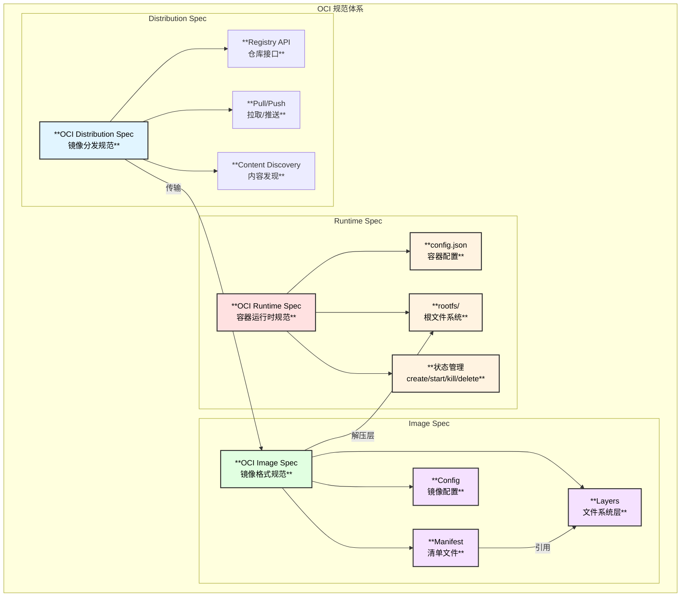
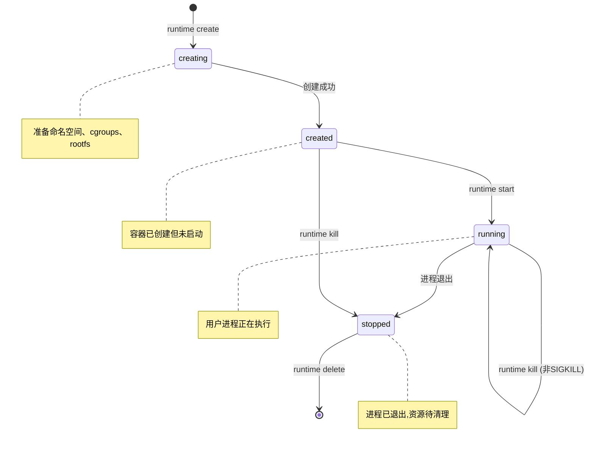
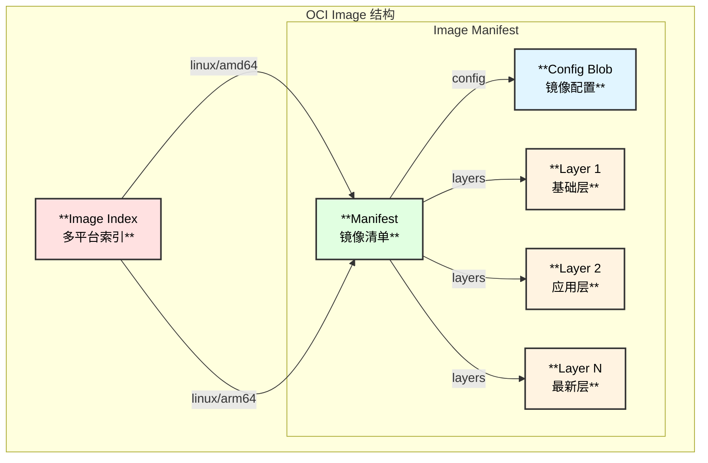
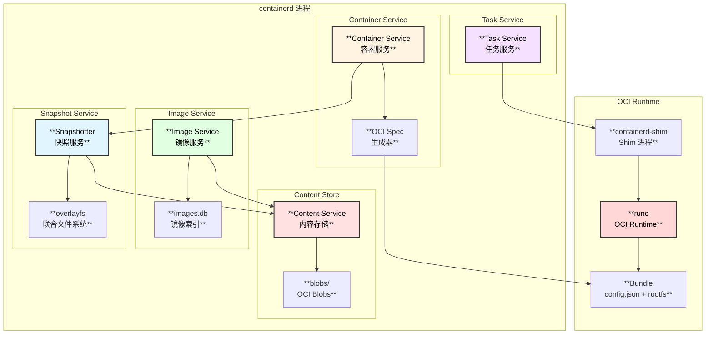
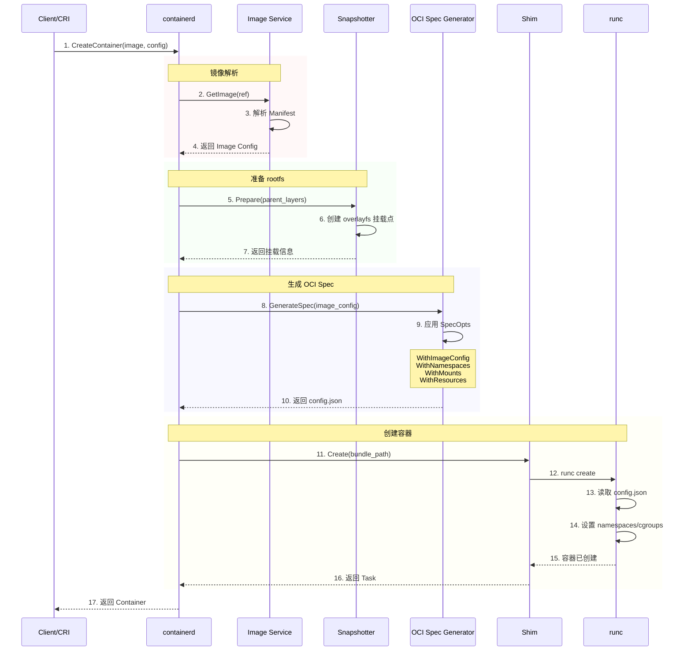
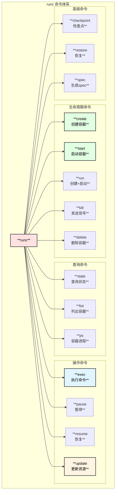
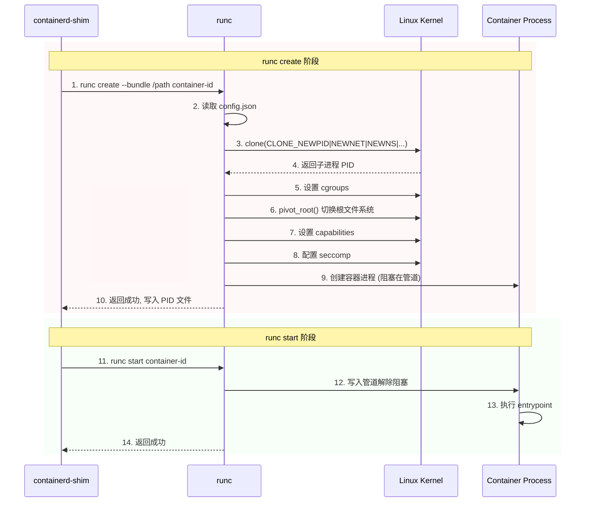
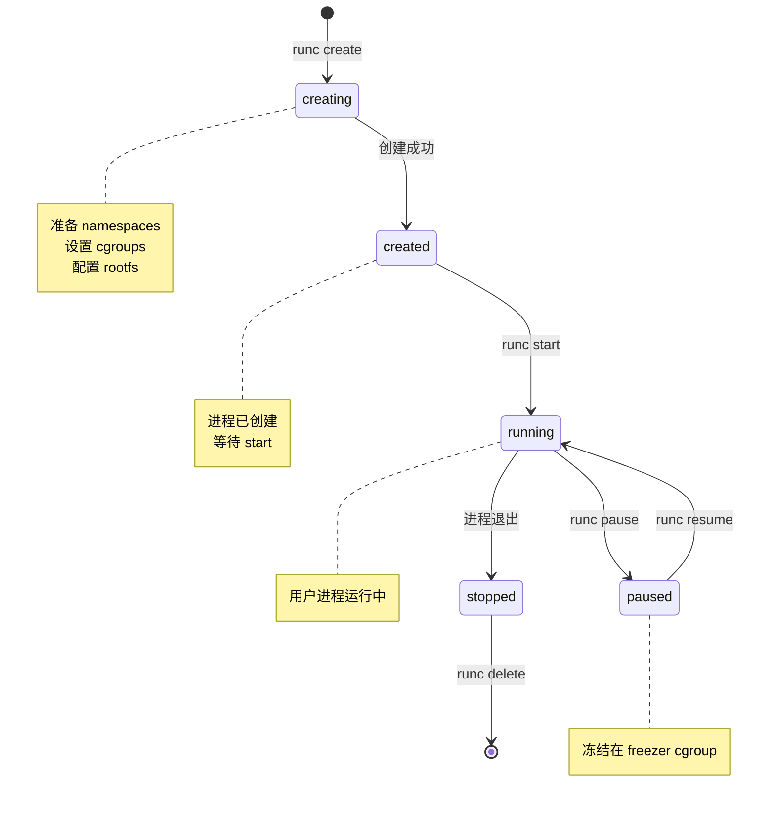

# OCI 规范与 containerd 集成深度解析

> 基于 containerd v2.1.0 版本源码分析

## 概述

OCI (Open Container Initiative) 是一个开放的容器标准组织，定义了容器运行时和镜像的标准规范。containerd 完整实现了 OCI 规范，是云原生生态系统中最重要的容器运行时之一。

## OCI 规范体系

### OCI 三大核心规范



## OCI Runtime Spec (运行时规范)

### 核心概念

OCI Runtime Spec 定义了容器的配置格式和生命周期管理接口。

### Bundle 结构

```
<bundle>/
├── config.json      # 容器配置文件 (必需)
└── rootfs/          # 根文件系统目录 (必需)
    ├── bin/
    ├── etc/
    ├── lib/
    ├── usr/
    └── ...
```

### config.json 核心结构

```json
{
  "ociVersion": "1.0.2",
  "process": {
    "terminal": true,
    "user": { "uid": 0, "gid": 0 },
    "args": ["/bin/sh"],
    "env": ["PATH=/usr/bin:/bin", "TERM=xterm"],
    "cwd": "/",
    "capabilities": { ... },
    "rlimits": [ ... ]
  },
  "root": {
    "path": "rootfs",
    "readonly": false
  },
  "hostname": "container",
  "mounts": [
    { "destination": "/proc", "type": "proc", "source": "proc" },
    { "destination": "/dev", "type": "tmpfs", "source": "tmpfs" }
  ],
  "linux": {
    "namespaces": [
      { "type": "pid" },
      { "type": "network" },
      { "type": "ipc" },
      { "type": "uts" },
      { "type": "mount" }
    ],
    "resources": {
      "memory": { "limit": 1073741824 },
      "cpu": { "shares": 1024, "quota": 100000, "period": 100000 }
    },
    "cgroupsPath": "/docker/container-id",
    "seccomp": { ... }
  }
}
```

### 容器生命周期状态



## OCI Image Spec (镜像规范)

### 镜像组成结构



### 内容寻址 (Content Addressable)

```
所有 OCI 内容通过 SHA256 摘要寻址:

Manifest:  sha256:abc123...
Config:    sha256:def456...
Layer 1:   sha256:ghi789...
Layer 2:   sha256:jkl012...

存储路径: blobs/sha256/<digest>
```

## containerd 如何使用 OCI

### containerd 与 OCI 的集成架构



### OCI Spec 生成时序图



### 源码函数调用链

```
containerd OCI Spec 生成调用链:

client.NewContainer() - client/container.go
├── 解析镜像配置
│   └── image.Config(ctx) - client/image.go
│       └── 返回 ocispec.Image (镜像配置)
│
├── 创建快照 (rootfs)
│   └── containerd.WithNewSnapshot() - client/container_opts.go
│       └── snapshots.Prepare() - core/snapshots/snapshots.go
│           └── 准备 overlayfs 挂载点
│               └── ┌────────────────┬─────────────────────────────────────┐
│                   │  挂载参数        │  说明                               │
│                   ├────────────────┼─────────────────────────────────────┤
│                   │  lowerdir       │  只读层 (镜像层)                    │
│                   ├────────────────┼─────────────────────────────────────┤
│                   │  upperdir       │  读写层 (容器层)                    │
│                   ├────────────────┼─────────────────────────────────────┤
│                   │  workdir        │  overlayfs 工作目录                 │
│                   └────────────────┴─────────────────────────────────────┘
│
├── 生成 OCI Spec
│   └── containerd.WithNewSpec() - client/container_opts.go
│       └── oci.GenerateSpec() - pkg/oci/spec.go:67
│           ├── populateDefaultUnixSpec() - pkg/oci/spec_unix.go
│           │   └── 设置默认 Linux 配置
│           │       ├── 默认命名空间 (pid, net, ipc, uts, mnt)
│           │       ├── 默认挂载点 (/proc, /dev, /sys)
│           │       ├── 默认 capabilities
│           │       └── 默认 seccomp 配置
│           │
│           └── 应用 SpecOpts
│               ├── oci.WithImageConfig() - pkg/oci/spec_opts.go:464
│               │   └── 从镜像配置提取
│               │       ├── Env 环境变量
│               │       ├── Cmd/Entrypoint 启动命令
│               │       ├── WorkingDir 工作目录
│               │       └── User 用户信息
│               │
│               ├── oci.WithMounts() - pkg/oci/spec_opts.go:235
│               │   └── 添加挂载点配置
│               │
│               ├── oci.WithLinuxNamespace() - pkg/oci/spec_opts.go:804
│               │   └── 配置 Linux 命名空间
│               │       └── ┌────────────────┬────────────────────────────┐
│               │           │  命名空间        │  路径格式                  │
│               │           ├────────────────┼────────────────────────────┤
│               │           │  network        │  /proc/pid/ns/net         │
│               │           ├────────────────┼────────────────────────────┤
│               │           │  ipc            │  /proc/pid/ns/ipc         │
│               │           ├────────────────┼────────────────────────────┤
│               │           │  uts            │  /proc/pid/ns/uts         │
│               │           ├────────────────┼────────────────────────────┤
│               │           │  pid            │  /proc/pid/ns/pid         │
│               │           └────────────────┴────────────────────────────┘
│               │
│               └── oci.WithResources() - internal/cri/opts/spec_linux_opts.go
│                   └── 配置 cgroup 资源限制
│                       ├── CPU: shares, quota, period
│                       ├── Memory: limit, swap
│                       └── Pids: max
│
└── 保存容器元数据
    └── containers.Create() - core/metadata/containers.go
        └── 存储到 BoltDB

runc 读取并执行 OCI Spec:

runc create <container-id> - vendor/github.com/containerd/go-runc/runc.go:156
├── 读取 config.json
│   └── 反序列化为 specs.Spec
│
├── 创建容器环境
│   ├── 创建命名空间
│   │   └── clone(CLONE_NEWPID | CLONE_NEWNET | ...)
│   ├── 配置 cgroups
│   │   └── 写入 cgroup 控制文件
│   ├── 准备 rootfs
│   │   └── pivot_root() 或 chroot()
│   └── 设置 capabilities
│
└── 创建容器进程 (暂停状态)
    └── 等待 runc start 执行用户进程
```

## containerd 中的 OCI 关键实现

### 1. OCI Spec 类型定义

```go
// pkg/oci/spec.go:47
// Spec 是 OCI runtime spec 的类型别名
type Spec = specs.Spec

// SpecOpts 用于配置 OCI spec 的选项函数
type SpecOpts func(context.Context, Client, *containers.Container, *Spec) error
```

### 2. 默认 Spec 生成

```go
// pkg/oci/spec.go:67
func GenerateSpec(ctx context.Context, client Client, c *containers.Container, opts ...SpecOpts) (*Spec, error) {
    // 创建默认 spec
    s, err := createDefaultSpec(ctx, c.ID)
    if err != nil {
        return nil, err
    }
    
    // 应用所有选项
    for _, o := range opts {
        if err := o(ctx, client, c, s); err != nil {
            return nil, err
        }
    }
    
    return s, nil
}
```

### 3. 镜像配置转换

```go
// pkg/oci/spec_opts.go:464
func WithImageConfig(image Image) SpecOpts {
    return func(ctx context.Context, client Client, c *containers.Container, s *Spec) error {
        ic, err := image.Config(ctx)
        if err != nil {
            return err
        }
        
        // 应用镜像配置到 spec
        if s.Process == nil {
            s.Process = &specs.Process{}
        }
        
        // 设置环境变量
        s.Process.Env = append(s.Process.Env, ic.Config.Env...)
        
        // 设置工作目录
        if ic.Config.WorkingDir != "" {
            s.Process.Cwd = ic.Config.WorkingDir
        }
        
        // 设置启动命令
        if len(ic.Config.Entrypoint) > 0 {
            s.Process.Args = append(ic.Config.Entrypoint, ic.Config.Cmd...)
        } else {
            s.Process.Args = ic.Config.Cmd
        }
        
        // 设置用户
        if ic.Config.User != "" {
            // 解析 user:group 格式
            // ...
        }
        
        return nil
    }
}
```

### 4. Bundle 目录结构

```
containerd 为每个容器创建的 Bundle 目录:

/run/containerd/io.containerd.runtime.v2.task/<namespace>/<container-id>/
├── config.json          # OCI runtime spec
├── rootfs/              # 容器根文件系统 (overlayfs 挂载点)
│   ├── bin/
│   ├── etc/
│   ├── lib/
│   ├── usr/
│   └── ...
├── init.pid             # 容器 init 进程 PID
├── log.json             # runc 日志
└── work/                # shim 工作目录
```

## OCI 规范版本兼容

### containerd 支持的 OCI 版本

| 规范类型 | 支持版本 | 说明 |
|---------|---------|------|
| Runtime Spec | 1.0.0 - 1.1.0 | 容器运行时配置 |
| Image Spec | 1.0.0 - 1.1.0 | 镜像格式 |
| Distribution Spec | 1.0.0 - 1.1.0 | 镜像分发 |

### 关键文件位置

```
📁 containerd/
├── 📁 pkg/oci/
│   ├── 📄 spec.go                    # OCI Spec 核心定义
│   │   ├── Spec 类型别名      :49    # specs.Spec 别名
│   │   ├── ReadSpec()         :54    # 读取 config.json
│   │   └── GenerateSpec()     :67    # 生成默认 Spec
│   │
│   ├── 📄 spec_opts.go               # Spec 配置选项 (1300+ 行)
│   │   ├── SpecOpts 类型      :46    # 选项函数类型
│   │   ├── WithHostname()     :123   # 设置主机名
│   │   ├── WithMounts()       :235   # 配置挂载
│   │   ├── WithImageConfig()  :464   # 应用镜像配置
│   │   ├── WithLinuxNamespace():804  # 配置命名空间
│   │   └── WithResources()           # 配置资源限制
│   │
│   ├── 📄 spec_unix.go               # Unix 平台默认配置
│   └── 📄 spec_windows.go            # Windows 平台默认配置
│
├── 📁 core/content/                  # OCI Content Store
│   └── 📄 content.go                 # 内容存储接口
│
├── 📁 core/images/                   # OCI Image 处理
│   ├── 📄 image.go                   # 镜像核心逻辑
│   └── 📄 mediatypes.go              # OCI 媒体类型
│
└── 📁 vendor/github.com/opencontainers/
    ├── 📁 runtime-spec/specs-go/     # OCI Runtime Spec 定义
    │   ├── 📄 config.go              # Spec 结构体
    │   └── 📄 state.go               # 状态定义
    │
    └── 📁 image-spec/specs-go/v1/    # OCI Image Spec 定义
        ├── 📄 config.go              # 镜像配置
        ├── 📄 manifest.go            # Manifest 定义
        └── 📄 descriptor.go          # 描述符定义
```

---

## runc: OCI Runtime 参考实现

### runc 概述

runc 是 OCI Runtime Specification 的参考实现，由 Docker 公司开源并捐赠给 OCI。它是一个轻量级的命令行工具，负责根据 OCI 规范创建和运行容器。

### runc 架构



### runc 容器创建流程



### runc 核心数据结构

```go
// vendor/github.com/containerd/go-runc/runc.go:62
type Runc struct {
    Command       string          // runc 二进制路径 (默认 "runc")
    Root          string          // 状态目录 (/run/runc)
    Debug         bool            // 调试模式
    Log           string          // 日志文件路径
    LogFormat     Format          // 日志格式 (json/text)
    PdeathSignal  syscall.Signal  // 父进程死亡信号
    Setpgid       bool            // 设置进程组
    SystemdCgroup bool            // 使用 systemd cgroup 驱动
    Rootless      *bool           // Rootless 模式
}

// 创建选项
type CreateOpts struct {
    IO            IO              // IO 配置
    PidFile       string          // PID 文件路径
    ConsoleSocket ConsoleSocket   // 终端 socket
    Detach        bool            // 后台运行
    NoPivot       bool            // 不使用 pivot_root
    NoNewKeyring  bool            // 不创建新 keyring
    ExtraFiles    []*os.File      // 额外文件描述符
}
```

### containerd 调用 runc 的方式

```go
// vendor/github.com/containerd/go-runc/runc.go:180
func (r *Runc) Create(context context.Context, id, bundle string, opts *CreateOpts) error {
    args := []string{"create", "--bundle", bundle}
    
    // 添加选项参数
    if opts.PidFile != "" {
        args = append(args, "--pid-file", opts.PidFile)
    }
    if opts.ConsoleSocket != nil {
        args = append(args, "--console-socket", opts.ConsoleSocket.Path())
    }
    if opts.NoPivot {
        args = append(args, "--no-pivot")
    }
    
    // 执行 runc create
    cmd := r.command(context, append(args, id)...)
    return r.runOrError(cmd)
}

// runc start
func (r *Runc) Start(context context.Context, id string) error {
    return r.runOrError(r.command(context, "start", id))
}

// runc exec
func (r *Runc) Exec(context context.Context, id string, spec specs.Process, opts *ExecOpts) error {
    // 将进程 spec 写入临时文件
    f, _ := os.CreateTemp("", "runc-process")
    json.NewEncoder(f).Encode(spec)
    
    args := []string{"exec", "--process", f.Name()}
    cmd := r.command(context, append(args, id)...)
    return r.runOrError(cmd)
}

// runc update (资源更新)
func (r *Runc) Update(context context.Context, id string, resources *specs.LinuxResources) error {
    buf := getBuf()
    json.NewEncoder(buf).Encode(resources)
    
    args := []string{"update", "--resources=-", id}
    cmd := r.command(context, args...)
    cmd.Stdin = buf  // 通过 stdin 传递资源配置
    return r.runOrError(cmd)
}
```

### runc 状态管理



### runc 与 Linux 内核交互

| runc 操作 | 内核系统调用 | 说明 |
|----------|-------------|------|
| **创建命名空间** | `clone()` | CLONE_NEWPID, CLONE_NEWNET, CLONE_NEWNS, ... |
| **切换根目录** | `pivot_root()` | 更换容器的根文件系统 |
| **资源限制** | `write()` | 写入 cgroup 控制文件 |
| **能力控制** | `capset()` | 设置 Linux capabilities |
| **系统调用过滤** | `seccomp()` | 安装 seccomp BPF 过滤器 |
| **暂停/恢复** | cgroups freezer | v1: `freezer.state`, v2: `cgroup.freeze` |
| **发送信号** | `kill()` | 向容器进程发送信号 |

### runc 关键特性

#### 1. Rootless 容器

```bash
# 无 root 权限运行容器
runc --rootless=true run container-id
```

使用 User Namespace 实现非特权用户运行容器。

#### 2. 检查点与恢复 (CRIU)

```bash
# 创建检查点
runc checkpoint --image-path /path/to/checkpoint container-id

# 从检查点恢复
runc restore --image-path /path/to/checkpoint container-id
```

支持容器的实时迁移和快照恢复。

#### 3. 多运行时支持

```go
// containerd 配置多运行时
[plugins."io.containerd.cri.v1.runtime".containerd.runtimes.runc]
  runtime_type = "io.containerd.runc.v2"

[plugins."io.containerd.cri.v1.runtime".containerd.runtimes.kata]
  runtime_type = "io.containerd.kata.v2"

[plugins."io.containerd.cri.v1.runtime".containerd.runtimes.gvisor]
  runtime_type = "io.containerd.runsc.v1"
```

### runc vs 其他 OCI 运行时

| 特性 | runc | kata-containers | gVisor |
|------|------|-----------------|--------|
| **隔离级别** | 命名空间 + cgroups | 轻量级 VM | 用户态内核 |
| **性能开销** | 极低 | 中等 | 低-中等 |
| **安全性** | 标准 | 高 | 高 |
| **兼容性** | 最佳 | 良好 | 部分 |
| **启动时间** | ~100ms | ~500ms | ~200ms |
| **内存开销** | ~几MB | ~几十MB | ~几十MB |

### runc 源码位置

```
📁 containerd/vendor/github.com/containerd/go-runc/
├── 📄 runc.go                    # runc 客户端主要实现 (850行)
│   ├── Runc struct        :62   # runc 配置结构
│   ├── List()             :97   # 列出容器
│   ├── State()           :111   # 获取状态
│   ├── Create()          :180   # 创建容器
│   ├── Start()           :224   # 启动容器
│   ├── Exec()            :260   # 执行命令
│   ├── Run()             :311   # 创建+启动
│   ├── Delete()          :329   # 删除容器
│   ├── Kill()            :349   # 发送信号
│   ├── Pause()           :361   # 暂停
│   ├── Resume()          :372   # 恢复
│   ├── Update()          :702   # 更新资源
│   ├── Checkpoint()      :592   # 检查点
│   └── Restore()         :659   # 恢复
│
├── 📄 console.go                 # 终端处理
├── 📄 container.go               # 容器状态定义
├── 📄 io.go                      # IO 管理
└── 📄 monitor.go                 # 进程监控
```

---

## 总结

containerd 通过以下方式完整实现了 OCI 规范:

### 1. OCI Image Spec
- 通过 Content Store 存储 OCI 格式的镜像层和配置
- 支持 Manifest、Config、Layer 的完整处理

### 2. OCI Runtime Spec
- 通过 `pkg/oci` 包生成符合规范的 `config.json`
- 支持所有 Linux 命名空间和 cgroup 配置

### 3. OCI Distribution Spec
- 通过 Transfer Service 实现镜像的拉取和推送
- 支持内容寻址和增量传输

### 4. runc (OCI Runtime 参考实现)
- 轻量级命令行工具，直接操作 Linux 内核
- 支持完整的容器生命周期管理
- 与 containerd-shim 紧密集成

### 5. 扩展性设计
- 可以与任何符合 OCI 规范的运行时配合使用 (runc, kata, gVisor)
- 可以处理任何符合 OCI 规范的容器镜像
- 可以与任何符合 OCI 规范的镜像仓库交互

这种基于标准的设计使 containerd 成为云原生生态系统中最重要的容器运行时基础设施。
