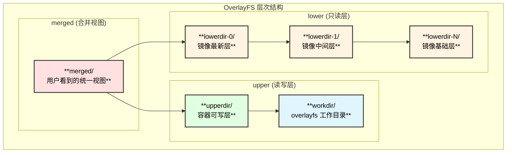
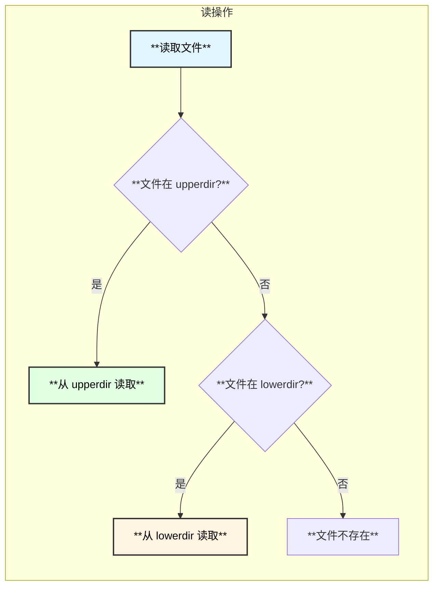
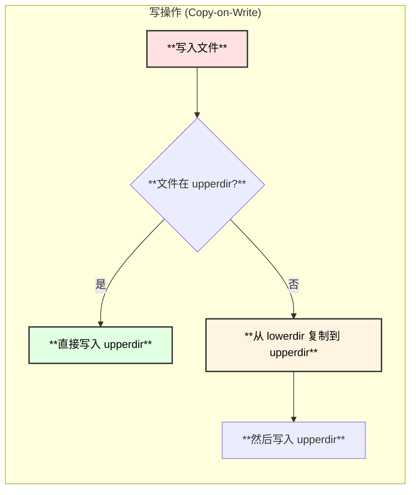
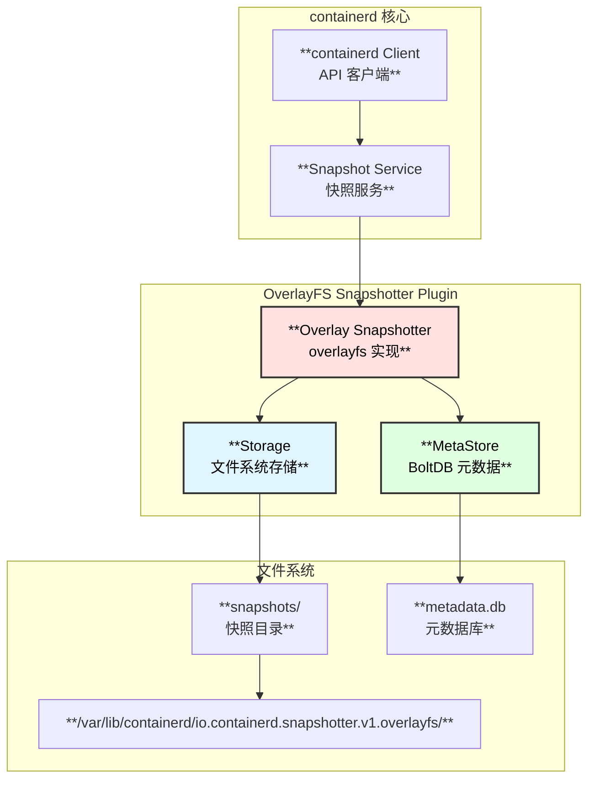
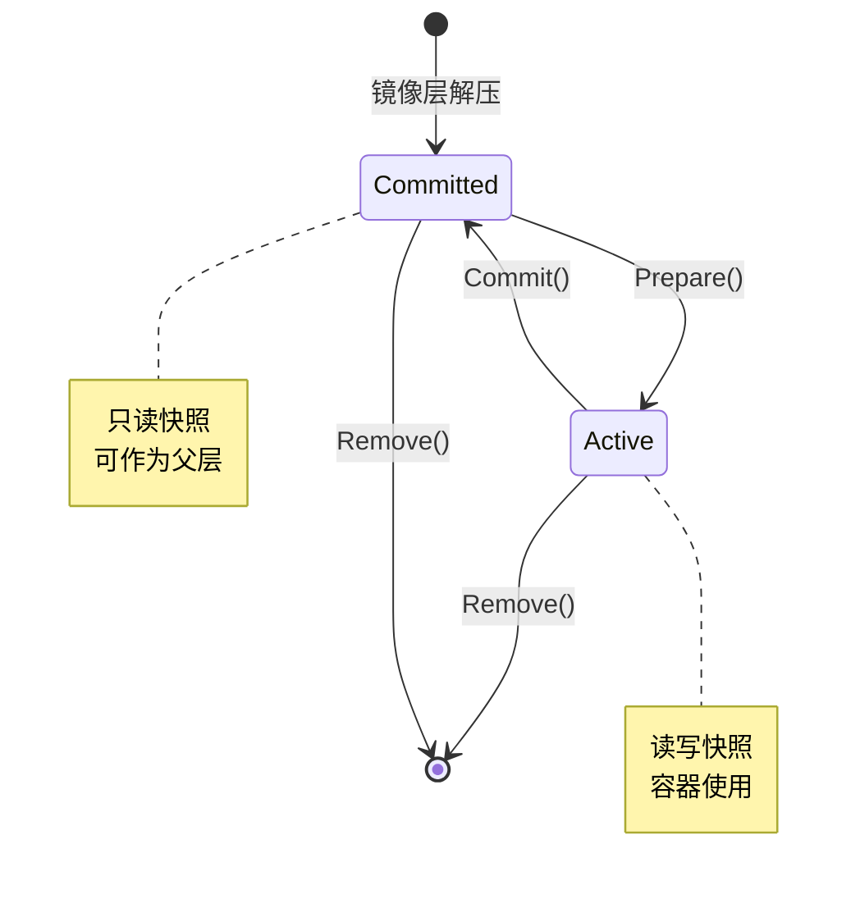
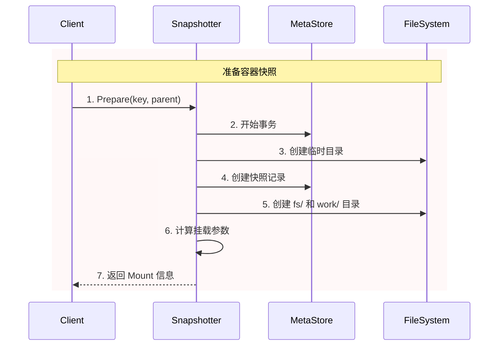
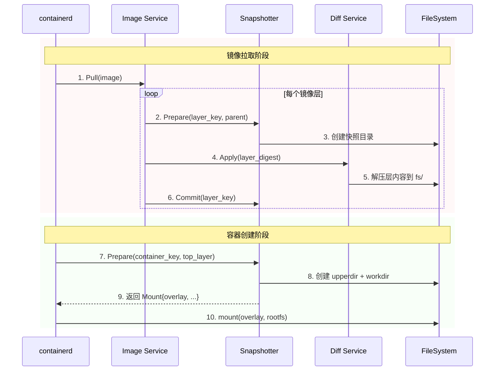
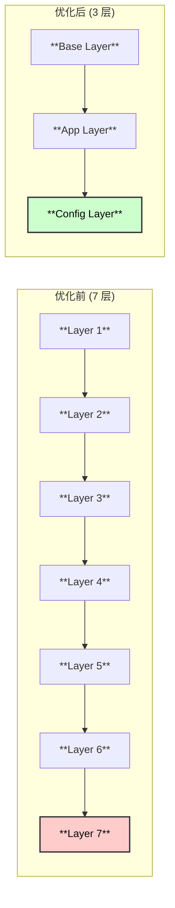

# OverlayFS 深度解析与 containerd 集成

> 基于 containerd v2.1.0 版本源码分析

## 概述

OverlayFS (Overlay Filesystem) 是 Linux 内核中的一种联合文件系统 (Union Filesystem)，它允许将多个目录层叠在一起，呈现为一个统一的文件系统视图。在容器技术中，OverlayFS 是实现镜像层叠和容器可写层的核心技术。

## OverlayFS 架构

### 核心概念



### 目录结构说明

| 目录 | 类型 | 说明 |
|------|------|------|
| **merged** | 挂载点 | 最终呈现给用户的统一文件系统视图 |
| **upperdir** | 读写 | 所有写操作发生在此目录，容器的修改都存储在这里 |
| **workdir** | 内部使用 | OverlayFS 内部使用的工作目录，用于原子操作 |
| **lowerdir** | 只读 | 一个或多个只读目录，按顺序叠加 (越靠前优先级越高) |

### 文件操作原理





### 删除操作 (Whiteout)

```
删除 lowerdir 中的文件时，overlayfs 使用 "whiteout" 机制:

┌─────────────────────────────────────────────────────────────────┐
│  原始状态:                                                       │
│  lowerdir/                                                      │
│  └── file.txt     (需要删除的文件)                               │
│                                                                 │
│  删除后:                                                         │
│  upperdir/                                                      │
│  └── file.txt     (字符设备 0,0 - whiteout 标记)                 │
│                                                                 │
│  效果: merged/ 中看不到 file.txt                                 │
└─────────────────────────────────────────────────────────────────┘
```

---

## containerd OverlayFS Snapshotter

### Snapshotter 架构



### Snapshotter 目录结构

```
/var/lib/containerd/io.containerd.snapshotter.v1.overlayfs/
├── metadata.db                    # BoltDB 元数据库
└── snapshots/
    ├── 1/                         # 快照 ID (镜像基础层)
    │   └── fs/                    # 层内容
    │       ├── bin/
    │       ├── etc/
    │       └── ...
    ├── 2/                         # 快照 ID (镜像第二层)
    │   └── fs/
    │       └── ... (仅包含变更)
    ├── 3/                         # 快照 ID (镜像第三层)  
    │   └── fs/
    │       └── ...
    └── 100/                       # 活动快照 (容器层)
        ├── fs/                    # upperdir (读写层)
        │   └── ... (容器修改)
        └── work/                  # workdir
```

### 快照类型



| 类型 | 说明 | 可写 | 可作为父层 |
|------|------|------|-----------|
| **Committed** | 已提交的只读快照 (镜像层) | ❌ | ✓ |
| **Active** | 活动的读写快照 (容器层) | ✓ | ❌ |

---

## 源码深度解析

### Snapshotter 初始化

```go
// plugins/snapshots/overlay/overlay.go:121
func NewSnapshotter(root string, opts ...Opt) (snapshots.Snapshotter, error) {
    var config SnapshotterConfig
    for _, opt := range opts {
        opt(&config)
    }
    
    // 创建根目录
    os.MkdirAll(root, 0700)
    
    // 检查文件系统支持
    supportsDType, _ := fs.SupportsDType(root)  // 检查 d_type 支持
    
    // 初始化元数据存储
    if config.ms == nil {
        config.ms, _ = storage.NewMetaStore(filepath.Join(root, "metadata.db"))
    }
    
    // 创建快照目录
    os.Mkdir(filepath.Join(root, "snapshots"), 0700)
    
    // 检测并添加必要的挂载选项
    if userxattr, _ := overlayutils.NeedsUserXAttr(root); userxattr {
        config.mountOptions = append(config.mountOptions, "userxattr")
    }
    if supportsIndex() {
        config.mountOptions = append(config.mountOptions, "index=off")
    }
    
    return &snapshotter{
        root:          root,
        ms:            config.ms,
        asyncRemove:   config.asyncRemove,
        upperdirLabel: config.upperdirLabel,
        options:       config.mountOptions,
        remapIDs:      config.remapIDs,
    }, nil
}
```

### 创建快照 (Prepare)



```go
// plugins/snapshots/overlay/overlay.go:428
func (o *snapshotter) createSnapshot(ctx context.Context, kind snapshots.Kind, 
    key, parent string, opts []snapshots.Opt) ([]mount.Mount, error) {
    
    var s storage.Snapshot
    
    o.ms.WithTransaction(ctx, true, func(ctx context.Context) error {
        snapshotDir := filepath.Join(o.root, "snapshots")
        
        // 创建临时目录
        td, _ = o.prepareDirectory(ctx, snapshotDir, kind)
        
        // 在数据库中创建快照记录
        s, _ = storage.CreateSnapshot(ctx, kind, key, parent, opts...)
        
        // 创建 fs/ 和 work/ 子目录
        if kind == snapshots.KindActive {
            os.Mkdir(filepath.Join(td, "fs"), 0755)  // upperdir
            os.Mkdir(filepath.Join(td, "work"), 0711) // workdir
        }
        
        return nil
    })
    
    // 生成挂载参数
    return o.mounts(s, info), nil
}
```

### 生成挂载参数

```go
// plugins/snapshots/overlay/overlay.go:552
func (o *snapshotter) mounts(s storage.Snapshot, info snapshots.Info) []mount.Mount {
    var options []string
    
    // 情况 1: 没有父层 - 使用 bind mount
    if len(s.ParentIDs) == 0 {
        return []mount.Mount{{
            Source:  o.upperPath(s.ID),
            Type:    "bind",
            Options: []string{"rw", "rbind"},
        }}
    }
    
    // 情况 2: 活动快照 - 完整 overlay mount
    if s.Kind == snapshots.KindActive {
        options = append(options,
            fmt.Sprintf("workdir=%s", o.workPath(s.ID)),      // workdir
            fmt.Sprintf("upperdir=%s", o.upperPath(s.ID)),    // upperdir (读写)
        )
    } else if len(s.ParentIDs) == 1 {
        // 情况 3: 只读快照且只有一个父层 - bind mount
        return []mount.Mount{{
            Source:  o.upperPath(s.ParentIDs[0]),
            Type:    "bind",
            Options: []string{"ro", "rbind"},
        }}
    }
    
    // 构建 lowerdir 参数 (父层列表)
    parentPaths := make([]string, len(s.ParentIDs))
    for i := range s.ParentIDs {
        parentPaths[i] = o.upperPath(s.ParentIDs[i])
    }
    options = append(options, fmt.Sprintf("lowerdir=%s", strings.Join(parentPaths, ":")))
    
    // 添加额外挂载选项
    options = append(options, o.options...)
    
    return []mount.Mount{{
        Type:    "overlay",
        Source:  "overlay",
        Options: options,
    }}
}
```

### 实际挂载命令示例

```bash
# 容器的 overlay 挂载命令 (内核执行)
mount -t overlay overlay \
    -o lowerdir=/var/lib/containerd/.../snapshots/3/fs:\
               /var/lib/containerd/.../snapshots/2/fs:\
               /var/lib/containerd/.../snapshots/1/fs,\
       upperdir=/var/lib/containerd/.../snapshots/100/fs,\
       workdir=/var/lib/containerd/.../snapshots/100/work,\
       index=off \
    /run/containerd/.../rootfs
```

---

## 容器 rootfs 创建流程



### 代码示例: 创建容器快照

```go
// 创建容器时准备 rootfs
func prepareRootfs(ctx context.Context, client *containerd.Client, 
    image containerd.Image) ([]mount.Mount, error) {
    
    snapshotter := client.SnapshotService("overlayfs")
    
    // 获取镜像的顶层快照
    imageConfig, _ := image.Config(ctx)
    diffIDs := imageConfig.RootFS.DiffIDs
    
    // 为容器创建新的活动快照
    containerKey := "container-" + uuid.New().String()
    parentKey := diffIDs[len(diffIDs)-1].String()
    
    // Prepare 返回挂载信息
    mounts, _ := snapshotter.Prepare(ctx, containerKey, parentKey)
    
    // mounts[0] 包含:
    // Type: "overlay"
    // Options: ["lowerdir=...", "upperdir=...", "workdir=..."]
    
    return mounts, nil
}
```

---

## 性能优化与最佳实践

### 挂载选项说明

| 选项 | 说明 | 推荐值 |
|------|------|--------|
| `index=off` | 禁用索引 (减少元数据开销) | ✓ |
| `metacopy=on` | 仅复制元数据 (需要内核 >= 4.19) | ✓ |
| `userxattr` | 用户命名空间支持 | 自动检测 |
| `volatile` | 跳过 sync (提升性能，降低数据安全) | ❌ |

### 层数优化



**建议**:
- 尽量减少镜像层数 (推荐 < 10 层)
- 将频繁变化的文件放在顶层
- 使用多阶段构建减少最终镜像层数

### 文件系统选择

| 底层文件系统 | 支持程度 | 注意事项 |
|-------------|---------|---------|
| **ext4** | ✓ 完全支持 | 推荐 |
| **xfs** | ✓ 需要 ftype=1 | `mkfs.xfs -n ftype=1` |
| **btrfs** | ✓ 支持 | 考虑使用原生 btrfs snapshotter |
| **zfs** | ✓ 支持 | 考虑使用原生 zfs snapshotter |
| **nfs** | ⚠️ 有限支持 | 需要 kernel >= 5.11 |

---

## 关键文件位置

```
📁 containerd/plugins/snapshots/overlay/
├── 📄 overlay.go                    # 主要实现 (636行)
│   ├── NewSnapshotter()     :121    # 初始化
│   ├── Stat()               :194    # 获取快照信息
│   ├── Update()             :212    # 更新快照
│   ├── Usage()              :240    # 获取使用量
│   ├── Prepare()            :305    # 创建活动快照
│   ├── View()               :322    # 创建只读视图
│   ├── Mounts()             :329    # 获取挂载信息
│   ├── Commit()             :346    # 提交快照
│   ├── Remove()             :381    # 删除快照
│   ├── createSnapshot()     :428    # 创建快照核心
│   └── mounts()             :552    # 生成挂载参数
│
├── 📄 overlayutils/
│   ├── 📄 check.go                  # 功能检测
│   └── 📄 userxattr.go              # userxattr 支持
│
└── 📁 plugin/
    └── 📄 plugin.go                 # 插件注册

📁 containerd/core/snapshots/
├── 📄 snapshots.go                  # Snapshotter 接口定义
└── 📁 storage/
    └── 📄 bolt.go                   # BoltDB 元数据存储
```

---

## 与其他 Snapshotter 对比

| 特性 | OverlayFS | Native (btrfs/zfs) | DeviceMapper |
|------|-----------|-------------------|--------------|
| **性能** | ⭐⭐⭐⭐ | ⭐⭐⭐⭐⭐ | ⭐⭐⭐ |
| **复杂度** | 低 | 中 | 高 |
| **层数限制** | 128 (内核限制) | 无限制 | 无限制 |
| **空间效率** | ⭐⭐⭐⭐ | ⭐⭐⭐⭐⭐ | ⭐⭐⭐ |
| **兼容性** | ⭐⭐⭐⭐⭐ | ⭐⭐⭐ | ⭐⭐⭐ |
| **配置难度** | 简单 | 中等 | 复杂 |

---

## 总结

OverlayFS 在 containerd 中扮演着核心角色:

### 1. 架构优势
- 联合文件系统实现高效的镜像层叠
- Copy-on-Write 机制减少存储空间
- 与 Linux 内核深度集成，性能优秀

### 2. containerd 集成
- Snapshotter 插件架构支持多种后端
- 完善的元数据管理 (BoltDB)
- 自动检测内核功能并优化

### 3. 最佳实践
- 控制镜像层数以优化性能
- 选择合适的底层文件系统
- 根据场景选择挂载选项

### 4. 关键特性
- **透明性**: 容器无感知地使用统一文件系统
- **效率**: 共享底层只读层，节省空间
- **隔离**: 每个容器有独立的可写层
