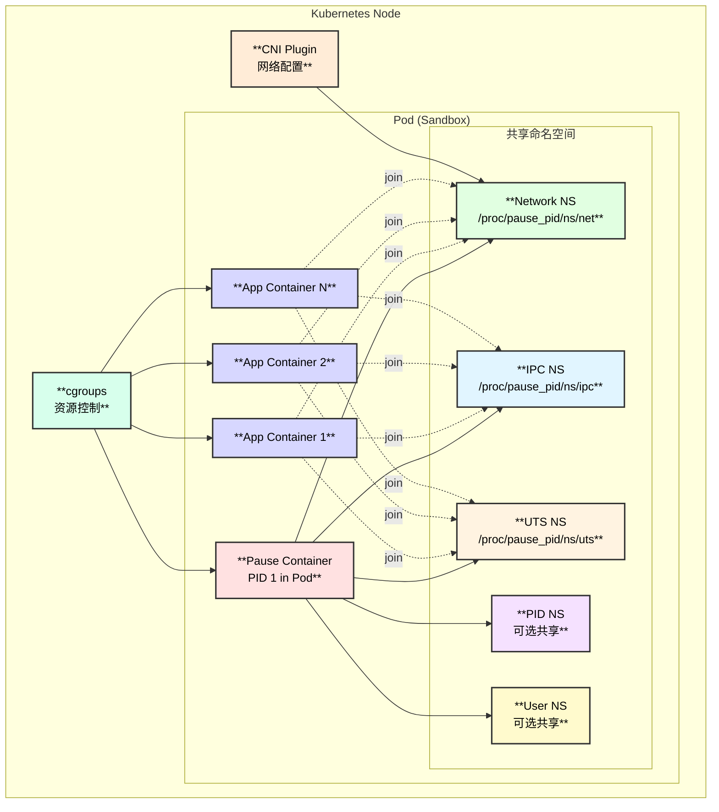
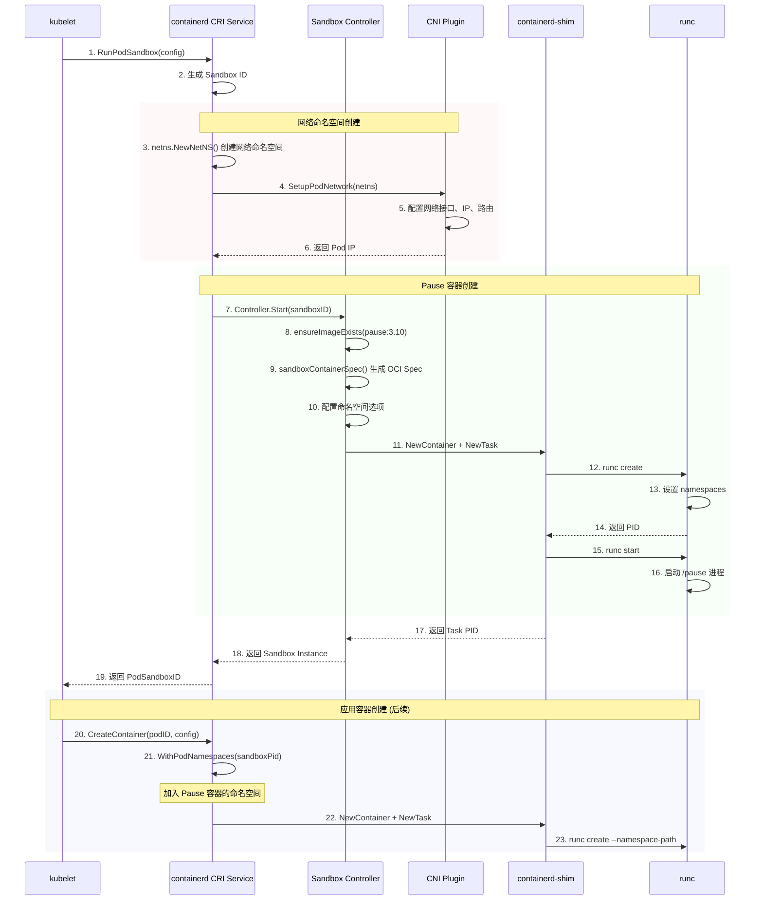
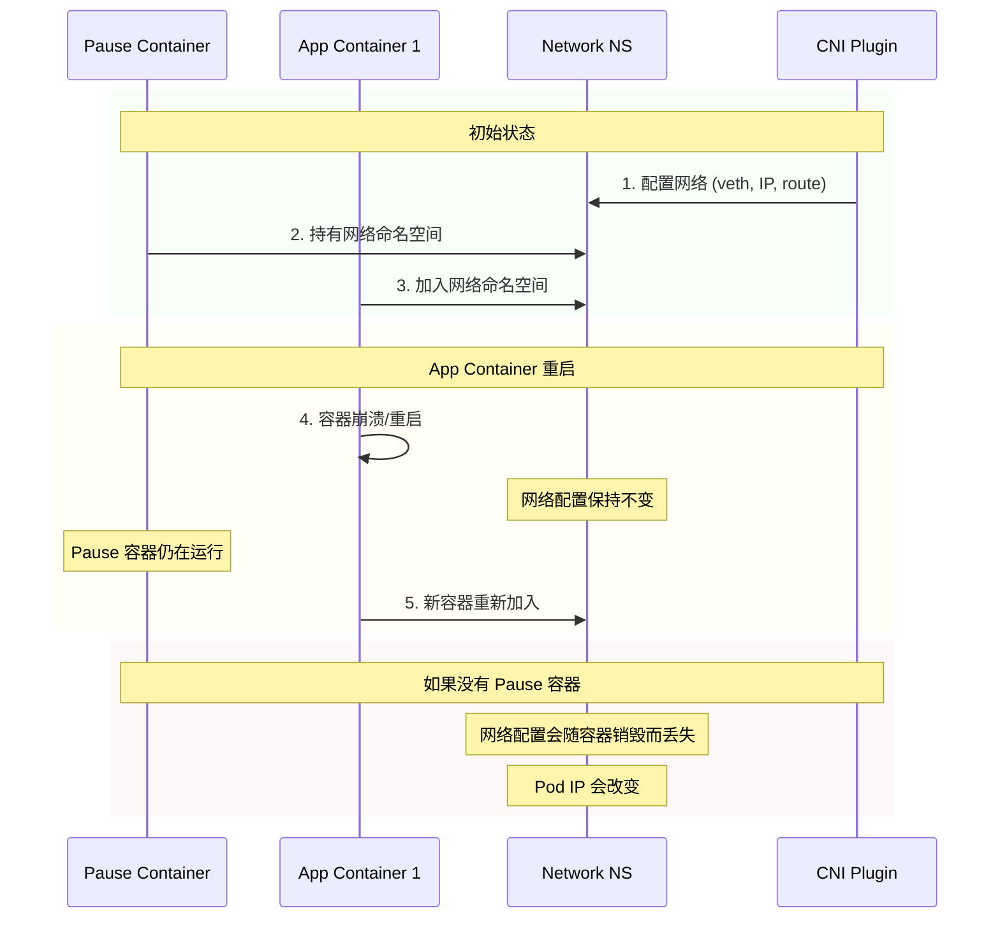

# Pause 容器 (Sandbox Container) 深度解析

> 基于 containerd v2.1.0 版本源码分析

## 概述

Pause 容器（也称为 Sandbox 容器或 Infra 容器）是 Kubernetes Pod 中的一个特殊容器，它是 Pod 中第一个创建的容器，作为 Pod 内所有容器共享资源的"锚点"。

## Pause 容器的核心能力

### 能力总览

| 能力分类 | 具体功能 | 实现方式 |
|---------|---------|---------|
| **命名空间共享** | 提供 Network/IPC/UTS/PID/User Namespace | Linux namespaces |
| **网络持久化** | 保持 Pod 网络命名空间不因业务容器重启而丢失 | Network NS pinning |
| **资源锚定** | 作为 Pod cgroup 的根，统一管理资源 | cgroups hierarchy |
| **信号处理** | 接管孤儿进程，处理 zombie 进程 | PID 1 reaper |
| **生命周期锚** | 作为 Pod 存活的标志 | 容器状态监控 |

## 架构图



## Pod 创建时序图



## 源码函数调用链

### Pause 容器创建完整调用链

```
criService.RunPodSandbox() - internal/cri/server/sandbox_run.go:51
├── 生成 Sandbox ID 和元数据
│   └── sandboxstore.NewSandbox()
├── 创建网络命名空间 (非 host network 模式)
│   └── netns.NewNetNS() - pkg/netns/netns_linux.go
│       ├── unix.Unshare(unix.CLONE_NEWNET)
│       └── 挂载到 /var/run/netns/<id>
├── 配置 Pod 网络
│   └── c.setupPodNetwork() - internal/cri/server/sandbox_run_linux.go:40
│       └── cniNetConfList.Setup() - vendor/github.com/containerd/go-cni
│           └── 调用 CNI 插件配置网络
├── 启动 Sandbox 控制器
│   └── controller.Start() - internal/cri/server/podsandbox/sandbox_run.go:60
│       ├── 获取 Sandbox 镜像
│       │   └── c.getSandboxImageName()
│       │       └── 默认: registry.k8s.io/pause:3.10
│       │           └── ┌──────────────────┬────────────────────────────────┐
│       │               │  配置项            │  说明                          │
│       │               ├──────────────────┼────────────────────────────────┤
│       │               │  sandbox_image    │  配置文件中指定的镜像          │
│       │               ├──────────────────┼────────────────────────────────┤
│       │               │  DefaultSandboxImage │  默认 pause:3.10           │
│       │               └──────────────────┴────────────────────────────────┘
│       ├── 确保镜像存在
│       │   └── c.ensureImageExists() - internal/cri/server/podsandbox/sandbox_run.go:316
│       │       ├── c.imageService.LocalResolve() 本地查找
│       │       └── c.imageService.PullImage() 拉取镜像
│       ├── 生成 Sandbox 容器 Spec
│       │   └── c.sandboxContainerSpec() - internal/cri/server/podsandbox/sandbox_run_linux.go:35
│       │       ├── 基础 OCI Spec
│       │       │   └── oci.WithDefaultSpec()
│       │       ├── 配置命名空间
│       │       │   └── sandboxContainerSpecOpts()
│       │       │       └── ┌──────────────────┬─────────────────────────────────┐
│       │       │           │  命名空间          │  配置方式                       │
│       │       │           ├──────────────────┼─────────────────────────────────┤
│       │       │           │  Network NS      │  使用预创建的 netns path        │
│       │       │           ├──────────────────┼─────────────────────────────────┤
│       │       │           │  IPC NS          │  新建 (POD) / 使用宿主 (NODE)   │
│       │       │           ├──────────────────┼─────────────────────────────────┤
│       │       │           │  UTS NS          │  新建 (POD) / 使用宿主 (NODE)   │
│       │       │           ├──────────────────┼─────────────────────────────────┤
│       │       │           │  PID NS          │  新建 (POD) / 使用宿主 (NODE)   │
│       │       │           ├──────────────────┼─────────────────────────────────┤
│       │       │           │  User NS         │  可选启用                       │
│       │       │           └──────────────────┴─────────────────────────────────┘
│       │       └── 配置资源限制
│       │           └── WithDefaultSandboxShares()
│       │               └── CPU Shares = 2 (最小值)
│       ├── 创建 containerd 容器
│       │   └── c.client.NewContainer() - client/container.go
│       │       ├── WithSnapshotter() 配置快照器
│       │       ├── WithNewSnapshot() 创建快照
│       │       ├── WithSpec() 设置 OCI Spec
│       │       └── WithRuntime() 设置运行时
│       ├── 创建 Task (启动容器)
│       │   └── container.NewTask() - client/task.go
│       │       ├── containerdio.NullIO 无 I/O 配置
│       │       └── 通过 shim 创建容器进程
│       ├── 启动 Task
│       │   └── task.Start() - client/task.go
│       │       └── 执行 pause 进程
│       └── 等待退出事件
│           └── go c.waitSandboxExit()
└── 更新 Sandbox 状态
    └── sandbox.Status.Update()

应用容器加入 Sandbox 命名空间:
criService.CreateContainer() - internal/cri/server/container_create.go
└── 配置容器 Spec
    └── WithPodNamespaces() - internal/cri/opts/spec_opts.go:321
        ├── Network NS: /proc/<sandbox_pid>/ns/net
        ├── IPC NS: /proc/<sandbox_pid>/ns/ipc
        ├── UTS NS: /proc/<sandbox_pid>/ns/uts
        ├── PID NS: /proc/<target_pid>/ns/pid (可选)
        └── User NS: /proc/<sandbox_pid>/ns/user (可选)
```

## 命名空间共享机制详解

### 命名空间路径格式

```
GetNetworkNamespace() - internal/cri/opts/spec_opts.go:361
├── 格式: /proc/<sandbox_pid>/ns/net
└── 应用容器通过此路径加入 Pause 容器的网络命名空间

GetIPCNamespace() - internal/cri/opts/spec_opts.go:366
├── 格式: /proc/<sandbox_pid>/ns/ipc
└── 用于进程间通信 (共享内存、信号量、消息队列)

GetUTSNamespace() - internal/cri/opts/spec_opts.go:371
├── 格式: /proc/<sandbox_pid>/ns/uts
└── 用于共享主机名和域名

GetPIDNamespace() - internal/cri/opts/spec_opts.go:376
├── 格式: /proc/<target_pid>/ns/pid
└── 可选: 默认各容器独立 PID 空间

GetUserNamespace() - internal/cri/opts/spec_opts.go:381
├── 格式: /proc/<sandbox_pid>/ns/user
└── 可选: 用于用户/组 ID 映射
```

### 命名空间配置选项

```go
// internal/cri/opts/spec_opts.go:321
func WithPodNamespaces(config, sandboxPid, targetPid, uids, gids) {
    opts := []oci.SpecOpts{
        // 总是加入 Sandbox 的 Network NS
        oci.WithLinuxNamespace(LinuxNamespace{
            Type: NetworkNamespace,
            Path: fmt.Sprintf("/proc/%v/ns/net", sandboxPid),
        }),
        // 总是加入 Sandbox 的 IPC NS
        oci.WithLinuxNamespace(LinuxNamespace{
            Type: IPCNamespace,
            Path: fmt.Sprintf("/proc/%v/ns/ipc", sandboxPid),
        }),
        // 总是加入 Sandbox 的 UTS NS
        oci.WithLinuxNamespace(LinuxNamespace{
            Type: UTSNamespace,
            Path: fmt.Sprintf("/proc/%v/ns/uts", sandboxPid),
        }),
    }
    
    // PID 命名空间可配置
    if namespaces.GetPid() != NamespaceMode_CONTAINER {
        opts = append(opts, oci.WithLinuxNamespace(LinuxNamespace{
            Type: PIDNamespace,
            Path: fmt.Sprintf("/proc/%v/ns/pid", targetPid),
        }))
    }
    
    // User 命名空间可配置
    if namespaces.GetUsernsOptions().GetMode() == NamespaceMode_POD {
        opts = append(opts, oci.WithLinuxNamespace(LinuxNamespace{
            Type: UserNamespace,
            Path: fmt.Sprintf("/proc/%v/ns/user", sandboxPid),
        }))
    }
    
    return oci.Compose(opts...)
}
```

## Pause 镜像分析

### 默认 Pause 镜像

```
镜像: registry.k8s.io/pause:3.10
配置位置: internal/cri/config/config.go:76

DefaultSandboxImage = "registry.k8s.io/pause:3.10"
```

### Pause 进程特性

```
┌─────────────────────────────────────────────────────────────────┐
│                    Pause 进程设计目标                           │
├─────────────────────────────────────────────────────────────────┤
│  1. 极小体积: 约 700KB 的静态链接二进制文件                      │
│  2. 低资源占用: 几乎不消耗 CPU 和内存                           │
│  3. 信号处理: 作为 PID 1 处理孤儿进程                           │
│  4. 永久运行: 简单的无限循环 (pause() 系统调用)                  │
│  5. 安全性: 以非 root 用户运行                                  │
└─────────────────────────────────────────────────────────────────┘

Pause 进程伪代码:
int main() {
    // 注册信号处理器 (收割僵尸进程)
    signal(SIGCHLD, sigchld_handler);
    
    // 无限循环等待
    for (;;)
        pause();  // 挂起进程直到收到信号
    
    return 0;
}
```

## Pause 容器的关键作用

### 1. 网络命名空间持久化



### 2. 僵尸进程收割

```
场景: 容器内进程创建子进程后退出

没有 Pause 容器 (PID NS 不共享):
┌─────────────────────────────────────────┐
│ Container                               │
│  PID 1: app_process                     │
│  ├── PID 2: child_process              │
│  └── (app 退出后 child 成为孤儿)        │
│      └── 僵尸进程无法被收割             │
└─────────────────────────────────────────┘

有 Pause 容器 (共享 PID NS):
┌─────────────────────────────────────────┐
│ Pod (共享 PID NS)                       │
│  PID 1: /pause (Pause 容器)            │
│  ├── PID 100: app_process (Container1) │
│  │   └── PID 101: child_process        │
│  └── (app 退出后 child 被 pause 收养)   │
│      └── pause 收割僵尸进程             │
└─────────────────────────────────────────┘
```

### 3. cgroup 层级结构

```
/sys/fs/cgroup/
└── kubepods/
    └── pod<pod-uid>/
        ├── pause (Pause 容器的 cgroup)
        │   └── cpu.shares = 2
        ├── <container-id-1> (App Container 1)
        │   ├── cpu.shares = 1024
        │   └── memory.limit_in_bytes = 1G
        └── <container-id-2> (App Container 2)
            ├── cpu.shares = 2048
            └── memory.limit_in_bytes = 2G
```

## 关键文件位置

```
📁 containerd/
├── 📁 internal/cri/
│   ├── 📁 server/
│   │   ├── 📄 sandbox_run.go                    # RunPodSandbox 入口
│   │   │   └── RunPodSandbox()          :51     # 创建 Pod Sandbox
│   │   ├── 📄 sandbox_run_linux.go              # Linux 特定实现
│   │   │   └── setupPodNetwork()        :40     # 配置 Pod 网络
│   │   ├── 📄 sandbox_stop.go                   # 停止 Sandbox
│   │   └── 📄 container_create.go               # 创建应用容器
│   │       └── CreateContainer()       :111     # 应用容器加入 Sandbox NS
│   │
│   ├── 📁 server/podsandbox/
│   │   ├── 📄 controller.go                     # Sandbox 控制器
│   │   │   └── Controller struct       :118     # 控制器定义
│   │   ├── 📄 sandbox_run.go                    # Sandbox 启动逻辑
│   │   │   ├── Start()                  :60     # 启动 Sandbox
│   │   │   ├── ensureImageExists()     :316     # 确保镜像存在
│   │   │   └── getSandboxImageName()   :338     # 获取 pause 镜像名
│   │   └── 📄 sandbox_run_linux.go              # Linux 特定 Spec 生成
│   │       └── sandboxContainerSpec()   :35     # 生成容器 Spec
│   │
│   ├── 📁 opts/
│   │   └── 📄 spec_opts.go                      # OCI Spec 选项
│   │       ├── WithPodNamespaces()     :321     # 配置 Pod 命名空间
│   │       ├── GetNetworkNamespace()   :361     # 获取网络 NS 路径
│   │       ├── GetIPCNamespace()       :366     # 获取 IPC NS 路径
│   │       └── GetUTSNamespace()       :371     # 获取 UTS NS 路径
│   │
│   └── 📁 config/
│       └── 📄 config.go                         # 配置定义
│           └── DefaultSandboxImage      :76     # 默认 pause 镜像
│
├── 📁 pkg/netns/
│   └── 📄 netns_linux.go                        # 网络命名空间管理
│       └── NewNetNS()                           # 创建网络命名空间
│
└── 📁 docs/cri/
    └── 📄 architecture.md                       # CRI 架构文档
```

## 配置选项

### containerd 配置

```toml
# /etc/containerd/config.toml
[plugins."io.containerd.grpc.v1.cri"]
  # Pause 容器镜像配置
  sandbox_image = "registry.k8s.io/pause:3.10"
  
  # 网络命名空间挂载目录
  netns_mounts_under_state_dir = false

[plugins."io.containerd.grpc.v1.cri".cni]
  # CNI 配置目录
  conf_dir = "/etc/cni/net.d"
  # CNI 插件目录
  bin_dir = "/opt/cni/bin"
```

### 运行时命名空间配置

```yaml
# Kubernetes PodSpec
apiVersion: v1
kind: Pod
spec:
  shareProcessNamespace: true  # 共享 PID 命名空间
  hostNetwork: false           # 使用 Pod 网络 (默认)
  hostIPC: false              # 使用 Pod IPC (默认)
  hostPID: false              # 使用 Pod PID (默认)
```

## 总结

Pause 容器是 Kubernetes Pod 模型的核心实现机制，提供以下关键能力:

1. **命名空间锚点**: 作为 Pod 内所有容器共享命名空间的持有者
2. **网络持久化**: 保证 Pod 网络配置在容器重启时不丢失
3. **资源隔离**: 作为 Pod cgroup 层级的根节点
4. **进程管理**: 作为 PID 1 收割僵尸进程
5. **最小化设计**: 极低的资源占用，专注于基础设施功能

通过 Pause 容器，Kubernetes 实现了 Pod 作为"逻辑主机"的抽象，使得同一 Pod 内的容器可以像同一台机器上的进程一样相互通信和共享资源。
