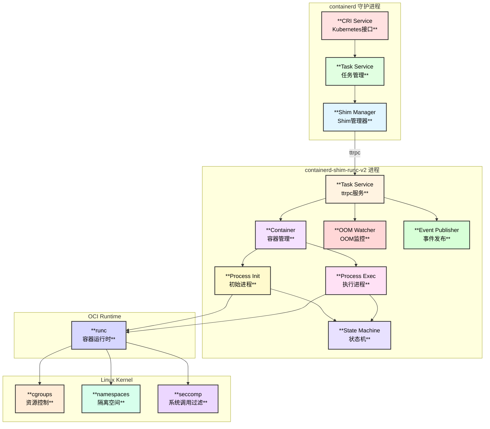
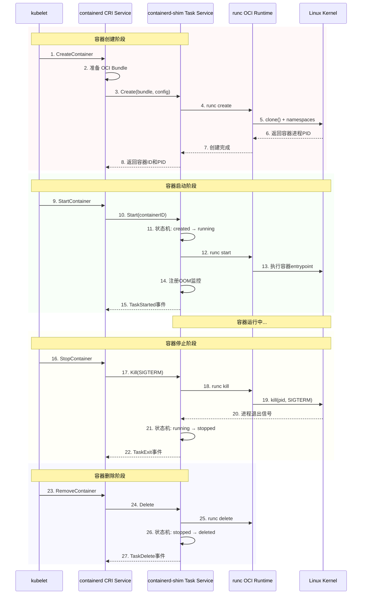
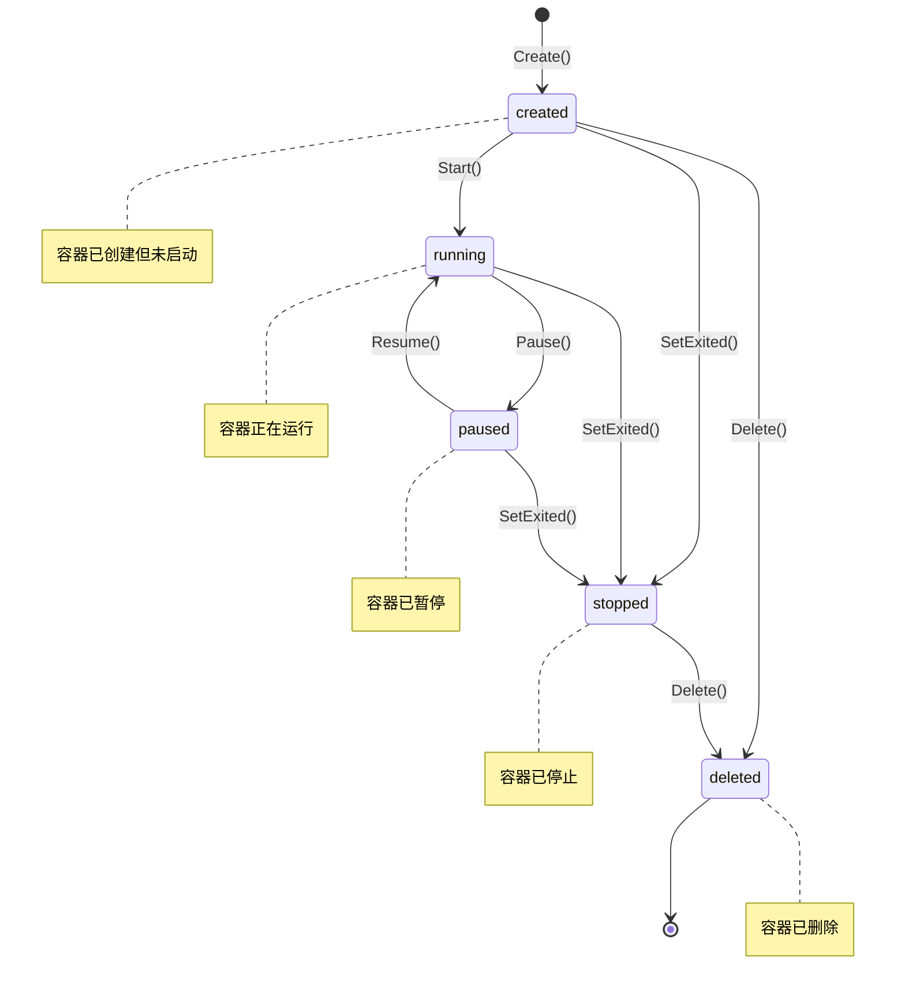
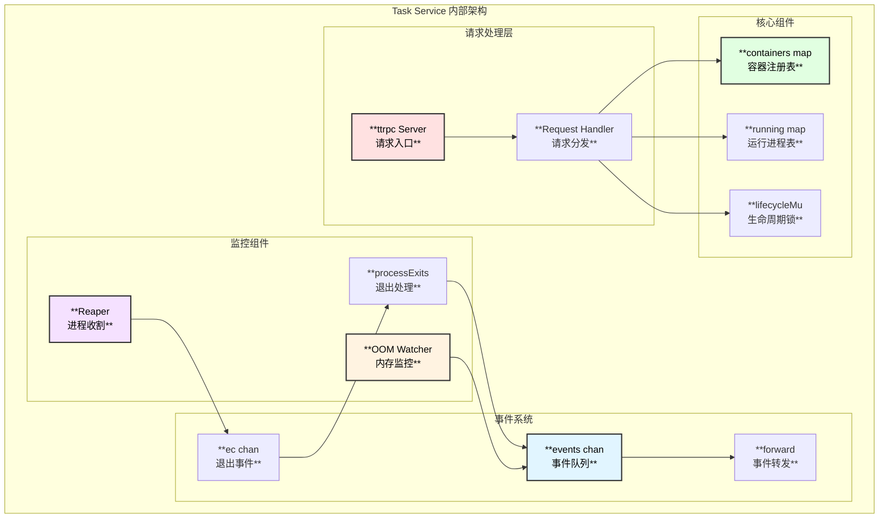
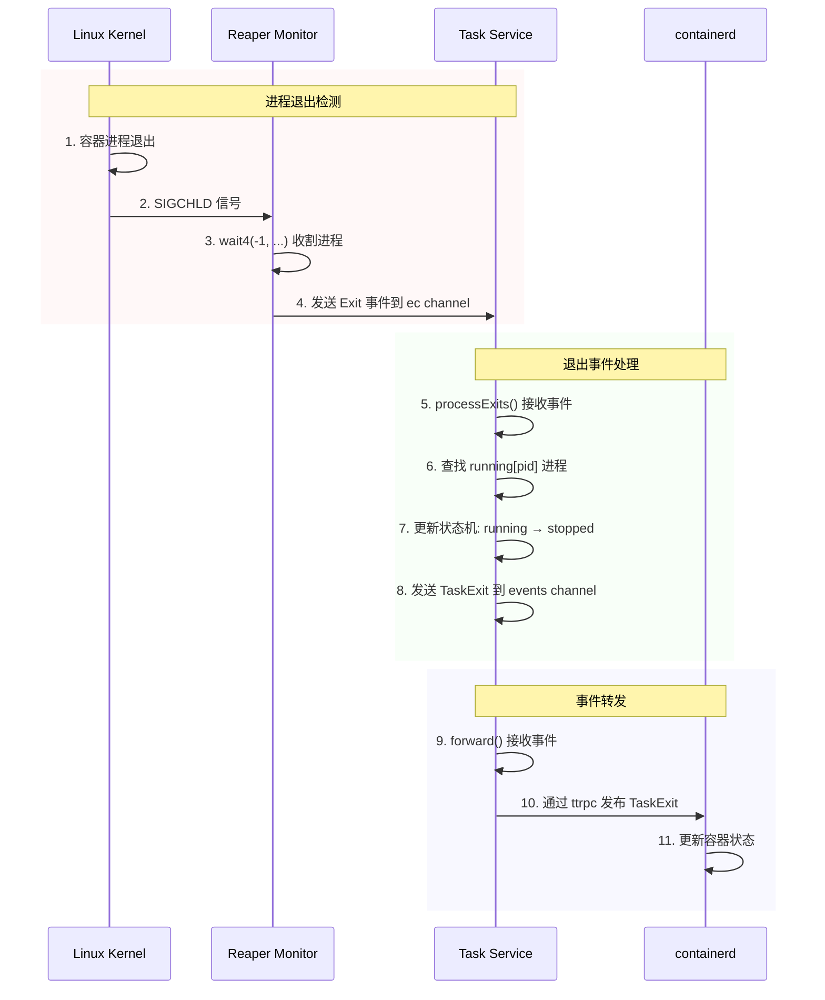
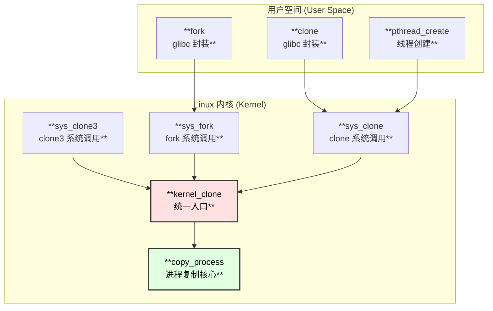
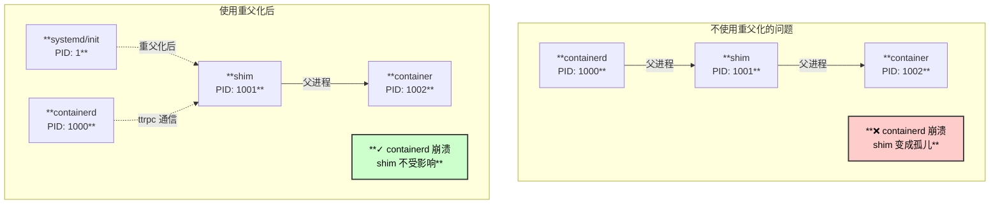
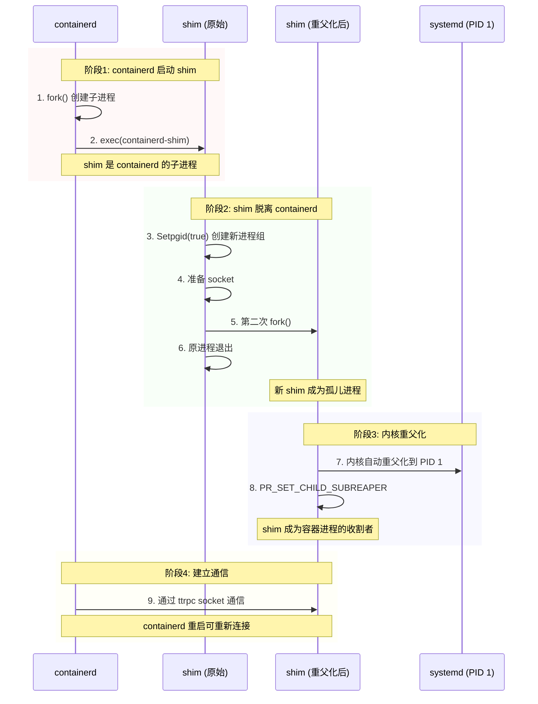

# containerd-shim 深度源码解析

> 基于 containerd v2.1.0 版本源码分析

## 概述

`containerd-shim` (shim) 是 containerd 架构中的关键组件，作为 containerd 守护进程和实际容器运行时 (如 runc) 之间的中间层。它的设计目标是实现容器的解耦管理，使得 containerd 可以重启而不影响运行中的容器。

## 核心能力总览

### shim 提供的主要能力

| 能力分类 | 具体功能 | 对应接口 |
|---------|---------|---------|
| **容器生命周期管理** | 创建、启动、停止、删除容器 | Create, Start, Delete, Kill |
| **进程管理** | 执行额外进程 (exec)、终端大小调整 | Exec, ResizePty |
| **状态管理** | 查询容器/进程状态、等待退出 | State, Wait |
| **暂停/恢复** | 冻结/解冻容器进程 | Pause, Resume |
| **资源控制** | 动态更新 cgroup 资源限制 | Update |
| **检查点** | 容器快照和恢复 (CRIU) | Checkpoint |
| **统计信息** | cgroup 资源使用统计 | Stats |
| **OOM 监控** | 内存溢出事件监控 | OOM Watcher |
| **事件发布** | 容器生命周期事件通知 | Event Publisher |

## 架构图



## 容器生命周期时序图



## 源码函数调用链

### 完整调用链 (容器创建到启动)

```
shim.Run() - pkg/shim/shim.go:171
├── 初始化 Shim Manager
│   └── manager.NewShimManager() - cmd/containerd-shim-runc-v2/manager/manager_linux.go:78
│       ├── 创建 Unix Socket
│       └── 注册 ttrpc 服务
│
└── 启动 ttrpc 服务器
    └── task.NewTaskService() - cmd/containerd-shim-runc-v2/task/service.go:64
        ├── 初始化 OOM Watcher
        │   ├── oomv1.New() - pkg/oom/v1/v1.go (cgroups v1)
        │   └── oomv2.New() - pkg/oom/v2/v2.go (cgroups v2)
        ├── 订阅进程退出事件
        │   └── reaper.Default.Subscribe() - pkg/sys/reaper/reaper_unix.go
        ├── 启动退出事件处理协程
        │   └── s.processExits() - cmd/containerd-shim-runc-v2/task/service.go:654
        └── 启动事件转发协程
            └── s.forward() - cmd/containerd-shim-runc-v2/task/service.go:785

service.Create() - cmd/containerd-shim-runc-v2/task/service.go:224
├── 获取互斥锁 s.mu.Lock()
├── 预处理启动 s.preStart()
│   └── 创建退出事件订阅
├── 创建容器
│   └── runc.NewContainer() - cmd/containerd-shim-runc-v2/runc/container.go:66
│       ├── 读取运行时配置
│       │   └── ReadOptions() - cmd/containerd-shim-runc-v2/runc/container.go:160
│       ├── 创建 Init 进程
│       │   └── newInit() - cmd/containerd-shim-runc-v2/runc/container.go:203
│       │       ├── process.NewRunc() - cmd/containerd-shim-runc-v2/process/init.go:82
│       │       │   └── 配置 runc 命令参数
│       │       │       ├── Log 路径
│       │       │       ├── Root 目录
│       │       │       └── SystemdCgroup 选项
│       │       └── process.New() - cmd/containerd-shim-runc-v2/process/init.go:97
│       │           └── 初始化状态机为 createdState
│       └── 执行容器创建
│           └── p.Create() - cmd/containerd-shim-runc-v2/process/init.go:110
│               ├── 处理终端/IO配置
│               │   ├── runc.NewTempConsoleSocket() (终端模式)
│               │   └── createIO() (非终端模式)
│               ├── 调用 runc create
│               │   └── p.runtime.Create() - vendor/github.com/containerd/go-runc/runc.go:156
│               │       └── ┌──────────────┬─────────────────────────────────────────┐
│               │           │  参数          │  说明                                   │
│               │           ├──────────────┼─────────────────────────────────────────┤
│               │           │  --bundle     │  OCI Bundle 路径                        │
│               │           ├──────────────┼─────────────────────────────────────────┤
│               │           │  --pid-file   │  PID 文件路径                           │
│               │           ├──────────────┼─────────────────────────────────────────┤
│               │           │  --no-pivot   │  不使用 pivot_root                      │
│               │           ├──────────────┼─────────────────────────────────────────┤
│               │           │  --console-socket │  终端 socket 路径                   │
│               │           └──────────────┴─────────────────────────────────────────┘
│               ├── 读取容器 PID
│               │   └── runc.ReadPidFile()
│               └── 处理终端连接
│                   └── socket.ReceiveMaster()
├── 注册容器
│   └── s.containers[r.ID] = container
├── 发送创建事件
│   └── s.send(&eventstypes.TaskCreate{...})
└── 处理启动完成
    └── handleStarted(container, proc)

service.Start() - cmd/containerd-shim-runc-v2/task/service.go:270
├── 获取容器 s.getContainer()
├── 检查容器状态
│   └── s.containerInitExit 检查
├── 启动容器/Exec
│   └── container.Start() - cmd/containerd-shim-runc-v2/runc/container.go:308
│       ├── (Init进程) p.Start()
│       │   └── createdState.Start() - cmd/containerd-shim-runc-v2/process/init_state.go:78
│       │       ├── p.start() - cmd/containerd-shim-runc-v2/process/init.go:227
│       │       │   └── p.runtime.Start() - vendor/github.com/containerd/go-runc/runc.go:237
│       │       │       └── 执行: runc start <container_id>
│       │       └── transition("running") - 状态转换
│       └── (Exec进程) e.Start()
│           └── execCreatedState.Start() - cmd/containerd-shim-runc-v2/process/exec_state.go:56
├── 注册 OOM 监控
│   └── s.ep.Add() - pkg/oom/v1/v1.go 或 pkg/oom/v2/v2.go
├── 发送启动事件
│   ├── TaskStart (Init进程)
│   └── TaskExecStarted (Exec进程)
└── 处理启动完成
    └── handleStarted()
```

## 状态机详解

### 容器状态转换图



### 状态机源码实现

```
initState 接口定义 - cmd/containerd-shim-runc-v2/process/init_state.go:31
├── Start(ctx) error           // 启动进程
├── Delete(ctx) error          // 删除进程
├── Pause(ctx) error           // 暂停进程
├── Resume(ctx) error          // 恢复进程
├── Update(ctx, any) error     // 更新资源
├── Checkpoint(ctx, cfg) error // 检查点
├── Exec(ctx, path, cfg) error // 执行额外进程
├── Kill(ctx, sig, all) error  // 发送信号
├── SetExited(status int)      // 设置退出状态
└── Status(ctx) (string, error)// 获取状态

状态实现类:
├── createdState - cmd/containerd-shim-runc-v2/process/init_state.go:44
│   ├── 允许: Start, Delete, Kill, Update, Exec
│   └── 禁止: Pause, Resume, Checkpoint
│
├── runningState - cmd/containerd-shim-runc-v2/process/init_state.go:221
│   ├── 允许: Pause, Kill, Update, Checkpoint, Exec
│   └── 禁止: Start, Delete, Resume
│
├── pausedState - cmd/containerd-shim-runc-v2/process/init_state.go:292
│   ├── 允许: Resume, Kill, Update, Checkpoint
│   └── 禁止: Start, Delete, Pause, Exec
│
├── stoppedState - cmd/containerd-shim-runc-v2/process/init_state.go:360
│   ├── 允许: Delete, Kill
│   └── 禁止: Start, Pause, Resume, Update, Checkpoint, Exec
│
└── deletedState - cmd/containerd-shim-runc-v2/process/deleted_state.go
    └── 所有操作返回 "container deleted" 错误
```

## 核心功能源码解析

### 1. 容器暂停/恢复 (Pause/Resume)

```
service.Pause() - cmd/containerd-shim-runc-v2/task/service.go:461
├── container.Pause() - cmd/containerd-shim-runc-v2/runc/container.go:395
│   └── process.Init.Pause() - cmd/containerd-shim-runc-v2/process/init.go:363
│       └── runningState.Pause() - cmd/containerd-shim-runc-v2/process/init_state.go:237
│           ├── 设置 pausing 标志
│           ├── p.runtime.Pause() - vendor/github.com/containerd/go-runc/runc.go:346
│           │   └── 执行: runc pause <container_id>
│           │       └── Linux: freezer cgroup (FROZEN状态)
│           └── transition("paused")
└── s.send(&eventstypes.TaskPaused{})

service.Resume() - cmd/containerd-shim-runc-v2/task/service.go:476
├── container.Resume() - cmd/containerd-shim-runc-v2/runc/container.go:400
│   └── process.Init.Resume() - cmd/containerd-shim-runc-v2/process/init.go:374
│       └── pausedState.Resume() - cmd/containerd-shim-runc-v2/process/init_state.go:312
│           ├── p.runtime.Resume() - vendor/github.com/containerd/go-runc/runc.go:357
│           │   └── 执行: runc resume <container_id>
│           │       └── Linux: freezer cgroup (THAWED状态)
│           └── transition("running")
└── s.send(&eventstypes.TaskResumed{})
```

### 2. 资源更新 (Update)

```
service.Update() - cmd/containerd-shim-runc-v2/task/service.go:562
├── container.Update() - cmd/containerd-shim-runc-v2/runc/container.go:466
│   └── process.Init.Update() - cmd/containerd-shim-runc-v2/process/init.go:455
│       ├── 获取进程锁 p.mu.Lock()
│       └── initState.Update() - (根据当前状态)
│           └── p.update() - cmd/containerd-shim-runc-v2/process/init.go:462
│               ├── 反序列化资源配置
│               │   └── json.Unmarshal(r.Value, &resources)
│               │       └── ┌────────────────┬──────────────────────────┐
│               │           │  字段            │  说明                    │
│               │           ├────────────────┼──────────────────────────┤
│               │           │  CPU.Shares     │  CPU 权重                │
│               │           ├────────────────┼──────────────────────────┤
│               │           │  CPU.Quota      │  CPU 配额                │
│               │           ├────────────────┼──────────────────────────┤
│               │           │  CPU.Period     │  CPU 周期                │
│               │           ├────────────────┼──────────────────────────┤
│               │           │  Memory.Limit   │  内存限制                │
│               │           ├────────────────┼──────────────────────────┤
│               │           │  Memory.Swap    │  Swap限制                │
│               │           └────────────────┴──────────────────────────┘
│               └── p.runtime.Update() - vendor/github.com/containerd/go-runc/runc.go:692
│                   └── 执行: runc update --resources=- <container_id>
│                       └── 通过 stdin 传递 JSON 配置
```

### 3. 进程执行 (Exec)

```
service.Exec() - cmd/containerd-shim-runc-v2/task/service.go:384
├── container.ReserveProcess() - 预留进程ID
├── container.Exec() - cmd/containerd-shim-runc-v2/runc/container.go:378
│   └── process.Init.Exec() - cmd/containerd-shim-runc-v2/process/init.go:387
│       └── runningState.Exec() - cmd/containerd-shim-runc-v2/process/init_state.go:284
│           └── p.exec() - cmd/containerd-shim-runc-v2/process/init.go:396
│               └── process.NewExec() - cmd/containerd-shim-runc-v2/process/exec.go:58
│                   ├── 创建 Exec 进程结构
│                   ├── 设置初始状态为 execCreatedState
│                   └── 配置 stdio
├── container.ProcessAdd() - 添加到进程列表
└── s.send(&eventstypes.TaskExecAdded{})

(后续启动 Exec 进程)
service.Start(execID) - cmd/containerd-shim-runc-v2/task/service.go:270
└── container.Start() - cmd/containerd-shim-runc-v2/runc/container.go:308
    └── exec.Start() - cmd/containerd-shim-runc-v2/process/exec.go:143
        └── execCreatedState.Start() - cmd/containerd-shim-runc-v2/process/exec_state.go:56
            └── e.start() - cmd/containerd-shim-runc-v2/process/exec.go:155
                └── e.parent.runtime.Exec() - vendor/github.com/containerd/go-runc/runc.go:283
                    └── 执行: runc exec --process=<spec> <container_id>
```

### 4. 统计信息 (Stats)

```
service.Stats() - cmd/containerd-shim-runc-v2/task/service.go:619
├── container.Cgroup() - 获取 cgroup 管理器
└── 根据 cgroup 版本获取统计
    ├── (cgroups v1) cg.Stat()
    │   └── ┌────────────────┬──────────────────────────────────┐
    │       │  统计项          │  说明                            │
    │       ├────────────────┼──────────────────────────────────┤
    │       │  CPU.Usage      │  CPU 使用时间                    │
    │       ├────────────────┼──────────────────────────────────┤
    │       │  Memory.Usage   │  内存使用量                      │
    │       ├────────────────┼──────────────────────────────────┤
    │       │  Blkio.IoServiceBytesRecursive │  块设备IO统计     │
    │       ├────────────────┼──────────────────────────────────┤
    │       │  Pids.Current   │  当前进程数                      │
    │       └────────────────┴──────────────────────────────────┘
    └── (cgroups v2) cg.Stat()
        └── 返回 cgroupsv2.Metrics
```

## 关键文件位置总览

```
📁 containerd/cmd/containerd-shim-runc-v2/
├── 📄 main.go                          # 程序入口
├── 📁 manager/
│   └── 📄 manager_linux.go             # Shim 管理器
├── 📁 task/
│   ├── 📄 service.go                   # ttrpc 服务实现 (821行)
│   │   ├── NewTaskService()     :64    # 服务初始化
│   │   ├── Create()            :224    # 创建容器
│   │   ├── Start()             :270    # 启动进程
│   │   ├── Delete()            :351    # 删除进程
│   │   ├── Exec()              :384    # 执行进程
│   │   ├── Pause()             :461    # 暂停容器
│   │   ├── Resume()            :476    # 恢复容器
│   │   ├── Kill()              :491    # 发送信号
│   │   ├── Update()            :562    # 更新资源
│   │   ├── Stats()             :619    # 统计信息
│   │   └── processExits()      :654    # 退出事件处理
│   └── 📁 plugin/
│       └── 📄 plugin_linux.go          # 插件注册
├── 📁 process/
│   ├── 📄 init.go                      # Init 进程 (502行)
│   │   ├── New()               :97     # 创建进程
│   │   ├── Create()           :110     # 创建容器
│   │   ├── Start()            :227     # 启动进程
│   │   ├── Pause()            :363     # 暂停
│   │   ├── Resume()           :374     # 恢复
│   │   └── Update()           :455     # 更新资源
│   ├── 📄 init_state.go                # 状态机实现 (416行)
│   │   ├── createdState        :44     # 已创建状态
│   │   ├── runningState       :221     # 运行中状态
│   │   ├── pausedState        :292     # 已暂停状态
│   │   └── stoppedState       :360     # 已停止状态
│   ├── 📄 exec.go                      # Exec 进程
│   ├── 📄 exec_state.go                # Exec 状态机
│   ├── 📄 deleted_state.go             # 已删除状态
│   └── 📄 io.go                        # IO 处理
└── 📁 runc/
    ├── 📄 container.go                 # 容器管理 (507行)
    │   ├── NewContainer()      :66     # 创建容器
    │   ├── Start()            :308     # 启动
    │   ├── Delete()           :363     # 删除
    │   ├── Exec()             :378     # 执行
    │   ├── Pause()            :395     # 暂停
    │   ├── Resume()           :400     # 恢复
    │   ├── Update()           :466     # 更新
    │   └── Checkpoint()       :441     # 检查点
    ├── 📄 platform.go                  # 平台适配
    └── 📄 util.go                      # 工具函数
```

## 设计优势

### 1. 进程隔离
- shim 作为独立进程运行，与 containerd 守护进程解耦
- containerd 重启不影响运行中的容器
- 每个 Pod/容器组有独立的 shim 进程

### 2. 状态机模式
- 严格的状态转换控制，防止非法操作
- 清晰的生命周期管理
- 便于错误处理和恢复

### 3. 事件驱动
- 异步事件发布机制
- 高效的进程退出处理
- OOM 事件监控和通知

### 4. 资源高效
- 使用 ttrpc 替代 gRPC，减少内存占用
- 轻量级设计，每个 shim 进程占用约 5-10MB 内存
- 支持多容器共享单个 shim 进程

## Task Service 运行原理深度剖析

### Task Service 架构

Task Service 是 shim 的核心服务，负责接收来自 containerd 的 ttrpc 请求并管理容器的完整生命周期。



### Task Service 初始化流程

```go
// cmd/containerd-shim-runc-v2/task/service.go:64
func NewTaskService(ctx context.Context, publisher shim.Publisher, sd shutdown.Service) (taskAPI.TTRPCTaskService, error) {
    var (
        ep  oom.Watcher
        err error
    )
    
    // 1. 初始化 OOM 监控器 (根据 cgroup 版本)
    if cgroups.Mode() == cgroups.Unified {
        ep, err = oomv2.New(publisher)  // cgroups v2
    } else {
        ep, err = oomv1.New(publisher)  // cgroups v1
    }
    go ep.Run(ctx)
    
    // 2. 创建 service 实例
    s := &service{
        context:              ctx,
        events:               make(chan interface{}, 128),  // 事件缓冲队列
        ec:                   reaper.Default.Subscribe(),   // 订阅进程退出
        ep:                   ep,                           // OOM 监控
        shutdown:             sd,
        containers:           make(map[string]*runc.Container),  // 容器表
        running:              make(map[int][]containerProcess),  // PID→进程映射
        runningExecs:         make(map[*runc.Container]int),     // exec 计数
        execCountSubscribers: make(map[*runc.Container]chan<- int),
        containerInitExit:    make(map[*runc.Container]runcC.Exit),
        exitSubscribers:      make(map[*map[int][]runcC.Exit]struct{}),
    }
    
    // 3. 启动后台协程
    go s.processExits()  // 处理进程退出事件
    go s.forward(ctx, publisher)  // 转发事件到 containerd
    
    return s, nil
}
```

### 进程退出事件处理机制



### 关键数据结构

```go
// service 结构体的核心字段
type service struct {
    mu sync.Mutex  // 全局互斥锁
    
    // 容器管理
    containers map[string]*runc.Container  // containerID → Container
    
    // 进程跟踪
    running map[int][]containerProcess     // PID → 进程列表 (处理 PID 复用)
    runningExecs map[*runc.Container]int   // 容器的 exec 进程计数
    
    // 生命周期同步
    lifecycleMu sync.Mutex
    containerInitExit map[*runc.Container]runcC.Exit  // init 退出状态缓存
    exitSubscribers map[*map[int][]runcC.Exit]struct{}  // 退出事件订阅者
    
    // 事件通道
    events chan interface{}  // 异步事件队列
    ec chan runcC.Exit       // 进程退出事件
    
    // 监控
    ep oom.Watcher  // OOM 监控器
}
```

---

## Linux fork() 与 clone() 深度解析

### 系统调用层次关系



### Linux 内核源码分析

```c
// linux/kernel/fork.c - fork 系统调用
SYSCALL_DEFINE0(fork)
{
    struct kernel_clone_args args = {
        .exit_signal = SIGCHLD,  // 子进程退出时发送 SIGCHLD
        // 不设置任何 CLONE_* 标志 → 完全复制所有资源
    };
    return kernel_clone(&args);
}

// linux/kernel/fork.c - clone 系统调用  
SYSCALL_DEFINE5(clone, unsigned long, clone_flags, ...)
{
    struct kernel_clone_args args = {
        .flags       = (lower_32_bits(clone_flags) & ~CSIGNAL),
        .exit_signal = (lower_32_bits(clone_flags) & CSIGNAL),
        .stack       = newsp,
        .tls         = tls,
        // clone_flags 决定共享哪些资源
    };
    return kernel_clone(&args);
}

// linux/kernel/fork.c:2745 - 统一的进程创建函数
pid_t kernel_clone(struct kernel_clone_args *args)
{
    struct task_struct *p;
    
    // 核心: 复制进程结构
    p = copy_process(NULL, trace, NUMA_NO_NODE, args);
    
    // 唤醒新进程
    wake_up_new_task(p);
    
    return pid_vnr(pid);
}
```

### fork vs clone 对比

| 特性 | fork() | clone() |
|-----|--------|---------|
| **资源共享** | 完全复制 (写时复制) | 可选择性共享 |
| **内存空间** | 独立 (COW) | CLONE_VM 共享 |
| **文件描述符** | 独立副本 | CLONE_FILES 共享 |
| **信号处理器** | 独立副本 | CLONE_SIGHAND 共享 |
| **PID 命名空间** | 继承父进程 | CLONE_NEWPID 新建 |
| **网络命名空间** | 继承父进程 | CLONE_NEWNET 新建 |
| **退出信号** | 固定 SIGCHLD | 可自定义 |
| **使用场景** | 创建子进程 | 创建线程/容器 |

### CLONE 标志详解

```c
// 容器创建常用的 CLONE 标志组合
#define CLONE_NEWNS   0x00020000  // 新的 mount namespace
#define CLONE_NEWPID  0x20000000  // 新的 PID namespace  
#define CLONE_NEWNET  0x40000000  // 新的 network namespace
#define CLONE_NEWUTS  0x04000000  // 新的 UTS namespace (hostname)
#define CLONE_NEWIPC  0x08000000  // 新的 IPC namespace
#define CLONE_NEWUSER 0x10000000  // 新的 user namespace

// runc 创建容器时使用的标志 (简化)
clone_flags = CLONE_NEWNS | CLONE_NEWPID | CLONE_NEWNET | 
              CLONE_NEWUTS | CLONE_NEWIPC;
```

---

## Shim 重父化 (Reparenting) 原理

### 为什么需要重父化?



### Linux 内核的重父化机制

```c
// linux/kernel/exit.c:618-658 - 寻找新父进程
/*
 * When we die, we re-parent all our children, and try to:
 * 1. give them to another thread in our thread group
 * 2. give it to the first ancestor process which prctl'd itself as a
 *    child_subreaper for its children (like a service manager)
 * 3. give it to the init process (PID 1) in our pid namespace
 */
static struct task_struct *find_new_reaper(struct task_struct *father,
                                           struct task_struct *child_reaper)
{
    struct task_struct *thread, *reaper;

    // 1. 尝试找同一线程组的其他线程
    thread = find_alive_thread(father);
    if (thread)
        return thread;

    // 2. 查找设置了 child_subreaper 的祖先进程
    if (father->signal->has_child_subreaper) {
        for (reaper = father->real_parent;
             task_pid(reaper)->level == ns_level;
             reaper = reaper->real_parent) {
            if (reaper == &init_task)
                break;
            if (!reaper->signal->is_child_subreaper)
                continue;
            thread = find_alive_thread(reaper);
            if (thread)
                return thread;
        }
    }

    // 3. 返回 init 进程 (PID 1)
    return child_reaper;
}
```

### Shim 重父化实现



### containerd 启动 shim 的代码

```go
// cmd/containerd-shim-runc-v2/manager/manager_linux.go:82
func newCommand(ctx context.Context, id, containerdAddress, containerdTTRPCAddress string, debug bool) (*exec.Cmd, error) {
    self, _ := os.Executable()  // 获取 shim 自身路径
    cwd, _ := os.Getwd()
    
    args := []string{
        "-namespace", ns,
        "-id", id,
        "-address", containerdAddress,
    }
    
    cmd := exec.Command(self, args...)
    cmd.Dir = cwd
    
    // 关键: 设置新进程组
    cmd.SysProcAttr = &syscall.SysProcAttr{
        Setpgid: true,  // 创建新进程组，脱离 containerd
    }
    
    return cmd, nil
}

// manager.Start() 启动 shim
func (manager) Start(ctx context.Context, id string, opts shim.StartOpts) (shim.BootstrapParams, error) {
    cmd, _ := newCommand(ctx, id, opts.Address, opts.TTRPCAddress, opts.Debug)
    
    // 启动 shim 进程
    cmd.Start()
    
    // 关键: 不等待 shim 退出
    // shim 会重新 fork 自己并让原进程退出
    go cmd.Wait()
    
    return params, nil
}
```

### Shim 自身的初始化代码

```go
// pkg/shim/shim.go:217
func run(ctx context.Context, manager Manager, config Config) error {
    // 1. 设置信号处理
    signals, _ := setupSignals(config)
    
    // 2. 关键: 设置为子进程收割者
    if !config.NoSubreaper {
        if err := subreaper(); err != nil {
            return err
        }
    }
    
    // 3. 启动 ttrpc 服务
    // ...
}

// pkg/shim/shim_linux.go:29
func subreaper() error {
    // 调用 prctl(PR_SET_CHILD_SUBREAPER, 1)
    return reaper.SetSubreaper(1)
}

// pkg/sys/reaper/reaper_utils_linux.go:26
func SetSubreaper(i int) error {
    return unix.Prctl(unix.PR_SET_CHILD_SUBREAPER, uintptr(i), 0, 0, 0)
}
```

### PR_SET_CHILD_SUBREAPER 的作用

```c
// linux/kernel/sys.c:2608
case PR_SET_CHILD_SUBREAPER:
    // 设置当前进程为子进程收割者
    me->signal->is_child_subreaper = !!arg2;
    
    if (!arg2)
        break;
    
    // 传播标志给所有后代进程
    walk_process_tree(me, propagate_has_child_subreaper, NULL);
    break;
```

**效果**:
- shim 的所有孤儿**后代**进程都会被 shim 收养
- 而不是被 PID 1 收养
- shim 负责调用 `wait4()` 获取这些进程的退出状态

### 进程收割流程

```go
// pkg/sys/reaper/reaper_unix.go:254
func reap(wait bool) (exits []exit, err error) {
    var (
        ws  unix.WaitStatus
        rus unix.Rusage
    )
    flag := unix.WNOHANG
    
    for {
        // 循环收割所有已退出的子进程
        pid, err := unix.Wait4(-1, &ws, flag, &rus)
        if err != nil {
            if err == unix.ECHILD {
                return exits, nil  // 没有更多子进程
            }
            return exits, err
        }
        if pid <= 0 {
            return exits, nil
        }
        exits = append(exits, exit{
            Pid:    pid,
            Status: exitStatus(ws),
        })
    }
}

// pkg/sys/reaper/reaper_unix.go:62 - 被 SIGCHLD 触发
func Reap() error {
    now := time.Now()
    exits, err := reap(false)
    
    // 通知所有订阅者
    for _, e := range exits {
        done := Default.notify(runc.Exit{
            Timestamp: now,
            Pid:       e.Pid,
            Status:    e.Status,
        })
        // ...
    }
    return err
}
```

---

## 总结

containerd-shim 通过以下核心设计实现了高可靠的容器运行时管理:

### 1. 分层架构
- containerd → shim → runc → kernel 的清晰分层
- 每层职责明确，便于维护和调试

### 2. Task Service 运行原理
- 事件驱动的异步架构
- 多级锁保护并发安全
- 完善的进程退出检测和处理

### 3. fork/clone 在容器中的应用
- **fork()**: 用于创建 shim 进程 (完全独立)
- **clone()**: 用于创建容器 (共享特定资源 + 新命名空间)

### 4. 重父化关键点
- **Setpgid**: 创建新进程组，脱离 containerd
- **双 fork**: 让原进程退出，触发内核重父化
- **PR_SET_CHILD_SUBREAPER**: shim 成为容器进程的收割者
- **状态持久化**: 所有信息保存到文件系统

### 5. 设计优势
- **热升级**: containerd 可无中断升级
- **故障隔离**: 单点故障不影响其他组件
- **资源隔离**: 每个 Pod 有独立的 shim 进程
- **可观测性**: 清晰的进程边界便于监控调试
